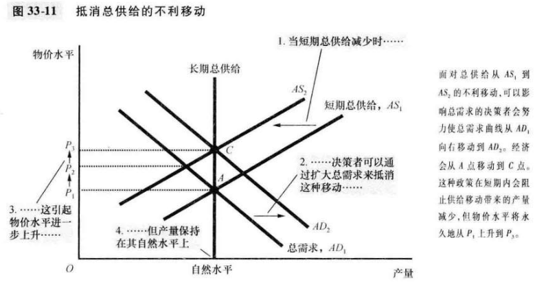

# 第33章 总需求与总供给

`衰退（recession）`真实收入下降和失业增加的时期。

`萧条（depression）`严重的衰退。

大多数经济学家认为，古典理论描述了长期世界，但并没有描述短期世界。

`总需求与总供给模型（model of aggregate demand and aggregate supply）`大多数经济学家用来解释经济活动围绕其长期趋势的短期波动的模型。

`总需求曲线（aggregate-demand curve）`表示在每一种物价水平时，家庭，企业，政府和外国客户想要购买的物品与服务数量的曲线。

`总供给曲线（aggregate-supply curve）`表示在每一种物价水平时，企业选择生产并销售的物品与服务数量的曲线。

**物价水平与消费：财富效应**：物价水平下降提高了货币的真实价值，并使消费者更富有，这又鼓励他们更多地支出。消费者支出增加意味着物品与服务需求量更大。相反，物价水平上升降低了货币的真实价值，并使消费者变穷，这又减少了消费者支出以及物品与服务的需求量。

**物价水平与投资：利率效应**：物价水平下降降低了利率，鼓励更多的用于投资品的支出，从而增加了物品与服务的需求量。相反，物价水平上升提高了利率，抑制了投资支出，并降低了物品与服务的需求量。

**物价水平与净出口：汇率效应**：当美国物价水平下降引起美国利率下降时，美元在外汇市场上的真实价值下降了。这种贬值刺激了美国的净出口，从而增加了物品与服务的需求量。相反，当美国物价水平上升并引起美国利率上升时，美元的真实价值就会上升，而且这种升值减少了美国的净出口以及物品与服务的需求量。

**总结**：有三个不同但相关的原因说明了为什么物价水平下降增加了物品与服务的需求量：

1. 消费者更富有了，这刺激了消费品需求。
2. 利率下降，这刺激了投资品需求。
3. 通货贬值，这刺激了净出口需求。

在长期中，总供给曲线是垂直的；而在短期中，总供给曲线向右上方倾斜。

在长期中，一个经济的物品与服务生产（它的真实GDP）取决于它的劳动，资本和自然资源的供给，以及可得到的用于把这些生产要素变为物品与服务的技术。

只有在长期中总供给曲线才是垂直的。

`自然产出水平（natural level of output）`一个经济在长期中当失业处于其正常率时达到的物品与服务的生产水平。

应该把产量与物价水平的短期波动视为对持续的产量增长和通货膨胀长期趋势的背离。

当经济中的实际物价水平背离了人们预期的物价水平时，供给量就背离了其长期水平或自然水平。

**总结**：对短期总供给曲线向右上方倾斜有三种不同的解释：1.粘性工资；2.粘性价格；3.对相对价格的错觉。所有者三个理论都表明，当实际物价水平背离人们预期的物价水平时，短期产量就背离自然产出水平。用数学公式表述如下：
$$
产量的供给量 = 自然产出水平 + a(实际物价水平 - 预期的物价水平)
$$

- $a$决定产量对未预期到的物价水平变动做出多大反应的数字。

预期物价水平上升减少了物品与服务的供给量，并使短期总供给曲线向左移动。预期物价水平下降增加了物品与服务的供给量，并使短期总供给曲线向右移动。

关于总需求移动的情形有三个重要结论：

- 在短期中，总需求移动引起经济中物品与服务产量的波动。
- 在长期中，总需求移动影响物价总水平，但不影响产量。
- 影响总需求的决策者可以潜在地减缓紧急波动的严重性。

关于总供给移动的情形有两个重要结论：

- 总供给移动会引起滞涨--衰退（产量减少）与通货膨胀（物价上升）的结合。
- 那些能影响总需求的决策者可以潜在地减缓对产量地不利影响。

## 内容提要

- 所有社会都经历过围绕长期趋势地短期积极波动。
- 古典经济理论建立在货币供给和物价水平这类名义变量并不影响产量和就业这类真实变量这一假设的基础之上。
- 总需求曲线由于三个原因向右下方倾斜：1.财富效应；2.利率效应；汇率效应。
- 在物价水平既定时任何一种增加消费，投资，政府购买或净出口地事件或证词都会增加总需求。
- 长期总供给曲线时垂直的。
- 改变经济生产能力地事件，都会使短期总供给曲线移动。
- 经济波动的一个可能原因是总需求的移动。
- 经济波动的第二个可能原因是总供给地移动。

