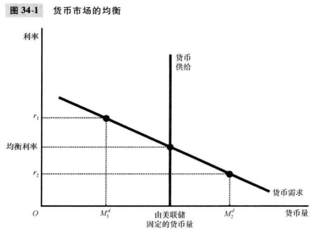
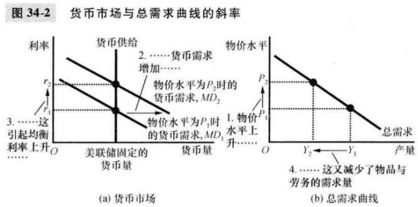
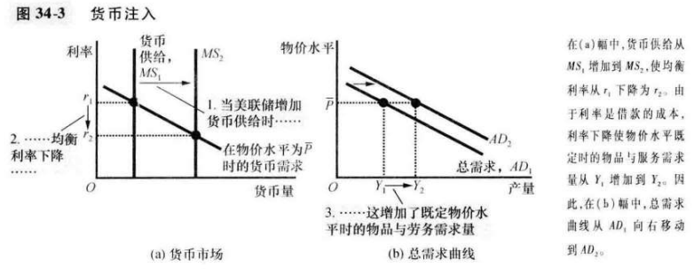
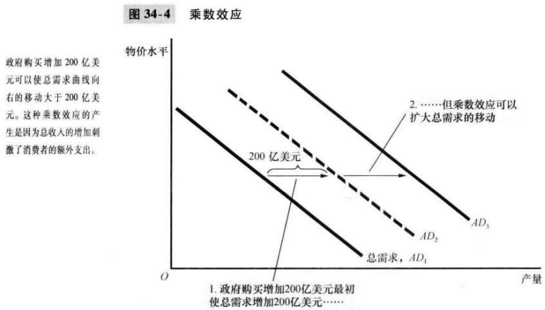
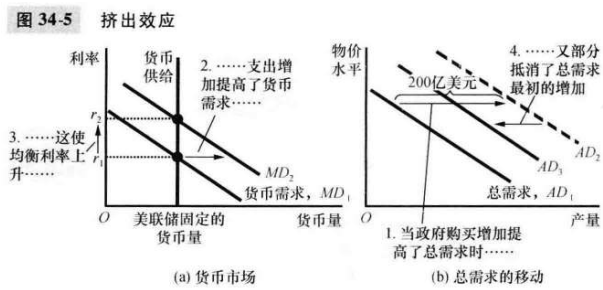

# 第34章 货币政策和财政政策对总需求地影响

对美国经济来说，总需求曲线向右下方倾斜地最重要原因是利率效应。

`流动性偏好理论（theory of liquidity preference）`凯恩斯地理论，认为利率地调整使货币供给与货币需求平衡。

当美联储增加货币供给时，它降低了利率，增加了既定物价水平使地物品与服务需求量，使总需求曲线向右移动。相反，当美联储紧缩货币供给时，它提高了利率，减少了既定物价水平时地物品与服务需求量，使总需求曲线向左移动。

既可以根据货币供给，也可以根据利率来描述货币政策。

旨在扩大总需求的货币政策变动既可以被描述为货币供给增加，也可以被描述为利率降低；旨在紧缩总需求的货币政策变动既可以被描述为货币供给减少，又可以被描述为利率提高。

`财政政策（fisical policy）`政府决策者对政府支出和税收水平的确定。

`乘数效应（multiplier effect）`当扩张性财政政策增加了收入，从而增加了消费支出时引起的总需求的额外变动。

$$
乘数 = 1 / (1 - MPC)
$$
`挤出效应（crowding-out effect）`当扩张性财政政策引起利率上升，从而减少投资支出时所引起的总需求减少。

`自动稳定器（automatic stabilizers）`当经济进入衰退时，决策者不必采取任何有意的行动就可以刺激总需求的财政政策变动。

## 内容提要

- 在建立短期经济波动理论时，凯恩斯提出了流动性偏好理论来解释利率的决定因素。
- 物价水平上升增加了货币需求，提高了使货币市场均衡的利率。
- 决策者可以用货币政策影响总需求。
- 决策者还可以用财政政策影响总需求。
- 当政府改变支出或税收时，所引起的总需求变动可能大于或小于财政变动。
- 由于货币政策和财政政策可以影响总需求，所以政府有时用这些政策工具来试图稳定经济。

