# 第35章 通货膨胀与失业之间的短期权衡取舍

`菲利普斯曲线（Phillips curve）`一条表示通货膨胀与失业之间短期权衡取舍的曲线。

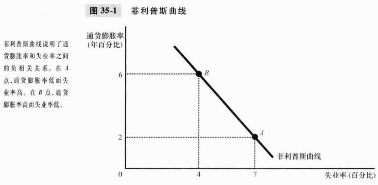

菲利普斯曲线说明，短期中出现的通货膨胀与失业的组合是由于总需求曲线的移动使经济沿着短期总供给曲线变动。

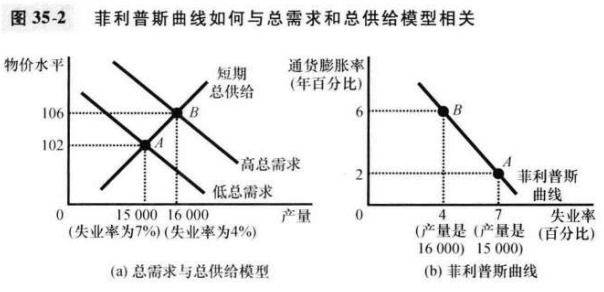

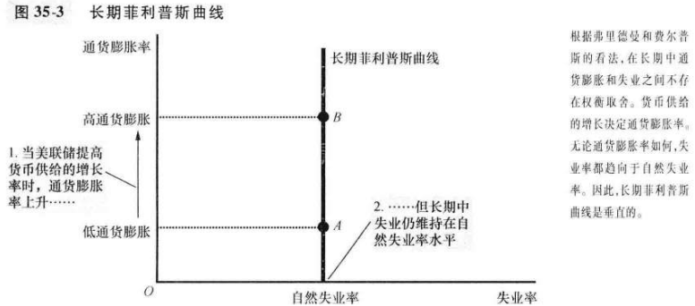

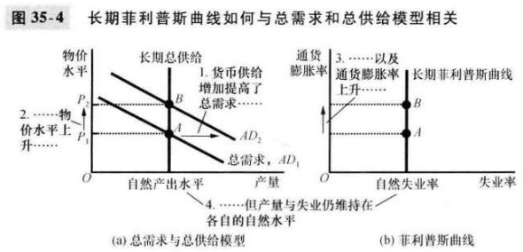

弗里德曼和菲尔普斯的分析可以概括为下列公式：
$$
失业率 = 自然失业率 - a(实际通货膨胀 - 预期通货膨胀)
$$
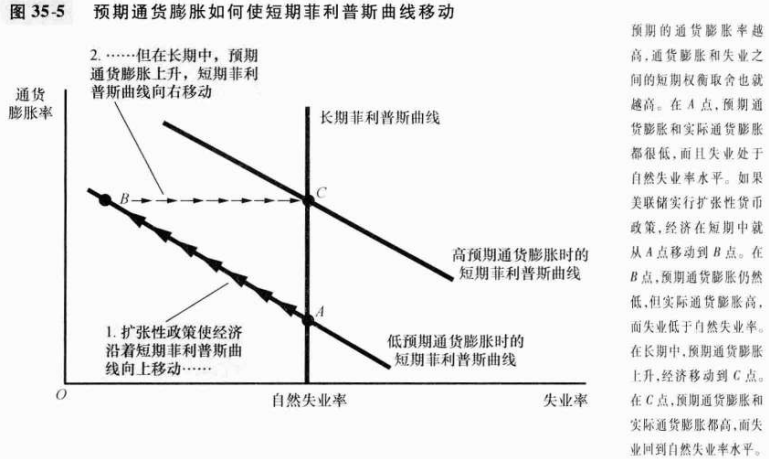

`自然率假说（natural-rate hypothesis）`认为无论通货膨胀率如何，失业最终都要回到其正常率或自然率的观点。

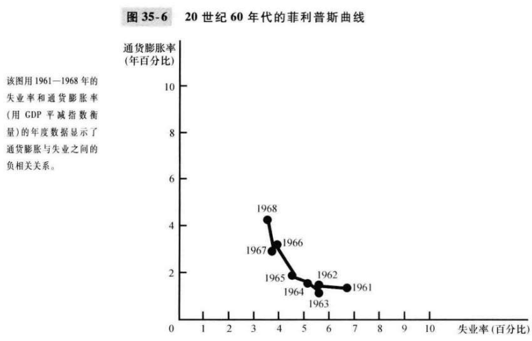

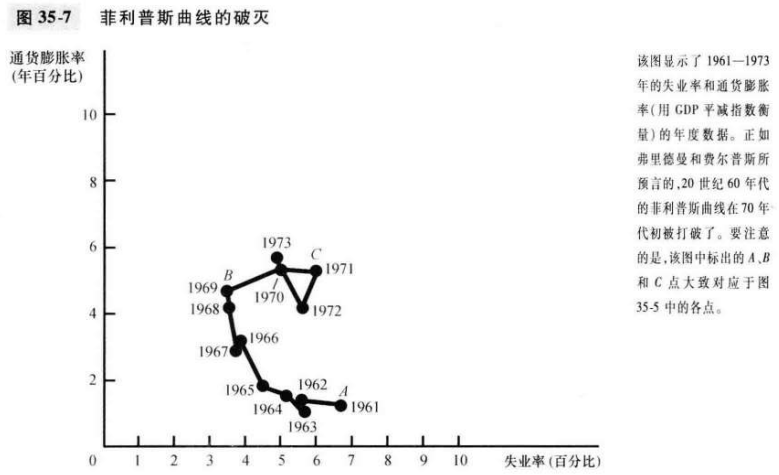

`供给冲击（supply shock）：`直接改变企业的成本和价格，使经济中的总供给曲线移动，进而使菲利普斯曲线移动的事件。

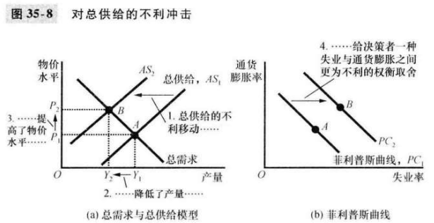

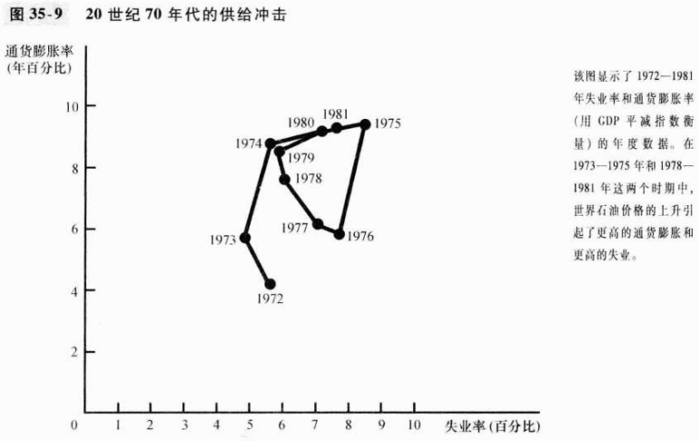

`牺牲率（sacrifice ratio）`在通货膨胀减少一个百分点的过程中每年产量损失的百分点数。

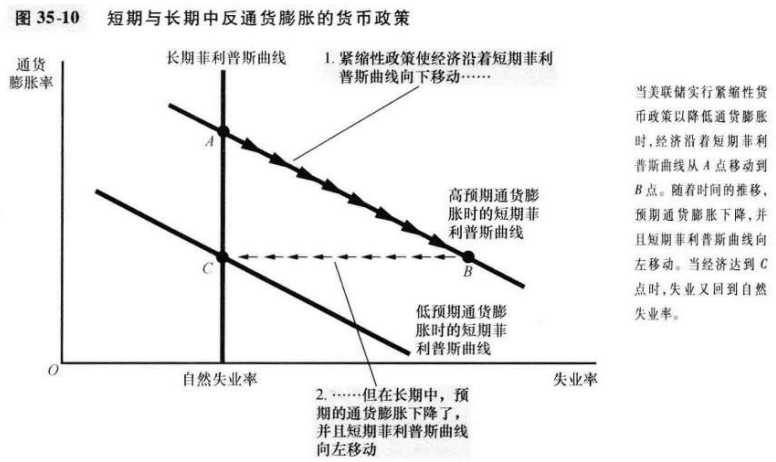

`理性预期（rational expectations）`当人们预测未来时，可以充分运用他们所拥有的全部信息，包括有关政府正常的的信息的理论。

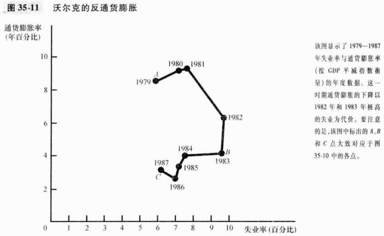

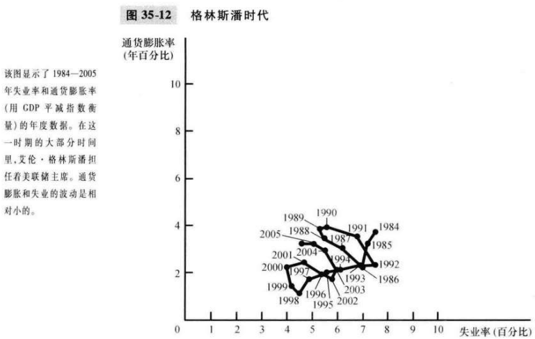

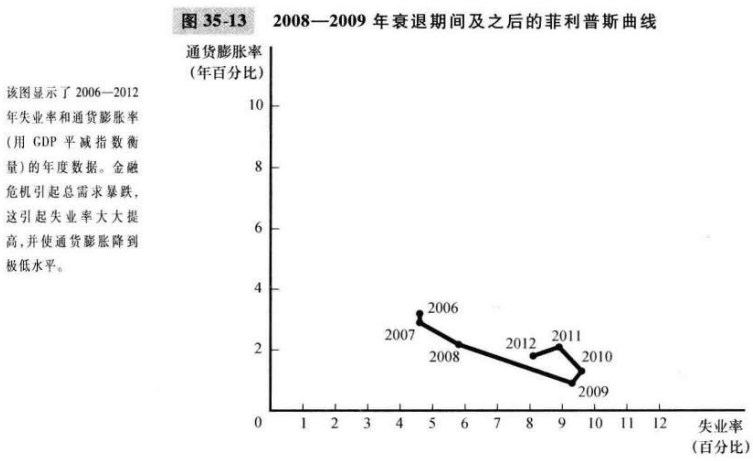

## 内容提要

- 菲利普斯曲线描述了通货膨胀和失业之间的负相关关系。
- 菲利普斯曲线所描述的通货膨胀与失业之间的权衡取舍只在短期中成立。
- 短期菲利普斯曲线也会由于总供给冲击而移动。
- 当美联储紧缩货币供给增长以降低通货膨胀时，它使经济沿着短期菲利普斯曲线移动，这就引起暂时的高失业。

