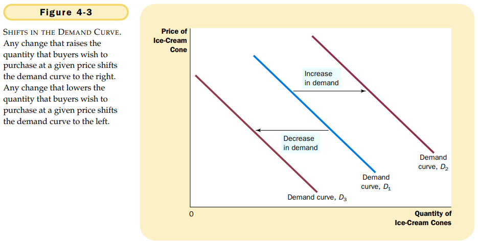

# CHAPTER 4 THE MARKET FORCES OF SUPPLY AND DEMAND

`market`. a group of buyers and sellers of a particular good or service.

`competitive market`. a market in which there are many buyer and many sellers so that each has a negligible impace on the market price.

Perfectly competitive markets are defined by two primary characteristics: 

1. the goods being offered for sale are all the same.
2. the buyers and sellers are so numerous that no single buyer or seller can influence the market price.

Because buyers and sellers in perfectly competitive markets must accept the price the market determines, they are said to be `price takers`.

Some markets have only one seller, and this seller sets the price. Such a seller is called a `monopoly`.

`quantity demanded`. the amount of a good that buyers are willing and able to purchase.

`law of demand`. the claim that, other things equal, the quantity demanded of a good falls when the price of the good rises.

`normal good`. a good for which, other things equal, an increase in income leads to an increase in demand.

`inferior good`. a good for which, other things equal, an increase in income leads to a decrease in demand.

`substitutes`. two goods for which an increase in the price of one leads to an increase in the demand for the other.

`complements`. two goods for which an increase in the price of one leads to a decrease in the demand for the other.

`demand schedule`. a table that shows the relationship between the price of a good and the quantity demanded.

`demand curve`. a graph of the relationship between the price of a good and the quantity demanded.

To analyze how markets work, we need to determine the `market demand`, which is the sum of all the individual demands for a particular good or service.

The demand curve shows what happens to the quantity demanded of a good when its price varies, holding constant all other determinants of quantity demanded. When one of these other determinants changes, the demand curve shifts.

`quantity supplied`. the amount of a good that sellers are willing and able to sell.

`law of supply`. the claim that, other things equal, the quantity supplied of a good rises when the price of the good rises.

`supply schedule`. a table that shows the relationship between the price of a good and the quantity supplied.

`supply curve`. a graph of the relationship between the price of a good and the quantity supplied.

`equilibrium`. a situation in which supply and demand have been brought into balance.

`equilibrium price`. the price that balances supply and demand.

At the equilibrium price, the quantity of the good that buyers are willing and able to buy exactly balance the quantity that sellers are willing and able to sell.

`equilibrium quantity`. the quantity supplied and the quantity demanded when the price has adjusted to balance supply and demand.

`surplus`. a situation in which quantity supplied is greater than quantity demanded.

`shortage`. a situation in which quantity demanded is greater than quantity supplied.

## Summary

- Economists use the model of supply and demand to analyze competitive markets. In a competitive market, there are many buyers and sellers, each of whom has little or no influence on the market price.
- The demand curve shows how the quantity of a good demanded depends on the price. According to the law of demand, as the price of a good falls, the quantity demanded rises. Therefore, the demand curve slopes downward.
- In addition to price, other determinants of the quantity demanded include income, tastes, expectations, and the prices of substitutes and complements. If one of these other determinants changes, the demand curve shifts.
- The supply curve shows how the quantity of a good supplied depends on the price. According to the law of supply, as the price of a good rises, the quantity supplied rises. Therefore, the supply curve slopes upward.
- In addition to price, other determinants of the quantity supplied include input prices, technology, and expectations. If one of these other determinants changes, the supply curve shifts.
- The intersection of the supply and demand curves determines the market equilibrium. At the equilibrium price, the quantity demanded equals the quantity supplied.
- The behavior of buyers and sellers naturally drives markets toward their equilibrium. When the market price is above the equilibrium price, there is a surplus of the good, which causes the market price to fall. When the market price is below the equilibrium price, there is a shortage, which causes the market price to rise.
- To analyze how any event influences a market, we use the supply-and-demand diagram to examine how the event affects the equilibrium price and quantity. To do this we follow three steps. First, we decide whether the event shifts the supply curve or the demand curve (or both). Second, we decide which direction the curve shifts. Third, we compare the new equilibrium with the old equilibrium.
- In market economies, prices are the signals that guide economic decisions and thereby allocate scarce resources. For every good in the economy, the price ensures that supply and demand are in balance. The equilibrium price then determines how much of the good buyers choose to purchase and how much sellers choose to produce.

