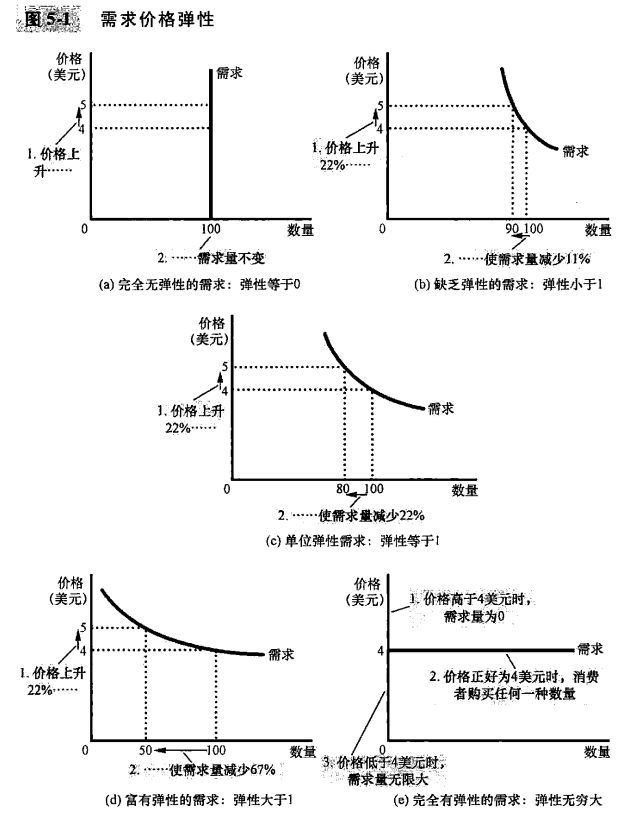
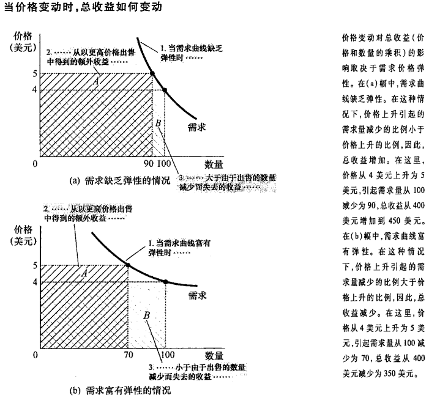
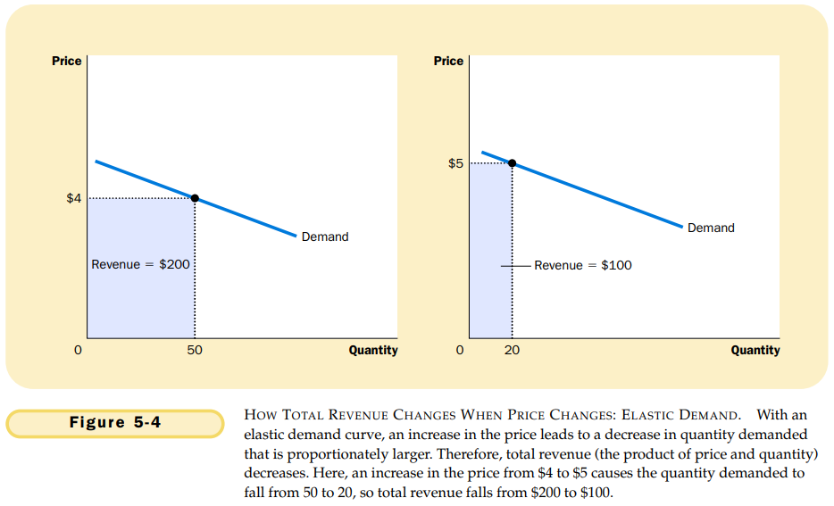
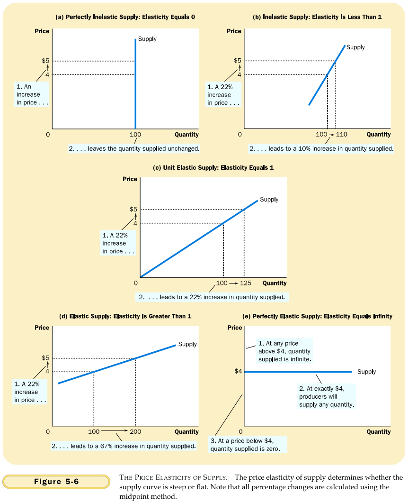

# CHAPTER 5 ELASTICITY AND ITS APPLICATION

`elasticity`. a measure of the responsiveness of quantity demanded or quantity supplied to one of its determinants.

`price elasticity of demand`. a measure of how much the quantity demanded of a good responds to a change in the price of that good, computed as the percentage change in quantity demanded divided by the percentage change in price.

Some general rules about what determines the price elasticity of demand:

- Necessities versus Luxuries.
- Availability of Close Substitutes.
- Definition of the Market.
- Time Horizon.

Economists compute the price elasticity of demand as the percentage change in the quantity demanded divided by the percentage change in the price. That is
$$
Price\ elasticity\ of\ demand = \frac{Percentage\ change\ in\ quantity\ demanded}{Percentage\ change\ in\ price}
$$
We can express the midpoint method with the following formula for the price elasticity of demand between two points, denoted $(Q_1, P_1)$ and $(Q_2, P_2)$:
$$
Price\ elasticity\ of\ demand = \frac{(Q_2 - Q_1)/[(Q_2 + Q_1)/2]}{(P_2 - P_1)/[(P_2 + P_1)/2]}
$$
The numerator is the percentage change in quantity computed using the midpoint method, and the denominator is the percentage change in price computed using the midpoint method. If you ever need to calculate elasticities, you should use this formula.

Demand is **elastic** when the elasticity is greater than 1, so that quantity moves proportionately more than the price.

Demand is **inelastic** when the elasticity is less than 1, so that quantity moves proportionately less than the price.

If the elasticity is exactly 1, so that quantity moves the same amount proportionately as price, demand is said to have **unit elasticity**.

`total revenue`. the amount paid by buyer and received by sellers of a good, computed as the price of the good times the quantity sold. In any market, total revenue is $P \times Q$, the price of the good times the quantity of the good sold.

- When a demand curve is inelastic (a price elasticity less than 1), a price increase raises total revenue, and a price decrease reduces total revenue.
- When a demand curve is elastic (a price elasticity greater than 1), a price increase reduces total revenue, and a price decrease raises total revenue.
- In the special case of unit elastic demand (a price elasticity exactly equal to 1), a change in the price does not affect total revenue.

`income elasticity of demand`. a measure of how much the quantity demanded of a good responds to a change in consumers' income, computed as the percentage change in quantity demanded divided by the percentage change in income. That is:
$$
Income\ elasticity\ of\ demand = \frac{Percentage\ change\ in\ quantity\ demanded}{Percentage\ change\ in\ income}
$$
`cross-price elasticity of demand`. a measure of how much the quantity demanded of one good responds to a change in the price of another good, computed as the percentage change in quantity demanded of the first good divided by the percentage change in the price of the second good. That is:
$$
Cross-price\ elasticity\ of\ demand = \frac{Percentage\ change\ in\ quantity\ demanded\ of\ good\ 1}{Percentage\ change\ in\ the\ price\ of\ good\ 2}
$$

`price elasticity of supply`. a measure of how much the quantity supplied of a good responds to a change in the price of that good, computed as the percentage change in quantity supplied divided by the percentage change in price. That is:
$$
Price\ elasticity\ of\ supply = \frac{Percentage\ change\ in\ quantity\ supplied}{Percentage\ change\ in\ price}
$$

## Summary

- The price elasticity of demand measures how much the quantity demanded responds to changes in the price. Demand tends to be more elastic if the good is a luxury rather than a necessity, if close substitutes are available, if the market is narrowly defined, or if buyers have substantial time to react to a price change.
- The price elasticity of demand is calculated as the percentage change in quantity demanded divided by the percentage change in price. If the elasticity is less than 1, so that quantity demanded moves proportionately less than the price, demand is said to be inelastic. If the elasticity is greater than 1, so that quantity demanded moves proportionately more than the price, demand is said to be elastic.
- Total revenue, the total amount paid for a good, equals the price of the good times the quantity sold. For inelastic demand curves, total revenue rises as price rises. For elastic demand curves, total revenue falls as price rises.
- The income elasticity of demand measures how much the quantity demanded responds to changes in consumers' income. The cross-prices elasticity of demand measures how much the quantity demanded of one good responds to the price of another good.
- The price elasticity of supply measures how much the quantity supplied responds to changes in the price. This elasticity often depends on the time horizon under consideration. In most markets, supply is more elastic in the long run than in the short run.
- The price elasticity of supply is calculated as the percentage change in quantity supplied divided by the percentage change in price. If the elasticity is less than 1, so that quantity supplied moves proportionately less than the price, supply is said to be inelastic. If the elasticity is greater than 1, so that quantity supplied moves proportionately more than the price, supply is said to be elastic.
- The tools of supply and demand can be applied in many different kinds of markets. This chapter uses them to analyze the market for wheat, the market for oil, and the market for illegal drugs.
