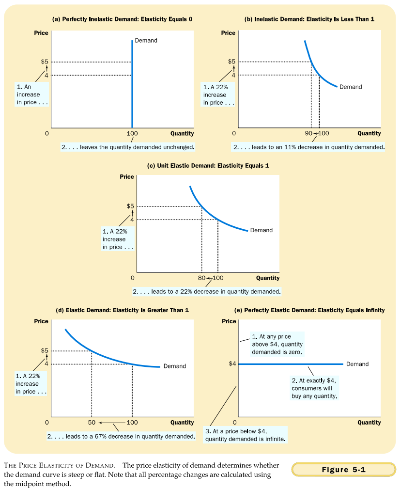
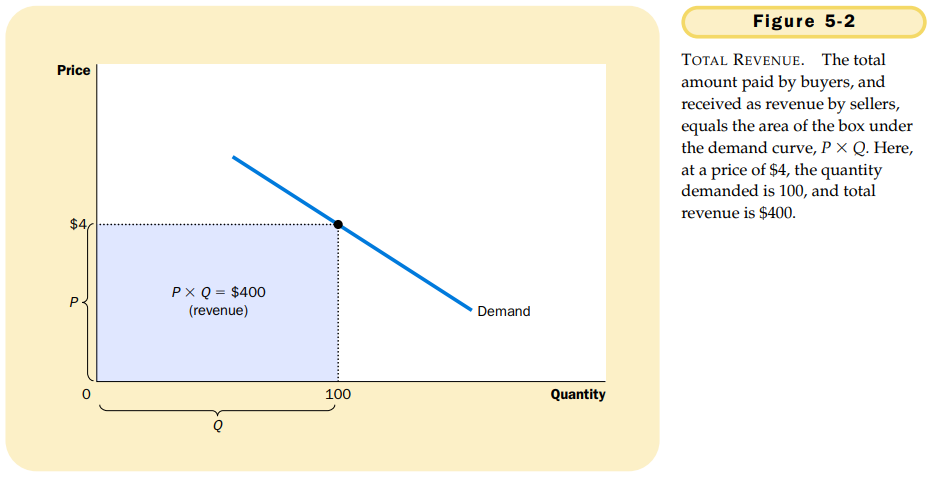
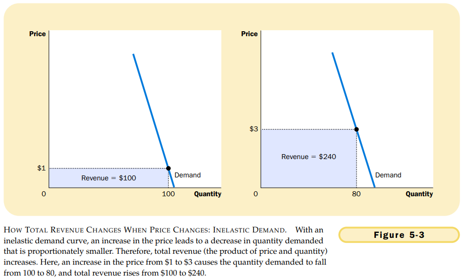
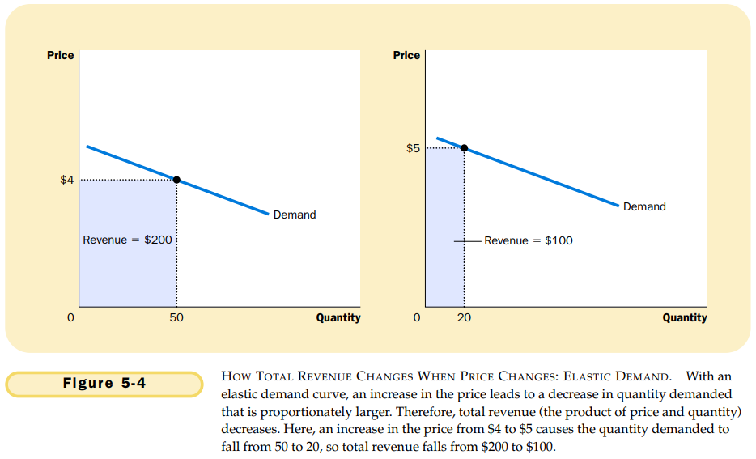

# 第五章 弹性及其应用

`需求价格弹性（price elasticity of demand）`衡量需求量对价格变动的反应程度。

决定需求价格弹性的经验法则：

- 相近替代品的可获得性。
- 必需品与奢侈品。
- 市场的定义。
- 时间范围。

经济学家用需求量变动百分比除以价格变动百分比来计算需求价格弹性，即：
$$
需求价格弹性 = \frac{需求量变动百分比}{价格变动百分比}
$$

计算$(Q_1, P_1)$和$(Q_2, P_2)$两点间需求价格弹性的中点法可以用以下公式表示：
$$
需求价格弹性 = \frac{(Q_2 - Q_1)/[(Q_2 + Q_1)/2]}{(P_2 - P_1)/[(P_2 + P_1)/2]}
$$
上面公式的分子是用中点法计算的数量变动百分比，分母是用中点法计算的价格变动百分比。

当弹性大于1，即需求量变动的比例大于价格变动的比例时，需求是**富有弹性**的。

当弹性小于1，即需求量变动的比例小于价格变动的比例时，需求是**缺乏弹性**的。

当弹性等于1，即需求量与价格同比例变动时，我们说需求具有**单位弹性**。

`总收益（total revenue）` 某种物品的买者支付从而卖者得到的量。计算公式为$P \times Q$，即一种物品的价格乘以该物品的销售量。

- 当需求缺乏弹性（价格弹性小于1）时，价格和总收益同方向变动：如果价格上升，总收益增加。
- 当需求富有弹性（价格弹性大于1）时，价格和总收益反方向变动：如果价格上升，总收益减少。
- 如果需求是单位弹性的（价格弹性正好等于1），当价格变动时，总收益保持不变。

上图说明：在价格较低而数量高的各点上，需求曲线是缺乏弹性的；在价格高而数量低的各点上，需求曲线是富有弹性的。

`需求收入弹性（income elasticity of demand）`衡量消费者收入变动时需求量如何变动。需求收入弹性用需求量变动的百分比除以收入变动的百分比来计算。即：
$$
需求收入弹性 = \frac{需求量变动百分比}{收入百年东百分比}
$$
`需求的交叉价格弹性（cross-price elasticity of demand）`衡量一种物品需求量对另外一种给物品价格变动的反应程度。需求的交叉价格弹性用物品1的需求量变动百分比除以物品2的价格变动百分比来计算。即：
$$
需求的交叉价格弹性 = \frac{物品1的需求量变动百分比}{物品2的价格变动百分比}
$$
`替代品`是指通常可以互相替代使用的物品。

`互补品`是指通常要一起使用的物品。

`供给价格弹性（price elasticity of supply）`：衡量供给量对价格变动的反应程度。
$$
供给价格弹性 = \frac{供给量变动百分比}{价格变动百分比}
$$

