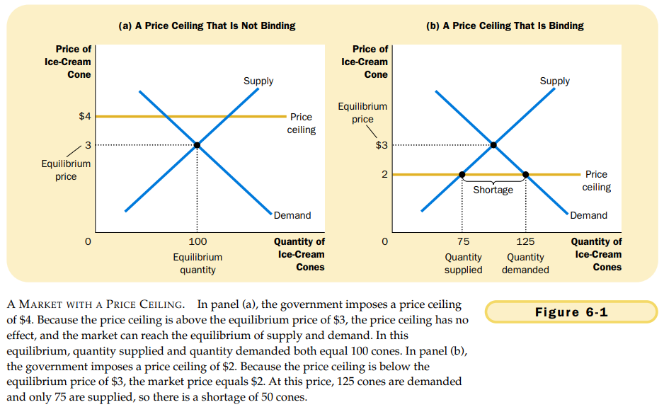
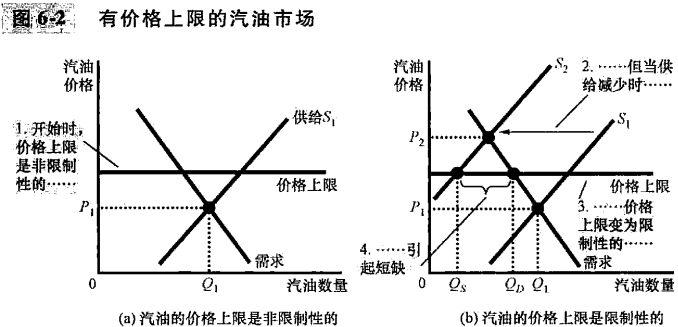
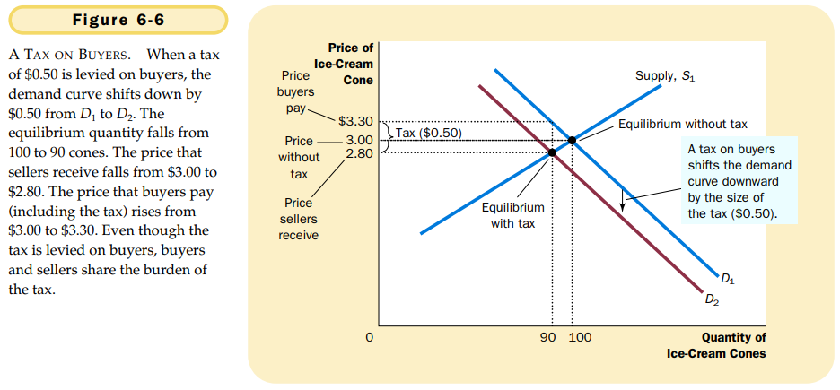
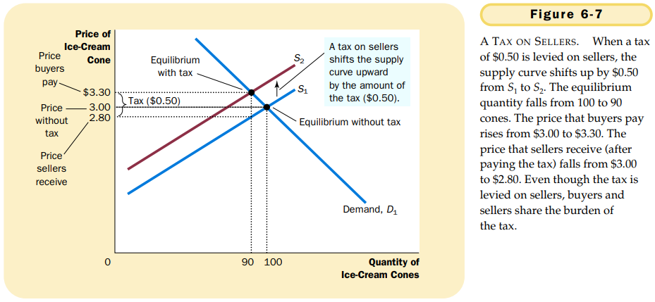
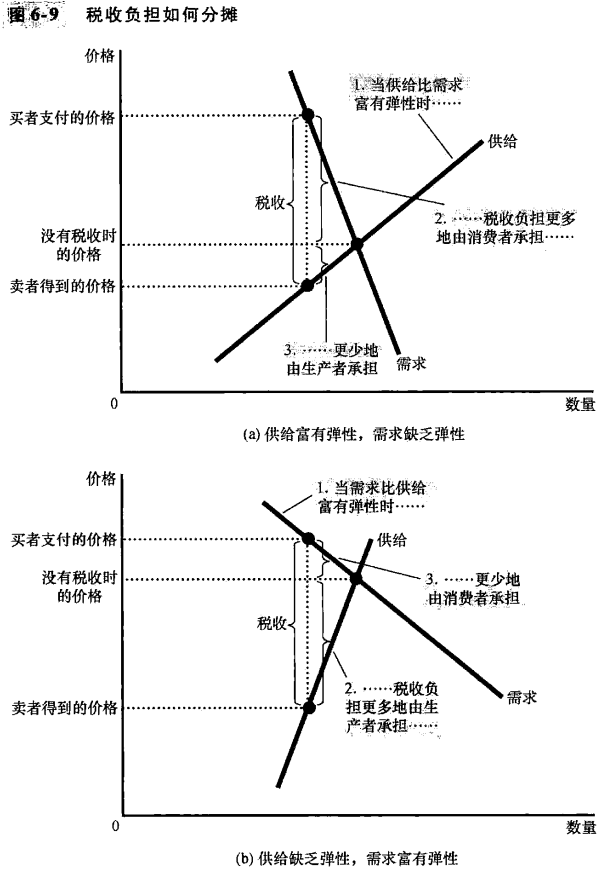

# CHAPTER 6 SUPPLY , DEMAND, AND GOVERNMENT POLICIES

`price ceiling` a legal maximum on the price at which a good can be sold.

`price floor`. a legal minimum on the price at which a good can be sold.

When the government imposes a binding price ceiling on a competitive market, a shortage of the good arises, and sellers must ration the scarce goods among the large number of potential buyers.

`tax incidence`. the study of who bears the burden of taxation.

- Taxes discourage market activity. When a good is taxed, the quantity of the good sold is smaller in the new equilibrium.
- Buyers and sellers share the burden of taxes. In the new equilibrium, buyers pay more for the good, and sellers receive less.

Taxes on buyers and taxes on sellers are equivalent.

Tax incidence depends on the forces of supply and demand.

A tax burden falls more heavily on the side of the market that is less elastic.

## Summary

- A price ceiling is a legal maximum on the price of a good or service. An example is rent control. If the price ceiling is below the equilibrium price, the quantity demanded exceeds the quantity supplied. Because of the resulting shortage, sellers must in some way ration the good or service among buyers.
- A price floor is a legal minimum on the price of a good or service. An example is the minimum wage. If the price floor is above the equilibrium price, the quantity supplied exceeds the quantity demanded. Because of the resulting surplus, buyers' demands for the good or service must in some way be rationed among sellers.
- When the government levies a tax on a good, the equilibrium quantity of the good falls. That is, a tax on a market shrinks the size of the market.
- A tax on a good places a wedge between the price paid by buyers and the price received by sellers. When the market moves to the new equilibrium, buyers pay more for the good and sellers receive less for it. In this sense, buyers and sellers share the tax burden. The incidence of a tax does not depend on whether the tax is levied on buyers or sellers.
- The incidence of a tax depends on the price elasticities of supply and demand. The burden tends to fall on the side of the market that is less elastic because that side of the market can respond less easily to the tax by changing the quantity bought 
