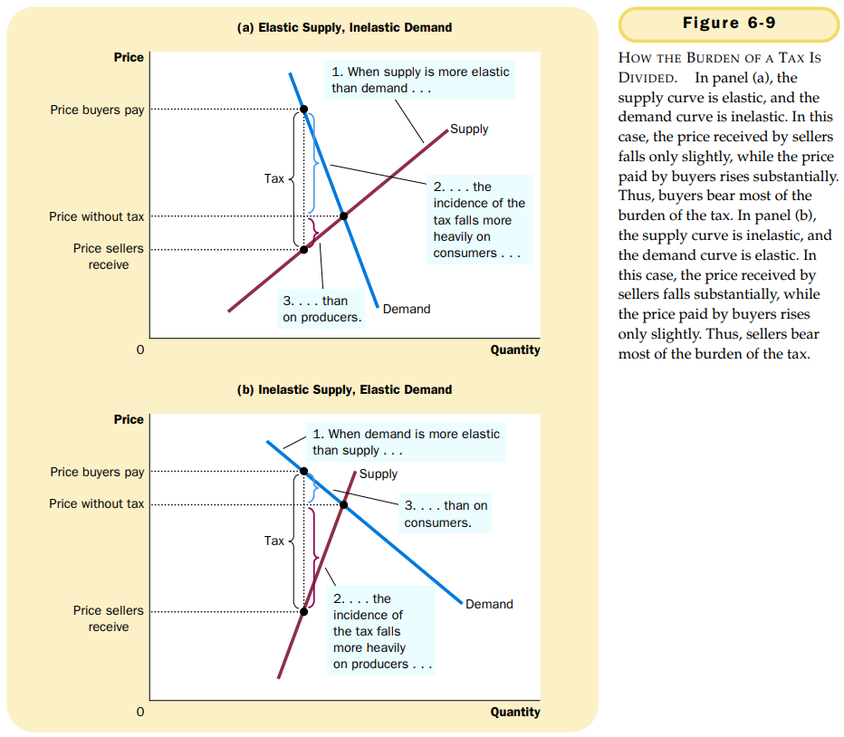

# 第六章 供给，需求与政府政策

## 6.1 价格控制

`价格上限（price ceiling）`法定最高价格。

`价格下限（price floor）`法定最低价格。

### 6.1.1 价格上限如何影响市场结果

当政府对竞争市场实行限制性价格上限时，就产生了物品的短缺，而且，卖者必须在大量潜在买者中配给稀缺物品。

### 6.1.2 价格下限如何影响市场结果

限制性价格下限引起了过剩。

### 6.1.3 对价格控制的评价

## 6.2 税收

`税收归宿（tax incidence）`指税收负担如何在组成市场的不同人之间分配。

### 6.2.1 向卖者征税如何影响市场结果

- 税收抑制了市场活动。当对一种物品征税时，该物品在新均衡时的销售量减少了。
- 买者与卖者分摊了税收负担。在新均衡时，买者为该物品支付的更多了，而卖者得到的更少了。

### 6.2.2 向买者征税如何影响市场结果

对买者征税和对卖者征税是相同的。

税收归宿取决于供给和需求的力量。

### 6.2.3 弹性与税收归宿

税收负担更多地落在缺乏弹性的市场一方身上。

## 6.3 结论

- 价格上限是某种物品与服务的法定最高价格。
- 价格下限是某种物品或服务的法定最低价格。
- 当政府对一种物品征收税收时，改物品的均衡数量减少。
- 对一种物品的征税是在买者支付的价格和卖者得到的价格之间打入一个楔子。
- 税收归宿取决于供给和需求的价格弹性。

