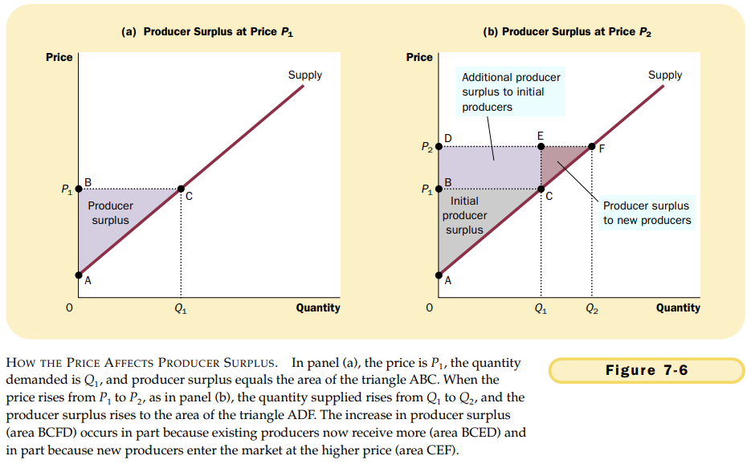

# CHAPTER 7 CONSUMERS, PRODUCERS, AND THE EFFICIENCY OF MARKETS

The equilibrium of supply and demand in a market maximizes the total benefits received by buyers and sellers.

`willingness to pay`. the maximum amount that a buyer will pay for a good.

The area below the demand curve and above the price measures the consumer surplus in a market.

`cost`. the value of everything a seller must give up to produce a good.

`producer surplus`. the amount a seller is paid for a good minus the seller's cost.

$$
\begin{equation}\begin{split}
Comsumer\ surplus &= Value\ to\ buyers - Amount\ paid\ by\ buyers \\
Producer\ surplus &= Amount\ received\ by\ sellers - Cost\ to\ sellers \\
Total\ surplus &= Value\ to\ buyers - Amount\ paid\ by\ buyers + Amount\ received\ by\ sellers - Cost\ to\ sellers \\
Total\ surplus &= Value\ to\ buyers - Cost\ to\ sellers. \\
\end{split}\end{equation}
$$

`efficiency`. the property of a resource allocation of maximizing the total surplus received by all members of society.

`equity`. the fairness of the distribution of well-being among the members of society.

1. Free markets allocate the supply of goods to the buyers who value them most highly, as measured by their willingness to pay.
2. Free markets allocate the demand for goods to the sellers who can produce them at least cost.
3. Free markets produce the quantity of goods that maximizes the sum of consumer and producer surplus.

`market failure`. the inability of some unregulated markets to allocate resources efficiently. When markets fail, public policy can potentially remedy the problem and increase economic efficiency.

## Summary

- Consuemr surplus equals buyers' willingness to pay for a good minus the amount they actually pay for it, and it measures the benefit buyers get from participating in a market. Consumer surplus can be computed by finding the area below the demand curve and above the price.
- Producer surplus equals the amount sellers receive for their goods minus their costs of production, and it measures the benefit sellers get from participating in a market. Producer surplus can be computed by finding the ares below the price and above the supply curve.
- An allocation of resources that maximizes the sum of consumer and producer surplus is said to be efficient. Policymakers are often concerned with the efficiency, as well as the equity, of economic outcomes.
- The equilibrium of supply and demand maximizes the sum of consumer and producer surplus. That is, the invisible hand of the marketplace leads buyers and sellers to allocate resources efficiently.
- Markets do not allocate resources efficiently in the presence of market failures such as market power or externalities.
