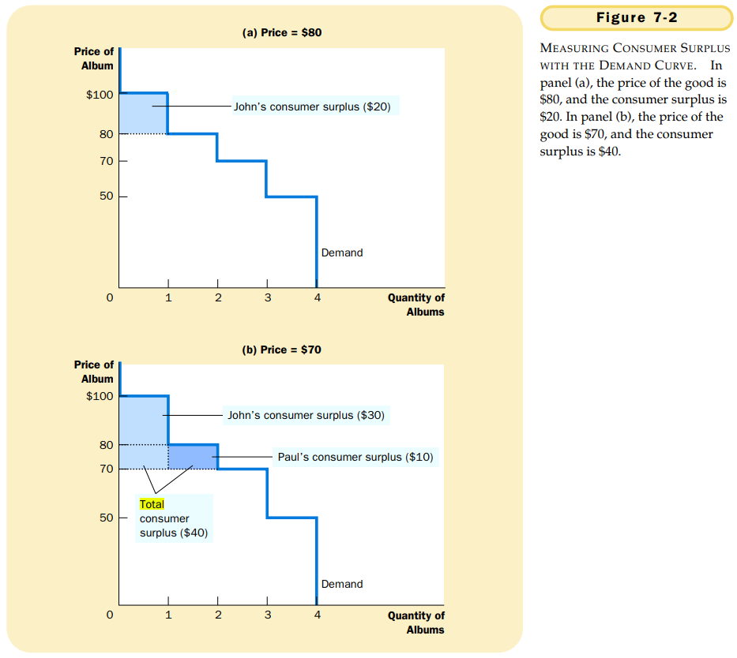
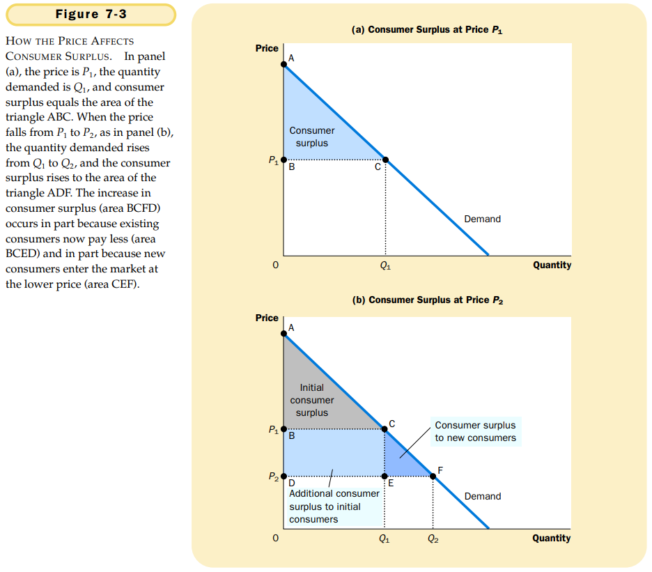
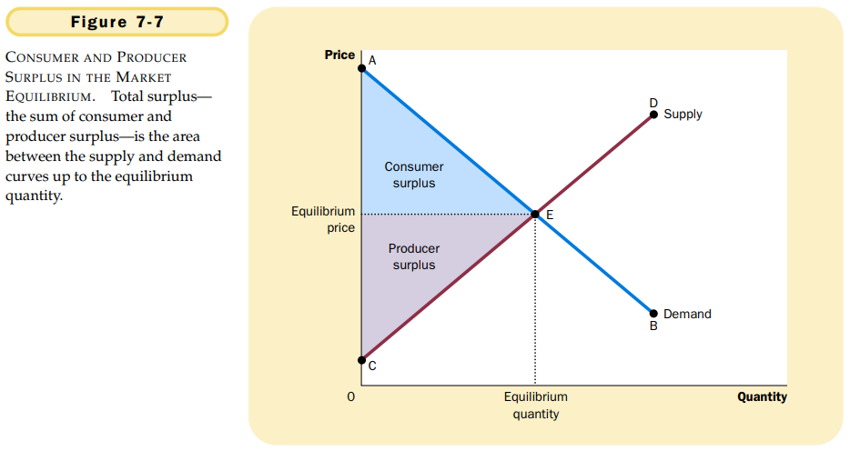
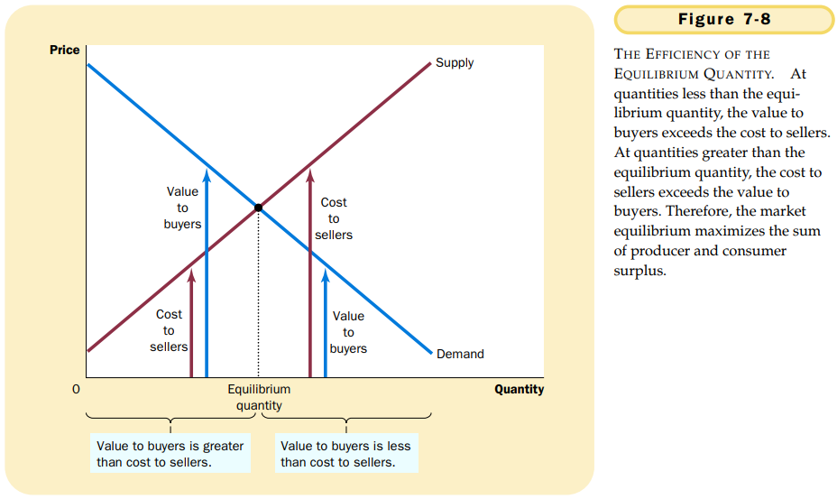

# 第七章 消费者，生产者与市场效率

市场上的供求均衡可以最大化买者与卖者得到的总利益。

每一个买者愿意支付的最高价格称为`支付意愿（willingness to pay）`，它衡量买者对物品的评价。

`消费者剩余（consumer surplus）`买者愿意为一种物品支付的量减去其为此实际支付的量。

需求曲线以下和价格以上的面积衡量一个市场上的消费者剩余。

消费者剩余，即买者原以为一种物品支付的量减去它们实际支付的量，衡量了买者从一种物品中得到的**自己感觉到**的利益。

成本：卖者为了生产一种物品而必须放弃的所有东西的价值。

`生产者剩余（producer surplus）`是卖者得到的量减去其生产成本。生产者剩余衡量卖者从参与市场中得到的利益。

价格之下和供给曲线以上的面积衡量一个市场上的生产者剩余。

$$
消费者剩余 = 买者的评价 - 买者支付的量 \\
生产者剩余 = 卖者得到的量 - 卖者的成本 \\
总剩余 = 买者的评价 - 卖者的成本
$$

效率（efficiency）：资源配置使社会所有成员得到的总剩余最大化的性质。

平等（equality）：在社会成员中平均地分配经济成果的性质。

1. 自由市场把物品的供给分配给对这些物品评价最高的买者，这种评价用买者的支付意愿来衡量。
2. 自由市场讲物品的需求分配给能够以最低成本生产这些物品的卖者。
3. 自由市场生产出使消费者剩余和生产者剩余的总和最大化的物品量。

在存在市场势力或外部性等市场失灵的情况下，市场不能有效地配置资源。

