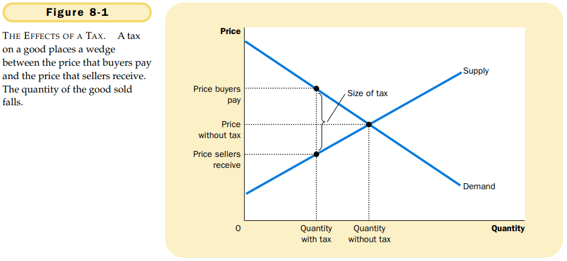
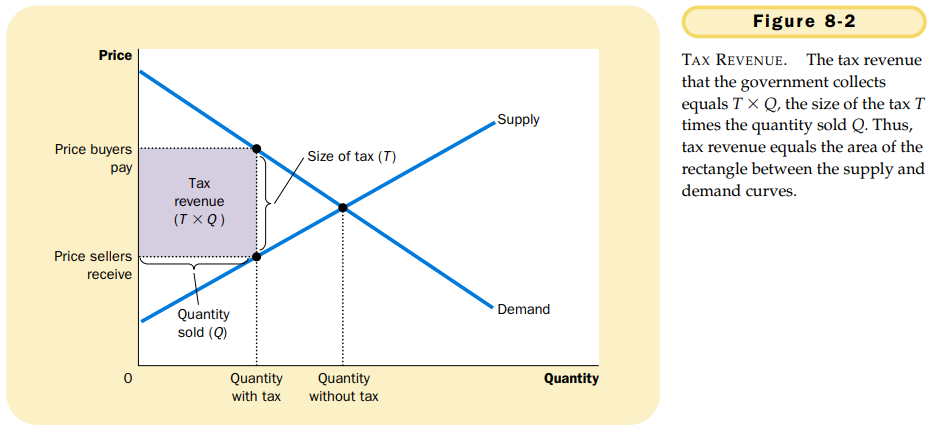
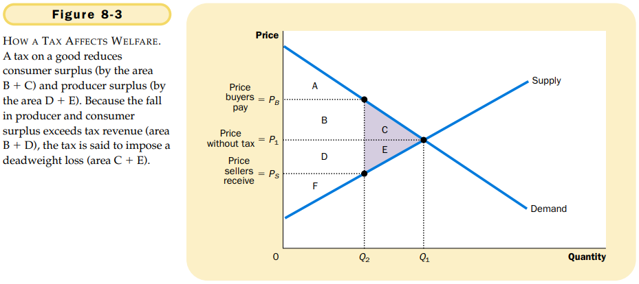

# CHAPTER 8 APPLICA TION: THE COSTS OF TAXATION

Thus, the losses to buyers and sellers from a tax exceed the revenue raised by the government.

`deadweight loss`. the fall in total surplus that results from a market distortion, such as a tax.

Taxes cause deadweight losses because they prevent buyers and sellers from realizing some of the gains from trade.

The greater the elasticities of supply and demand, the greater the deadweight loss of a tax.

## Summary

- A tax on a good reduces the welfare of buyers and sellers of the good, and the reduction in consumer and producer surplus usually exceeds the revenue raised by the government. The fall in total surplus -- the sum of consumer surplus, producer surplus, and tax revenue is called the deadweight loss of the tax.
- Taxes have deadweight losses because they cause buyers to consume less and sellers to produce less, and this change in behavior shrinks the size of the market below the level that maximizes total surplus. Because the elasticities of supply and demand measure how much market prticipants respond to market conditions, larger elasticities imply larger deadweight losses.
- As a tax grows larger, it distorts incentives more, and its deadweight loss grows larger. Tax revenue first rises with the size of a tax. Eventually, however, a larger tax reduces tax revenue becaue it reduces the size of the market.

