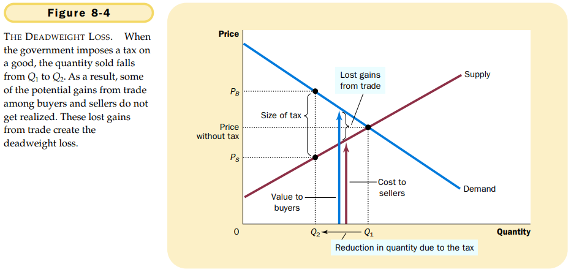
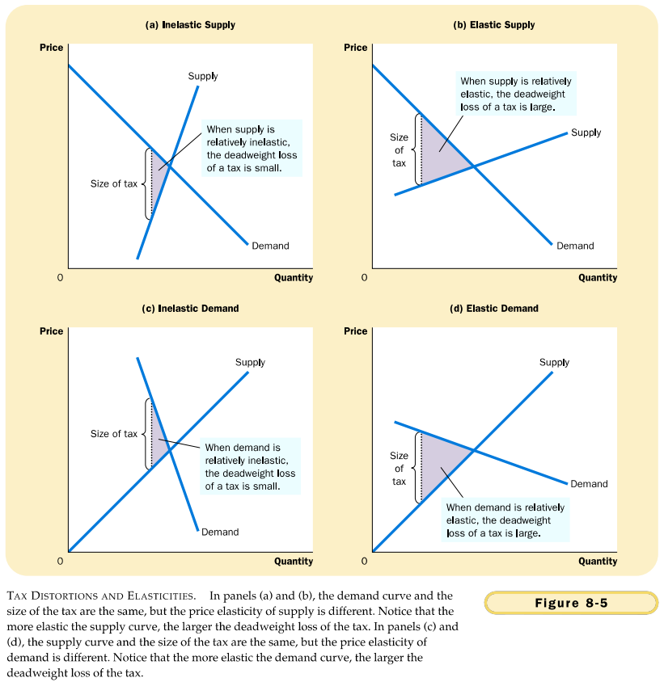

# 第8章 应用：赋税的代价

## 8.1 赋税的无谓损失

### 8.1.1 税收如何影响市场参与者

买者和卖者因税收遭受的损失大于政府筹集到的收入。

`无谓损失（deadweight loss）`市场扭曲（例如税收）引起的总剩余减少。

### 8.1.2 无谓损失与贸易的好处

税收引起无谓损失是因为它使买者和卖者不能实现某些贸易的好处。

## 8.2 决定无谓损失的因素

供给和需求的弹性越大，税收的无谓损失也就越大。

## 8.3 税收变动时的无谓损失和税收收入

## 8.4 结论

- 一种物品的税收使该物品买者与卖者的福利减少了，而且，消费者剩余和生产者剩余的减少常常超过了政府筹集到的收入。
- 税收带来无谓损失是因为它使买者少消费，使卖者少生产，而且，这种行为变动使市场规模缩小到使总剩余最大化的水平之下。
- 税收增加越多，它对激励的扭曲越大，无谓损失也就越大。

