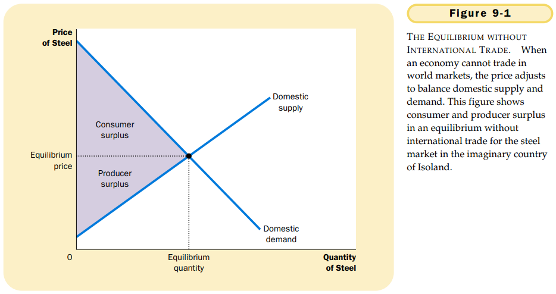
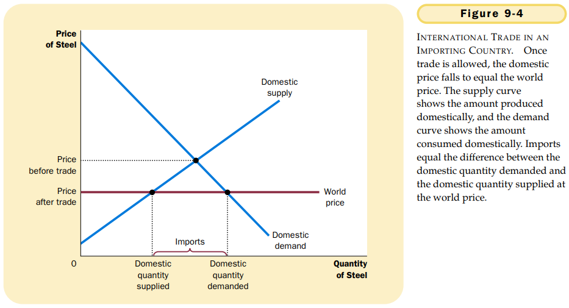

# 第9章 应用：国际贸易

`世界价格（world price）`一种物品在世界市场上通行的价格。

当一国允许贸易并成为一种物品的出口者时，国内该物品生产者的状况变好了，而国内该物品消费者的状况变坏了。

- 从赢家收益超过了输家损失的意义上说，贸易使一国的经济福利增加了。

- 当一国允许贸易并成为一种物品的进口者时，国内该物品消费者的状况变好了，而国内该物品生产者的状况变坏了。
- 从赢家收益超过了输家损失的意义上说，贸易使一国的经济福利增加了。

灌水减少了进口量，并使国内市场向没有贸易时的均衡移动。

国际贸易的其它好处：

- 增加了物品的多样性；
- 通过规模经济降低了成本；
- 增加了竞争；
- 加强了思想交流。

## 内容提要

- 通过比较没有国际贸易时的国内价格和世界价格，可以确定自由贸易的影响。
- 当一国允许贸易并成为一种物品的出口者时，该物品生产者的状况变好了，而该物品消费者的状况变坏了。当一国允许贸易并成为一种物品的进口者时，该物品消费者的状况变好了，而该物品生产者的状况变坏了。在者两种情况下，贸易的好处都大于损失。
- 关税：对进口物品征收的一种税，使市场向没有贸易时的均衡移动。