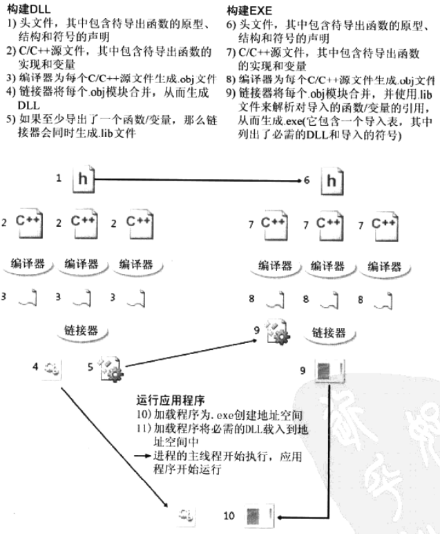

# 第19章 DLL基础

[TOC]


## 19.1 DLL和进程的地址空间


## 19.2 纵观全局



*DLL创建过程及应用程序隐式链接到DLL的过程*

### 19.2.1 构建DLL模块

```c++
// MyLib.h
#ifdef MYLIBAPI
#else
#define MYLIBAPI extern "C" __declspec(dllimport) // 优于extern "C"
#endif

MYLIBAPI int g_nResult;

MYLIBAPI int Add(int nLeft, int nRight);
```

```c++
// MyLib.cpp
#include <windows.h>
#define MYLIBAPI extern "C" __declspec(dllexport)
#include "MyLib.h"

int g_nResult;

int Add(int nLeft, int nRight) {
    g_nResult = nLeft + nRight;
    return (g_nResult);
}
```

兼容不同的编译器命名的方法：

1. 通过定义.def文件指定导出函数名

   ```def
   EXPORTS
       MyFunc
   ```

2. 在源文件中添加代码

   ```c++
   #pragma comment(linker, "/export:MyFunc=_MyFunc@8")
   ```

使用visual studio的DumpBin.exe工具来查看DLL的导出段：

```sh
C:\Work\src\wtest\dll\Debug>dumpbin.exe -exports dll.dll
Microsoft (R) COFF/PE Dumper Version 14.00.24215.1
Copyright (C) Microsoft Corporation.  All rights reserved.


Dump of file dll.dll

File Type: DLL

  Section contains the following exports for dll.dll

    00000000 characteristics
    625FBE8D time date stamp Wed Apr 20 16:04:29 2022
        0.00 version
           1 ordinal base
           2 number of functions
           2 number of names

    ordinal hint RVA      name

          1    0 000110CD Add = @ILT+200(_Add)
          2    1 00018138 g_nResult = _g_nResult

  Summary

        1000 .00cfg
        1000 .data
        1000 .gfids
        1000 .idata
        2000 .rdata
        1000 .reloc
        1000 .rsrc
        5000 .text
       10000 .textbss
```

### 19.2.2 构建可执行模块

```c++
// MyExeFile.cpp
#include <windows.h>
#include <strsafe.h>
#include <stdlib.h>

#include "MyLib\MyLib.h"

int WINAPI _tWinMain(HINSTANCE, HINSTANCE, LPTSTR, int) {
    int nLeft = 10, nRight = 25;
    TCHAR sz[100];
    StringCchPrintf(sz, _countof(sz), TEXT("%d + %d = %d"), 
                    nLeft, nRight, Add(nLeft, nRight));
    MessageBox(NULL, sz, TEXT("Calculation"), MB_OK);
    
    StringCchPrintf(sz, _countof(sz), 
                    TEXT("The result from the last Add is: %d"), g_nResult);
    MessageBox(NULL, sz, TEXT("Last Result"), MB_OK);
    return 0;
}
```

使用visual studio的DumpBin.exe工具来查看DLL的导入段：

```sh
C:\Work\src\wtest\dll\Debug>dumpbin.exe -imports dll.dll
Microsoft (R) COFF/PE Dumper Version 14.00.24215.1
Copyright (C) Microsoft Corporation.  All rights reserved.


Dump of file dll.dll

File Type: DLL

  Section contains the following imports:

    VCRUNTIME140D.dll
              1001909C Import Address Table
              10019250 Import Name Table
                     0 time date stamp
                     0 Index of first forwarder reference

                   31 __vcrt_LoadLibraryExW
                   2F __vcrt_GetModuleHandleW
                   2E __vcrt_GetModuleFileNameW
                   35 _except_handler4_common
                   48 memset
                   25 __std_type_info_destroy_list

    ucrtbased.dll
              100190E4 Import Address Table
              10019298 Import Name Table
                     0 time date stamp
                     0 Index of first forwarder reference

                  57E wcscpy_s
                  3E4 _wsplitpath_s
                  3C8 _wmakepath_s
                   8E __stdio_common_vsprintf_s
                  565 terminate
                   CA _cexit
                   E7 _crt_at_quick_exit
                   E8 _crt_atexit
                  10C _execute_onexit_table
                  2E1 _register_onexit_function
                  197 _initialize_onexit_table
                  196 _initialize_narrow_environment
                   DC _configure_narrow_argv
                  2ED _seh_filter_dll
                  19A _initterm_e
                  199 _initterm
                   15 _CrtDbgReportW
                   14 _CrtDbgReport

    KERNEL32.dll
              10019000 Import Address Table
              100191B4 Import Name Table
                     0 time date stamp
                     0 Index of first forwarder reference

                  113 DisableThreadLibraryCalls
                  2D6 GetSystemTimeAsFileTime
                  20E GetCurrentThreadId
                  20A GetCurrentProcessId
                  42D QueryPerformanceCounter
                  367 IsDebuggerPresent
                  561 TerminateProcess
                  209 GetCurrentProcess
                  29D GetProcAddress
                  19E FreeLibrary
                  5A3 VirtualQuery
                  2A2 GetProcessHeap
                  333 HeapFree
                  32F HeapAlloc
                  250 GetLastError
                  5CD WideCharToMultiByte
                  3D1 MultiByteToWideChar
                  440 RaiseException
                  267 GetModuleHandleW
                  36D IsProcessorFeaturePresent
                  2BE GetStartupInfoW
                  543 SetUnhandledExceptionFilter
                  582 UnhandledExceptionFilter
                  34B InitializeSListHead

  Summary

        1000 .00cfg
        1000 .data
        1000 .gfids
        1000 .idata
        2000 .rdata
        1000 .reloc
        1000 .rsrc
        5000 .text
       10000 .textbss
```

### 19.2.3 运行可执行模块

加载程序的搜索顺序：

1. 包含可执行文件的目录；
2. Windows的系统目录，该目录可以通过GetSystemDirectory得到；
3. 16位的系统目录，即Windows目录中的System子目录；
4. Windows目录，该目录可以通过GetWindowsDirectory得到；
5. 进程的当前目录；
6. PATH环境变量中所列出的目录。
