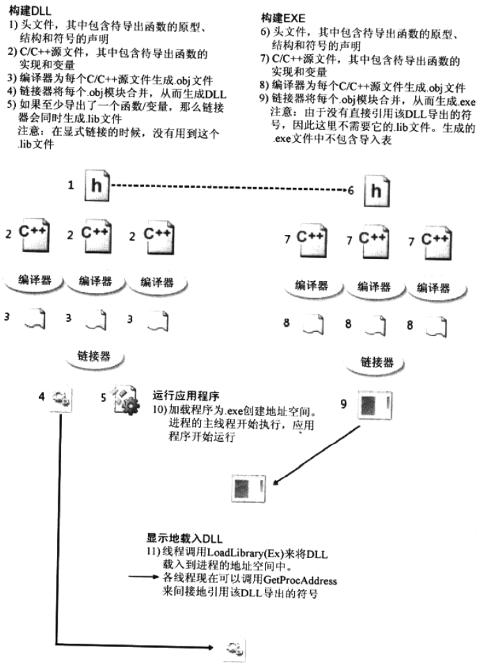
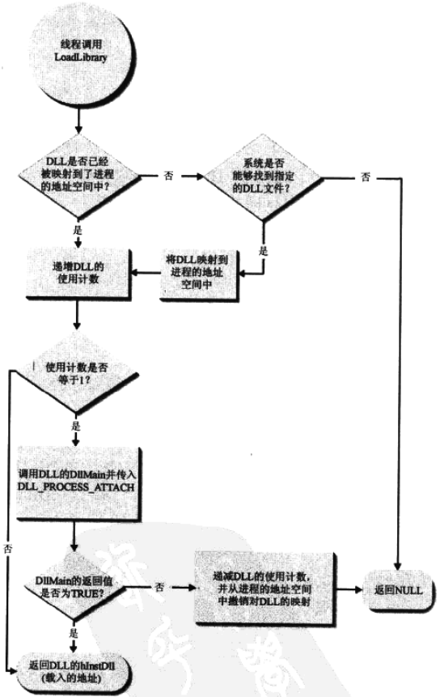

# 第20章 DLL高级技术

[TOC]


## 20.1 DLL模块的显式载入和符号链接



*DLL的创建过程以及应用程序显式链接到DLL的过程*

### 20.1.1 显式地载入DLL模块

```c++
HMODULE LoadLibrary(PCTSTR pszDLLPathName);
HMODULE LoadLibraryEx(
	PCTSTR pszDLLPathName,
	HANDLE hFile,
	DWORD dwFlags);
```

- `pszDLLPathName` dll文件路径

- `hFile`

- `dwFlags`标志

  - `DONT_RESOLVE_DLL_REFERENCES` 只需将DLL映射到调用进程的地址空间，而不调用DllMain；

  - `LOAD_LIBRARY_AS_DATAFILE` 将DLL作为数据文件映射到进程的地址空间中，而不会花费额外的时间来准备执行文件中的任何代码。

  - `LOAD_LIBRARY_AS_DATAFILE_EXCLUSIVE` 以当前进程**独占访问模式**将DLL作为数据文件映射到进程的地址空间中，而不会花费额外的时间来准备执行文件中的任何代码。

  - `LOAD_LIBRARY_AS_IMAGE_RESOURCE` 将DLL作为数据文件映射到进程的地址空间中，并对相对虚拟地址（relative virtual address, RVA）进行修复，而不会花费额外的时间来准备执行文件中的任何代码。

  - `LOAD_WITH_ALTERED_SEARCH_PATH` 使用三种算法来搜索文件：

    1. `pszDLLPathName`不包括`\`字符

       使用**标准搜索路径**来对DLL进行搜索。

    2. `pszDLLPathName`包含`\`字符

       - 传入的参数是全路径或网络共享路径

         试图直接载入DLL文件，当文件不存在时，直接返回NULL。

       - 传入的是其它参数

         将下列文件夹与`pszDLLPathName`连接起来：

         1. 进程的当前目录；
         2. Windows的系统目录；
         3. 16位Windows系统目录（即Windows目录下的System子目录）；
         4. Windows目录；
         5. PATH环境变量中列出的目录。

         如果`pszDLLPathName`参数中出现`.`或`..`，那么在搜索过程中的每一个步骤都会将他们考虑在内来构建一个相对路径。

    3. 从一个中所周知的路文件夹中动态载入DLL

       1. 进程的当前目录；
       2. Windows的系统目录；
       3. 16位Windows系统目录（即Windows目录下的System子目录）；
       4. Windows目录；
       5. PATH环境变量中列出的目录。

  - `LOAD_IGNORE_CODE_AUTHZ_LEVEL` 关闭WinSafer(Software Restriction Policies或Safer)所提供的验证，对代码在执行过程中可以拥有的特权加以控制。

- `返回值` 文件映像被映射到的虚拟内存地址。

将一个DLL映射到进程的地址空间中。

### 20.1.2 显式地卸载DLL模块

```c++
BOOL FreeLibrary(HMODULE hInstDll);
```

- `hInstDll`想要卸载的DLL

显式地将DLL从进程的地址空间中卸载。

```c++
VOID FreeLibraryAndExitThread(HMODULE hInstDll, DWORD dwExitCode);
```

- `hInstDll`想要卸载的DLL
- `dwExitCode`想要终止的线程

显式地将DLL从进程的地址空间中卸载，并终止线程；等效于分别调用`FreeLibrary`和`ExitThread`，但是在多线程环境下更加安全。

```c++
HMODULE GetModuleHandle(PCTSTR pszModuleName);
```

- `pszModuleName` DLL文件名

检测一个DLL是否已经被映射到了进程的地址空间中。

```c++
DWORD GetModuleFileName(HMODULE hInstModule, PTSTR pszPathName, DWORD cchPath);
```

- `hInstModule` DLL的HMODULE
- `pszPathName` 缓存地址，用于保存文件映像的全路径
- `cchPath` 缓存大小

获得DLL的全路径。

### 20.1.3 显式地链接到导出符号

```c++
FARPROC GetProcAddress(HMODULE hInstDll, PCSTR pszSymbolName);
```

- `hInstDll` 包含符号的DLL的句柄
- `pszSymbolName` 符号名/序号

返回它想要引用的符号的地址。


## 20.2 DLL的入口点函数

```c++
BOOL WINAPI DllMain(HINSTANCE hInstDll, DWORD fdwReason, PVOID fImpLoad) {
    switch (fdwReason) {
        case DLL_PROCESS_ATTACH:
            // The DLL is beging mapped into the process' address space.
            break;
        case DLL_PROCESS_ATTACH:
            // A thread is begin created.
            break;
        case DLL_PROCESS_ATTACH:
            // A thread is exiting cleanly.
            break;
        case DLL_PROCESS_ATTACH:
            // The DLL is being unmapped from the process' address space.
            break;
    }
    return (TRUE); // Used only for DLL_PROCESS_ATTACH
}
```

- `hInstDll` DLL实例的句柄
- `fdwReason` 系统调用入口点函数的原因
  - `DLL_PROCESS_ATTACH` DLL文件第一次被映射时，需要进行初始化；
  - `DLL_PROCESS_DETACH` DLL从进程的地址空间中撤销映射时，执行与进程相关的清理工作；
  - `DLL_THREAD_ATTACH` 当进程创建一个线程的时候，让新线程开始执行它的线程函数；
  - `DLL_THREAD_DETACH` 即将终止的线程来调用所有已映射DLL的DllMain函数，告诉DLL执行与线程相关的清理。
- `fImpLoad` 

DLL入口点函数。

### 20.2.1 DLL_PROCESS_ATTACH通知

当系统第一次将一个DLL映射到进程的地址空间中时，会调用DllMain函数，并在fdwReason参数中传入DLL_PROCESS_ATTACH。只有当DLL的文件映像第一次被映射的时候，才会这样。

### 20.2.2 DLL_PROCESS_DETACH通知

当系统将一个DLL从进程的地址空间中撤销映射时，会调用DLL的DllMain函数，并在fdwReason参数中传入DLL_PROCESS_DETACH。当DLL处理这个通知的时候，应该执行与进程相关的清理工作。



*线程调用LoadLibrary时系统执行的步骤*


*线程调用FreeLibrary时系统执行的步骤*

**注意：如果进程终止是因为系统中的某个线程调用了`TerminateProcess`，系统便不会用`DLL_PROCESS_DETACH`来调用DLL的DllMain函数。这意味着在进程终止之前，已映射到进程的地址空间中的任何DLL将没有机会执行任何清理代码。这可能会导致数据丢失。因此，除非万不得已，我们应该避免使用`TerminateProcess`函数。**

### 20.2.3  DLL_THREAD_ATTACH通知

当进程创建一个线程的时候，系统会检查当前映射到该进程的地址空间中的所有DLL文件映像，并用DLL_THREAD_ATTACH来调用每个DLL的DllMain函数。这告诉DLL需要执行与线程相关的初始化。新创建的线程负责执行所有DLL的DllMain函数中的代码。只有当所有DLL都完成了对该通知的处理之后，系统才会让新线程开始执行它的线程函数。

### 20.2.4 DLL_THREAD_DETACH通知

让线程终止的首选方式是让它的线程函数返回。这会使得系统调用ExitThread来终止线程。ExitThread告诉系统该线程想要终止，但系统不会立即终止该线程，而会让这个即将终止的线程用DLL_THREAD_DETACh来调用所有已映射DLL的DllMain函数。这个通知告诉DLL执行与线程相关的清理。

### 20.2.5 DllMain的序列化调用

```c++
BOOL DisableThreadLibraryCalls(HMODULE hInstDll);
```

不让系统向某个指定DLL的DllMain函数发送`DLL_THREAD_ATTACH`和`DLL_THREAD_DETACH`通知。

### 20.2.6 DllMain和C/C++运行库


## 20.3 延迟载入DLL

适用场景：

- 当应用程序使用了多个DLL，那么它的初始化会比较慢，因为加载程序要将所有必须的DLL映射到进程的地址空间中；延迟载入DLL可以将DLL的载入过程延伸到进程的执行过程中。
- 在不同版本的windows下运行程序，在缺少某些函数的版本下，通过延迟载入的方式及时弹出错误提示框。

缺陷：

- 一个导出了字段的DLL是无法延迟载入的；
- Kernel32.dll模块是无法延迟载入的，这是因为必须载入该模块才能调用LoadLibrary和GetProcAddress；
- 不应该在DllMain入口点函数中调用一个延迟载入的函数，因为这样可能会导致程序崩溃。

通过设置VisualStudio `配置属性\链接器\输入\延迟加载的DLL` 的属性页来延迟加载dll。

```c++
// DelayLoadApp.cpp
#include "..\CommonFiles\CmnHdr.h"
#include <Windowsx.h>
#include <tchar.h>
#include <StrSafe.h>

#include <Delayimp.h>
#include "..\20-DelayLoadLib\DelayLoadLib.h"

#pragma comment(lib, "Delayimp.lib")

TCHAR g_szDelayLoadModuleName[] = TEXT("20-DelayLoadLib");

LONG WINAPI DelayLoadDllExceptionFilter(PEXCEPTION_POINTERS pep);

void IsModuleLoaded(PCTSTR pszModuleName) {
    HMODULE hmod = GetModuleHandle(pszModuleName);
    char sz[100];
#ifdef UNICODE
    StringCchPrintfA(sz, _countof(sz), "Module \"%S\" is %Sloaded.", 
                     pszModuleName, (hmod == NULL) ? "not " : L"");
#else
    StringCchPrintfA(sz, _countof(sz), "Module \"%s\" is %sloaded.", 
                     pszModuleName, (hmod == NULL) ? "not " : "");
#endif
    chMB(sz);
}

int WINAPI _tWinMain(HINSTANCE hInstExe, HINSTANCE, PTSTR pszCmdLine, int) {
    __try{
        int x = 0;
        
        IsModuleLoaded(g_szDelayLoadModuleName);
        x = fnLib();
        IsModuleLoaded(g_szDelayLoadModuleName);
        x = fnLib2();
        __FUnloadDelayLoadedDLL2("20-DelayLoadLib.dll");
        IsModuleLoaded(g_szDelayLoadModuleName);
        x = fnLib();
        IsModuleLoaded(g_szDelayLoadModuleName);
    } __except (DelayLoadDllExceptionFilter(GetExceptionInformation())) {
        // Nothing to do in here, thread continues to run normally
    }
    
    // More code can go here...
    return (0);
}

LONG WINAPI DelayLoadDllExceptionFilter(PEXCEPTION_POINTERS pep) {
    LONG lDisposition = EXCEPTION_EXECUTE_HANDLER;
    PDelayLoadInfo pdli = 
        PDelayLoadInfo(pep->ExceptionRecord->ExceptionInformation[0]);
    char sz[500] = {0};
    switch (pep->ExceptionRecord->ExceptionCode) {
        case VcppException(ERROR_SEVERITY_ERROR, ERROR_MOD_NOT_FOUND):
            StringCchPrintfA(sz, _countof(sz), "Dll not found: $s", pdli->szDll);
            break;
        case VcppException(ERROR_SEVERITY_ERROR, ERROR_PROC_NOT_FOUND):
            if (pdli->dlp.fImportByName) {
                StringCchPrintfA(sz, _countof(sz), 
                                 "Function %s was not found in %s", 
                                 pdli->dlp.szProcName, pdli->szDll);
            } else {
                StringCchPrintfA(sz, _countof(sz), 
                                 "Function ordinal %d was not found in %s", 
                                 pdli->dlp.dwOrdinal, pdli->szDll);
            }
            break;
        default:
            lDisposition = EXCEPTION_CONTINUE_SEARCH;
            break;
    }
    
    if (lDisposition == EXCEPTION_EXECUTE_HANDLER) {
        chMB(sz);
    }
}

FARPROC WINAPI DliHook(unsigned dliNotify, PDelayLoadInfo pdli) {
    FARPROC fp = NULL;
    switch (dliNotify) {
        case dliStartProcessing:
            break;
        case dliNotePreLoadLibrary:
            fp = (FARPROC)(HMODULE)NULL;
            break;
        case dliFailLoadLib:
            fp = (FARPROC)(HMODULE)NULL;
            break;
        case dliNotePreGetProcAddress:
            fp = (FARPROC)NULL;
            break;
        case dliFailGetProc:
            fp = (FARPROC)NULL;
            break;
        case dliNoteEndProcessing:
            break;
    }
    return (fp);
}

PfnDliHook __pfnDliNotifyHook2 = DliHook;
PfnDliHook __pfnDliFailureHook2 = DliHook;
```

```c++
// DelayLoadLib.cpp
#include "..\CommonFiles\CmnHdr.h"
#include <Windowsx.h>
#include <tchar.h>

#define DELAYLOADLIBAPI extern "C" __declspec(dllexport)
#include "DelayLoadLib.h"

int fnLib() {
    return(321);
}

int fnLib2() {
    return (123);
}
```

```c++
// DelayLoadLib.h
#ifndef DELAYLOADLIBAPI
#define DELAYLOADLIBAPI extern "C" __declspec(dllimport)
#endif

DELAYLOADLIBAPI int fnLib();
DELAYLOADLIBAPI int fnLib2();
```


## 20.4 函数转发器

`函数转发器(function forwarder)`是DLL输出段中的一个条目，用来将一个函数调用转发到另一个DLL中的另一个函数。


## 20.5 已知的DLL

系统对某些DLL进行了特殊处理，这些DLL被称为`已知的DLL(known DLL)`；操作系统在载入它们时总在同一个目录中查找；注册表中的注册表项：`HKEY_LOCAL_MACHINE\SYSTEM\CurrentControlSet\Control\Session Manager\KnownDLLs`记录了已知DLL的信息。


## 20.6 DLL重定向

自Windows2000开始新增了一项DLL重定向特性，这项特性强制操作系统的加载程序首先从应用程序的目录中载入模块，只有当加载程序无法找到要找的文件时，才会在其它的目录中搜索。


## 20.7 模块的基地址重定位

每个可执行文件和DLL模块都有一个`首选基地址(preferred base address)`，它标识在将模块映射到进程的地址空间中时的最佳内存地址。当我们在构建一个可执行模块的时候，链接器会将模块的首选基地址设为`0x00400000`。对DLL模块来说，链接器会将首选基地址设为`0x10000000`。

使用vs的dumpbin工具查看文件映像的首选基地址：

```sh
C:\Program Files (x86)\Microsoft Visual Studio 14.0\VC\bin>dumpbin.exe /headers dumpbin.exe
Microsoft (R) COFF/PE Dumper Version 14.00.24215.1
Copyright (C) Microsoft Corporation.  All rights reserved.


Dump of file dumpbin.exe

PE signature found

File Type: EXECUTABLE IMAGE

FILE HEADER VALUES
             14C machine (x86)
               6 number of sections
        575A4F60 time date stamp Fri Jun 10 13:25:52 2016
               0 file pointer to symbol table
               0 number of symbols
              E0 size of optional header
             122 characteristics
                   Executable
                   Application can handle large (>2GB) addresses
                   32 bit word machine

OPTIONAL HEADER VALUES
             10B magic # (PE32)
           14.00 linker version
            1200 size of code
            1600 size of initialized data
               0 size of uninitialized data
            17C3 entry point (004017C3)
            1000 base of code
            3000 base of data
          400000 image base (00400000 to 00407FFF)
            1000 section alignment
             200 file alignment
            6.00 operating system version
           10.00 image version
            6.00 subsystem version
               0 Win32 version
            8000 size of image
             400 size of headers
            F1B6 checksum
               3 subsystem (Windows CUI)
            8140 DLL characteristics
                   Dynamic base
                   NX compatible
                   Terminal Server Aware
          100000 size of stack reserve
            2000 size of stack commit
          100000 size of heap reserve
            1000 size of heap commit
               0 loader flags
              10 number of directories
               0 [       0] RVA [size] of Export Directory
            40E0 [      C8] RVA [size] of Import Directory
            6000 [     6FC] RVA [size] of Resource Directory
               0 [       0] RVA [size] of Exception Directory
            2C00 [    3EA0] RVA [size] of Certificates Directory
            7000 [     168] RVA [size] of Base Relocation Directory
            10E0 [      38] RVA [size] of Debug Directory
               0 [       0] RVA [size] of Architecture Directory
               0 [       0] RVA [size] of Global Pointer Directory
               0 [       0] RVA [size] of Thread Storage Directory
            1118 [      40] RVA [size] of Load Configuration Directory
               0 [       0] RVA [size] of Bound Import Directory
            4000 [      DC] RVA [size] of Import Address Table Directory
               0 [       0] RVA [size] of Delay Import Directory
               0 [       0] RVA [size] of COM Descriptor Directory
               0 [       0] RVA [size] of Reserved Directory


SECTION HEADER #1
   .text name
    11AC virtual size
    1000 virtual address (00401000 to 004021AB)
    1200 size of raw data
     400 file pointer to raw data (00000400 to 000015FF)
       0 file pointer to relocation table
       0 file pointer to line numbers
       0 number of relocations
       0 number of line numbers
60000020 flags
         Code
         Execute Read

  Debug Directories

        Time Type        Size      RVA  Pointer
    -------- ------- -------- -------- --------
    575A4F60 cv            24 00001184      584    Format: RSDS, {7102060B-2668-44DB-ABAD-6F13FF42FB3B}, 2, dumpbin.pdb
    575A4F60 coffgrp      27C 000011A8      5A8    4C544347 (LTCG)

SECTION HEADER #2
   .data name
     398 virtual size
    3000 virtual address (00403000 to 00403397)
     200 size of raw data
    1600 file pointer to raw data (00001600 to 000017FF)
       0 file pointer to relocation table
       0 file pointer to line numbers
       0 number of relocations
       0 number of line numbers
C0000040 flags
         Initialized Data
         Read Write

SECTION HEADER #3
  .idata name
     714 virtual size
    4000 virtual address (00404000 to 00404713)
     800 size of raw data
    1800 file pointer to raw data (00001800 to 00001FFF)
       0 file pointer to relocation table
       0 file pointer to line numbers
       0 number of relocations
       0 number of line numbers
40000040 flags
         Initialized Data
         Read Only

SECTION HEADER #4
  .gfids name
      24 virtual size
    5000 virtual address (00405000 to 00405023)
     200 size of raw data
    2000 file pointer to raw data (00002000 to 000021FF)
       0 file pointer to relocation table
       0 file pointer to line numbers
       0 number of relocations
       0 number of line numbers
40000040 flags
         Initialized Data
         Read Only

SECTION HEADER #5
   .rsrc name
     6FC virtual size
    6000 virtual address (00406000 to 004066FB)
     800 size of raw data
    2200 file pointer to raw data (00002200 to 000029FF)
       0 file pointer to relocation table
       0 file pointer to line numbers
       0 number of relocations
       0 number of line numbers
40000040 flags
         Initialized Data
         Read Only

SECTION HEADER #6
  .reloc name
     168 virtual size
    7000 virtual address (00407000 to 00407167)
     200 size of raw data
    2A00 file pointer to raw data (00002A00 to 00002BFF)
       0 file pointer to relocation table
       0 file pointer to line numbers
       0 number of relocations
       0 number of line numbers
42000040 flags
         Initialized Data
         Discardable
         Read Only

  Summary

        1000 .data
        1000 .gfids
        1000 .idata
        1000 .reloc
        1000 .rsrc
        2000 .text
```

当一个模块无法被载入到它的首选基地址时，存在以下两个缺点：

- 加载程序必须遍历重定位段并修改模块中大量的代码。这个过程不仅是一大性能杀手，而且也确实会损害应用程序的初始化时间；
- 当加载程序写入到模块的代码页面中时，系统的写时复制机制会强制这些页面以系统的页交换文件为后备存储器。

**注意：为了减少地址空间碎片，我们应该总是先从高内存地址开始载入DLL，然后再到低内存地址。**

```c++
BOOL ReBaseImage(
	PCSTR CurrentImageName,
	PCSTR SymbolPath,
	BOOL bRebase,
	BOOL bRebaseSysFileOk,
	BOOL bGoingDown,
	ULONG CheckImageSize,
	ULONG* pOldImageSize,
	ULONG* pOldImageBase,
	ULONG* pNewImageSize,
	ULONG* pNewImageBase,
	ULONG TimeStamp);
```

用于实现Rebase工具的功能。

执行Rebase工具的时候传给它一组映像文件名，它会执行下列操作：

1. 模拟创建一个进程地址空间；
2. 打开应该被载入到这个地址空间中的所有模块，并得到每个模块的大小以及它们的首选基地址；
3. 在模拟的地址空间中对模块重定位的过程进行模拟，使各模块之间没有交叠；
4. 对每个重定位过的模块，它会解析该模块的重定位段，并修改模块在磁盘文件中的代码；
5. 为了反映新的首选基地址，它会更新每个重定位过的模块的文件头。


## 20.8 模块的绑定

```c++
BOOL BindImageEx(
	DWORD dwFlags,
	PCSTR pszImageName,
	PCSTR pszDllPath,
	PCSTR pszSymbolPath,
	PIMAGEHLP_STATUS_ROUTINE pfnStatusRoutine);
```

- `dwFlags`

- `pszImageName`

- `pszDllPath`

- `pszSymbolPath`

- `pfnStatusRoutine` 回调函数，定义如下：

  ```c++
  BOOL WINAPI StatusRoutine(
  	IMAGEHLP_STATUS_REASON Reason,
  	PCSTR pszImageName,
  	PCSTR pszDllName,
  	ULONG_PTR VA,
  	ULONG_PTR Parameter);
  ```

在执行Bind工具的时候传给它一个映像文件名，它会执行下列操作：

1. 打开指定的映像文件的导入段；
2. 对导入段中列出的每个DLL，它会查看该DLL文件的文件头，来确定该DLL的首选基地址；
3. 在DLL的导出段中查看每个符号；
4. 取得符号的RVA，并将它与模块的首选基地址相加；将计算得到的地址，也就是导入符号预期的虚拟地址，写入到映像文件的导入段中；
5. 在映像文件的导入段中添加一些额外的信息，这些信息包括映像文件被绑定到的各DLL模块的名称，以及各模块的时间戳。

