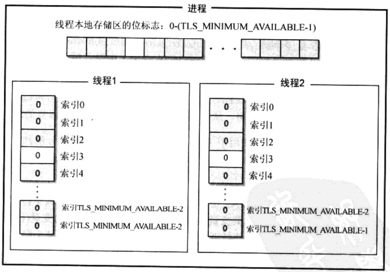

# 第21章 线程局部存储区

[TOC]


## 21.1 动态TLS



*用来管理TLS的内部数据结构*

```c++
DWORD TlsAlloc();
```

让系统对进程中的位标志进行检索并找到一个FREE标志，然后系统会将该标志从FREE改为INUSE并让TlsAlloc返回该标志在位数组中的索引。如果TlsAlloc无法在列表中找到一个FREE标志，那么它会返回`TLS_OUT_OF_INDEXES`(在WinBase.h中被定义为0xFFFFFFFF)。

```c++
BOOL TlsSetValue(DWORD dwTlsIndex, PVOID pvTlsValue);
```

- `dwTlsIndex` 索引
- `pvTlsValue` 值

把一个PVOID值放到线程的数组中，指定索引的位置。

```c++
PVOID TlsGetValue(DWORD dwTlsIndex);
```

- `dwTlsIndex` 索引

根据索引从线程的数组中取回一个值。

```c++
BOOL TlsFree(DWORD dwTlsIndex);
```

- `dwTlsIndex` 索引

释放一个已经预订的TLS元素。

使用动态TLS示例：

```c++
DWORD g_dwTlsIndex;
...
void MyFunction(PSOMESTRUCT pSomeStruct) {
    if (pSomeStruct != NULL) {
        if (TlsGetValue(g_dwTlsIndex) == NULL) {
            TlsSetValue(g_dwTlsIndex, 
                        HeapAlloc(GetProcessHeap(), 0, sizeof(*pSomeStruct)));
        }
        memcpy(TlsGetValue(g_dwTlsIndex), pSomeStruct, sizeof(*pSomeStruct));
    } else {
        pSomeStruct = (PSOMESTRUCT)TlsGetValue(g_dwTlsIndex);
        // ...
    }
}
```


## 21.2 静态TLS

```c++
__declspec(thread) DWORD get_dwStartTime = 0;
```

将线程与线程的启动时间关联起来。

**注意：不能将局部变量声明为`__declspec(thread)`类型，因为局部变量无论如何都是与特定的线程相关联的。**

