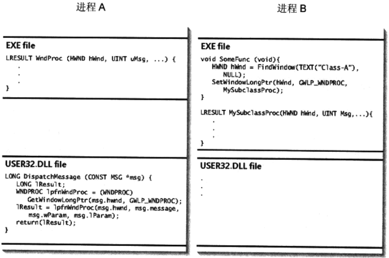

# 第22章 DLL注入和API拦截

[TOC]


每个进程有自己私有的地址空间，当使用指针来引用内存的时候，指针的值表示的是进程自己的地址空间中的一个内存地址；进程不能创建一个指针来引用属于其它进程的内存。

## 22.1 DLL注入的一个例子

```c++
SetWindowLongPtr(hWnd, GWLP_WNDPROC, MySubclassProc);
```

从一个窗口派生子类窗口。



*进程B的一个线程试图从进程A创建的一个窗口派生子类窗口*


## 22.2 使用注册表注入DLL

注册表项`HKEY_LOCAL_MACHINE\Software\Microsoft\Windows NT\CurrentVersion\Windows\`中一些值可以用来改变系统的行为。

使用注册表注入DLL的缺点：

- 我们的DLL只会被映射到使用了User32.dll的进程中，基于CUI的应用程序不会使用它；
- DLL被映射到越多的进程中，导致“容器”进程崩溃的可能性越大；
- DLL被映射到每个基于GUI的应用程序中，在应用程序终止之前，它将一直存在于进程的地址空间中。


## 22.3 使用Windows挂钩来注入DLL

```c++
HHOOK hHook = SetWindowsHookEx(WH_GETMESSAGE, GetMsgProc, hInstDll, 0);
```

- `WH_GETMESSAGE` 要安装的挂钩的类型；
- `GetMsgProc` 函数地址，在窗口即将处理一条消息的时候，系统应该调用这个函数；
- `hInstDll` 进程地址空间中DLL被映射到的虚拟内存地址；
- `0` 要挂钩的线程标识符（0标识所有GUI线程）。

向线程安装挂钩。

流程如下：

1. 进程B中的一个线程准备向一个窗口派送一条消息；

2. 系统检查该线程是否已经安装了`WH_GETMESSAGE`挂钩；

3. 系统检查`GetMsgProc`所在的DLL是否已经被映射到进程B的地址空间中，并将进程B中该DLL的锁计数器(lock count)递增；

4. 由于DLL的`hInstDll`是在进程B中映射的，因此系统会对它进行检查，看它与该DLL在进程A中的位置是否相同：

   - `hInstDll`相同

     在两个进程的地址空间中，`GetMsgProc`函数位于相同的位置；在这种情况下，系统可以直接在进程A的地址空间中调用`GetMsgProc`。

   - `hInstDll`不同

     系统必须确定`GetMsgProc`函数在进程B的地址空间中的虚拟内存地址，该地址的计算公式：

     $GetMsgProc(B) = hInstDll(B) + (GetMsgProc(A) - hInstDll(A))$

     *通过把$GetMsgProc(A)$减去$hInstDll(A)$，得到$GetMsgProc$函数的偏移量，以字节为单位。把这个偏移量与$hInstDll(B)$相加就得到了$GetMsgProc$函数在进程B的地址空间中的位置*

5. 系统在进程B中递增该DLL的锁计数器；

6. 系统在进程B的地址空间中调用`GetMsgProc`函数；

7. 当`GetMsgProc`返回的时候，系统递减该DLL在进程B中的锁计数器。

**注意：当系统把挂钩过滤函数(hook filter function)所在的DLL注入或映射到地址空间中时，会映射整个DLL，而不仅仅只是挂钩过滤函数。**

```c++
BOOL UnhookWindowsHookEx(HHOOK hHook);
```

从进程的地址空间中撤销对DLL的映射。

DIPS工具示例：

```c++
// Dips.cpp
TODO
```

```c++
// DipsLib.cpp
TODO
```


## 22.4 使用远程线程来注入DLL

Windows提供了一些函数来让一个进程对另一个进程进行操作。

```c++
HANDLE CreateRemoteThread(
	HANDLE hProcess,
	PSECURITY_ATTRIBUTES psa,
	DWORD dwStackSize,
	PTHREAD_START_ROUTINE pfnStartAddr,
	PVOID pvParam,
	DWORD fdwCreate,
	PDWORD pdwThreadId);
```

- `hProcess`
- `psa`
- `dwStackSize`
- `pfnStartAddr` （远程）线程函数的内存地址；
- `pvParam`
- `fdwCreate`
- `pdwThreadId`

在另一个进程中创建线程。

```c++
HMODULE LoadLibrary(PCTSTR pszLibFile);
```

让线程载入DLL。

```c++
PVOID VirtualAllocEx(
	HANDLE hProcess,
	PVOID pvAddress,
	SIZE_T dwSize,
	DWORD flAllocationType,
	DWORD flProtect);
```

在另一个进程的地址空间中分配一块内存。

```c++
BOOL VirtualFreeEx(
	HANDLE hProcess,
	PVOID pvAddress,
	SIZE_T dwSize,
	DWORD dwFreeType);
```

释放另一个进程的地址空间中的内存。

```c++
BOOL ReadProcessMemory(
	HANDLE hProcess,
	LPCVOID pvAddressRemote,
	PVOID pvBufferLocal,
	SIZE_T dwSize,
	SIZE_T* pdwNumBytesRead);

BOOL WriteProcessMemory(
	HANDLE hProcess,
	PVOID pvAddressRemote,
	LPCVOID pvBufferLocal,
	SIZE_T dwSize,
	SIZE_T* pdwNumBytesWritten);
```

读/写另一个进程的地址空间。

### 22.4.1 Inject Library示例程序

```c++
hProcess = OpenProcess(
    PROCESS_CREATE_THREAD | PROCESS_VM_OPERATION | PROCESS_VM_WRITE, 
    FALSE,
	dwProcessId);
```

打开正在运行的进程的句柄，并请求合适的访问权限。

例，Inject Library示例程序：

```c++
// InjLib.cpp
TODO
```

### 22.4.2 Image Walk DLL

例，ImgWalk示例：

```c++
// ImgWalk.cpp
TODO
```


## 22.5 使用木马DLL来注入DLL

用一个同名的DLL把进程要加载的DLL替换。


## 22.6 把DLL作为调试器来注入


## 22.7 使用CreateProcess来注入代码

让进程对它的子进程的主线程执行的代码进行控制：

1. 让进程生成一个被挂起的子进程；
2. 从.exe模块的文件头中取得主线程的起始内存地址；
3. 将位于该内存地址处的机器指令保存起来；
4. 强制将一些手工编写的机器指令写入到该内存地址处；这些指令应该调用`LoadLibrary`来载入一个DLL；
5. 让子进程的主线程恢复运行，从而让这些指令得到执行；
6. 把保存起来的原始指令恢复到起始地址处；
7. 让进程从起始地址继续执行，就好像什么都没有发生过一样。


## 22.8 API拦截一个例子

### 22.8.1 通过覆盖代码来拦截API

API拦截工作方式：

1. 在内存中对要拦截的函数进行定位，从而得到它的内存地址；
2. 把这个函数起始的几个字节保存到我们自己的内存中；
3. 用CPU的一条JUMP指令来覆盖这个函数起始的几个字节，这条JUMP指令用来跳转到我们的替代函数的内存地址；我们的替代函数的函数签名必须与要拦截的函数的函数签名完全相同：所有的参数必须相同，返回值必须相同，调用约定也必须相同；
4. 当线程调用被拦截函数（hooked function）的时候，跳转指令实际上会跳转到我们的替代函数；这是我们就可以执行自己想要执行的任何代码；
5. 为了撤销对函数的拦截，我们必须把（第2步）保存下来的字节放回被拦截函数起始的几个字节中；
6. 调用被拦截函数，让该函数执行它的正常处理；
7. 当原来的函数返回时，再次执行第2，3步，这样我们的替代函数将来还会被调用到。

### 22.8.2 通过修改模块的导入段来拦截API

例，ReplaceIATEntryInOneMod示例：

```c++
PROC pfnOrig = GetProcAddress(GetModuleHandle("Kernel32"), "ExitProc");
HMODULE hmodCaller = GetModuleHandle("Database.exe");
ReplaceIATEntryInOneMod(
	"Kernel32.dll",
	pfnOrig,
	MyExitProcess,
	hmodCaller);
```

### 22.8.3 Last MessageBox Info示例程序

例，创建一个CAPIHook拦截一个函数：

```c++
CAPIHook g_MessageBoxA("User32.dll", "MessageBoxA", (PROC)Hook_MessageBoxA, TRUE);
CAPIHook g_MessageBoxW("User32.dll", "MessageBoxW", (PROC)Hook_MessageBoxW, TRUE);
```

例，拦截API的程序：

```c++
// LastMsgBoxInfo.cpp
TODO
```

```c++
// LastMsgBoxInfoLib.cpp
TODO
```

```c++
// LastMsgBoxInfoLib.h
TODO
```

```c++
// APIHook.cpp
TODO
```

```c++
// APIHook.h

```

