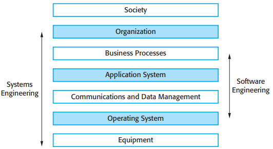
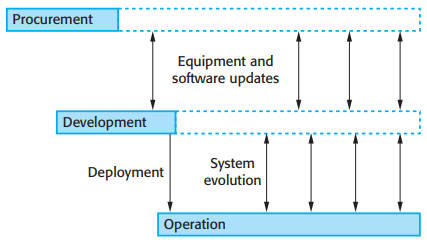
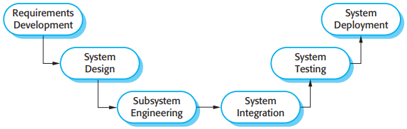
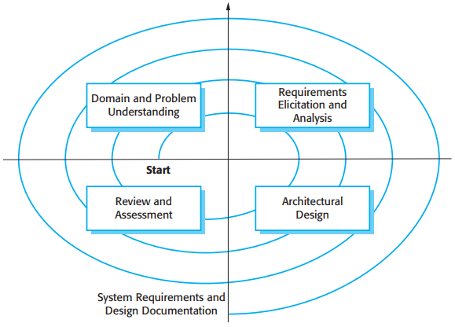

# 10 Sociotechnical systems

[TOC]

*The sociotechnical systems stack*

These layers make up the sociotechnical systems stack:

1. The equipment layer.
2. The operating system layer.
3. The communications and data management layer.
4. The application layer.
5. The business process layer.
6. The organizational layer.
7. The social layer.

## Complex systems

A system is a purposeful collection of interrelated components, of different kinds, which work together to achieve some objective.

Systems that include software fall into two categories:

1. `Technical computer-based systems` These are systems that include hardware and software components but not procedures and processes.
2. `Sociotechnical systems` These include one or more technical systems but, crucially, also include people who understand the purpose of the system within the system itself.

Organizational factors from the system's environment that may affect the requirements, design, and operation of a sociotechnical system include:

1. `Process changes` The system may require changes to the work processes in the environment.
2. `Job changes` New systems may de-skill the users in an environment or cause them to change the way they work.
3. `organizational changes` The system may change the political power structure in an organization.

Sociotechnical systems have three characteristics that are particularly important when considering security and dependability:

1. They have emergent properties that are properties of the system as a whole, rather than associated with individual parts of the system.
2. They are often non-deterministic.
3. The extent to which the system supports organizational objectives does not just depend on the system itself.

### Emergent system properties

There are two types of emergent properties:

1. Functional emergent properties when the purpose of a system only emerges after its components are integrated.
2. Non-functional emergent properties, which relate to the behavior of the system in its operational environment. Reliability, performance, safety, and security are examples of emergent properties.

In a sociotechnical system, you need to consider reliability from three perspectives:

1. Hardware reliability.
2. Software reliability.
3. Operator reliability.

## Systems engineering

*Stages of systems engineering*

There are three overlapping stages in the lifetime of large and complex sociotechnical systems:

1. Procurement or acquisition
2. Development
3. Operation

## System procurement

*System procurement processes*

## System development

*Systems development*

*Requirements and design spiral*

## System operation

### Human error

As Reason discusses (2000) human errors will always occur and there are two ways to view the problem of human error:

1. The person approach.
2. The systems approach.