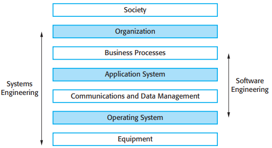
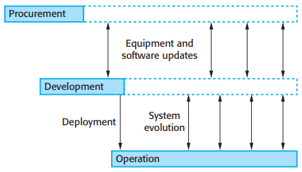
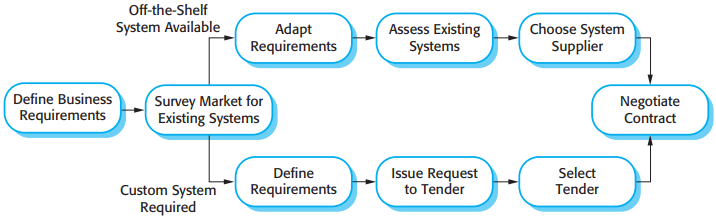
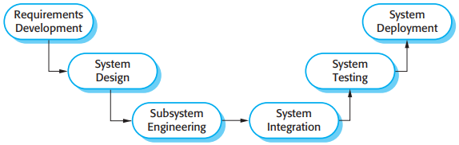
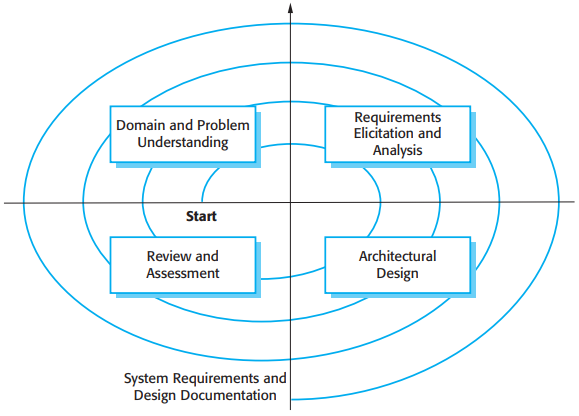

# 第10章 社会技术系统

[TOC]

*社会技术系统栈*

- 设备层
- 操作系统层
- 通信和数据管理层
- 应用层
- 业务过程层
- 机构层
- 社会层

## 10.1 复杂系统

系统是一组相互关联，不同种类，为实现目标协同工作的组件集合。

包含软件的系统可以分为两类：

1. 基于计算机的纯技术系统
2. 社会技术系统

系统欢聚的机构因素会影响到社会技术系统的需求，设计和运作，它包括：

1. 过程变更
2. 工作变更
3. 机构变更

社会技术系统有3个重要特性：

1. 系统整体特性
2. 系统的非确定性
3. 系统支持机构目标的程度和范围不仅仅依赖于系统本身

### 10.1.1 系统总体特性

总体特性有两种类型：

1. 功能特性，再系统的所有组件集成后系统目的才表现出来。
2. 非功能特性，与系统在其运行环境中的行为有关，如可靠性，性能，安全性和信息安全性。

在一个社会技术系统中，可以从如下3点需要考虑可靠性：

1. 硬件可靠性
2. 软件可靠性
3. 操作员可靠性

### 10.1.2 系统非确定性

### 10.1.3 成功标准

## 10.2 系统工程

*系统工程的阶段*

- 采购和获得
- 开发
- 运行

## 10.3 系统采购

*系统采购流程*

## 10.4 系统开发

*系统开发*

*需求和设计螺旋*

## 10.5 系统运行

### 10.5.1 人为错误

人为错误总会发生，可从两个角度来看待这个问题：

1. 人的方法
2. 系统的方法

### 10.5.2 系统进化
