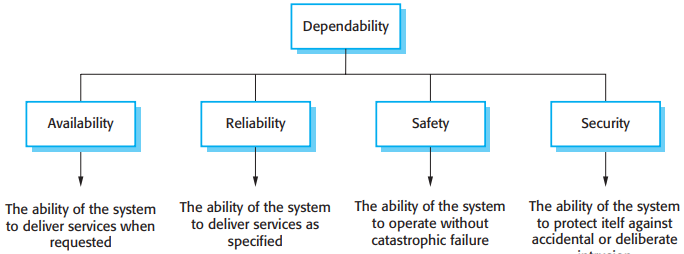
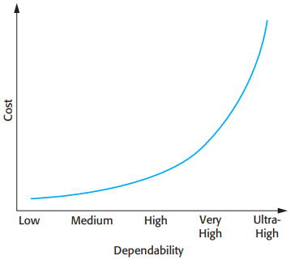
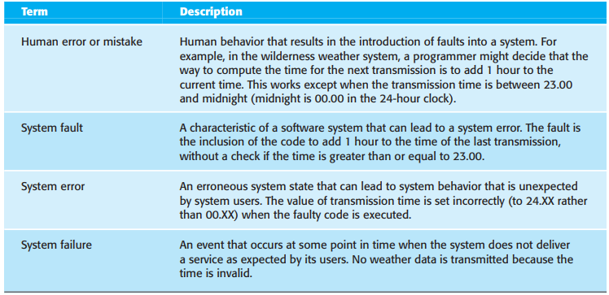
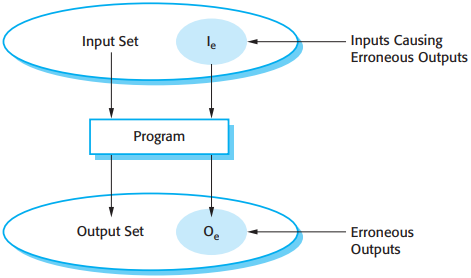
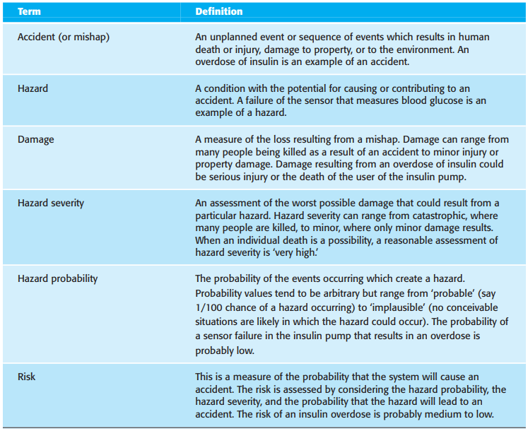
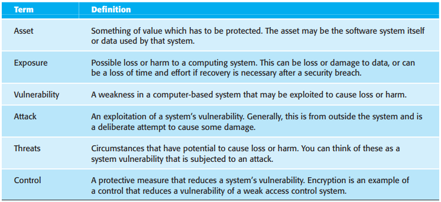

# 11 Dependability and security

[TOC]

The dependability of systems is now usually more important than their detailed functionality for the following reasons:

1. System failures affect a large number of people.
2. Users often reject systems that are unreliable, unsafe, or insecure.
3. System failure costs may be enormous.
4. Undependable systems may cause information loss.

When designing a dependable system, you therefore have to consider:

1. Hardware failure.
2. Software failure.
3. Operational failure.

## Dependability properties

*Principal dependability properties*

There are some principal dimensions to dependability:

1. Availability.
2. Reliability.
3. Safety.
4. Security.
5. Repairability.
6. Maintainability.
7. Survivability.
8. Error tolerance.

To develop dependable software, you therefore need to ensure that:

1. You avoid the introduction of accidental errors into the system during software specification and development.
2. You design verification and validation processes that are effective in discovering residual errors that affect the dependability of the system.
3. You design protection mechanisms that guard against external attacks that can compromise the availability or security of the system.
4. You configure the deployed system and its supporting software correctly for its operating environment.

*Cost/dependability curve*

## Availability and reliability

System reliability and availability may be defined more precisely as follows:

1. `Reliability` The probability of failure-free operation over a specified time, in a given environment, for a specific purpose.
2. `Availability` The probability that a system, at a point in time, will be operational and able to deliver the requested services.

*Reliability terminology*

*A system as an input/output mapping*

System faults do not always result in system errors and system errors do not necessarily result in system failures. The reasons for this are as follows:

1. Not all code in a program is executed.
2. Errors are transient.
3. The system may include fault detection and protection mechanisms.

Identify three complementary approaches that are used to improve the reliability of a system:

1. Fault avoidance.
2. Fault detection and removal.
3. Fault tolerance.

## Safety

Safety-critical software falls into two classes:

1. Primary safety-critical software.
2. Secondary safety-critical software.

*Safety terminology*

The key to assuring safety is to ensure either that accidents do not occur or that the consequences of an accident are minimal. This can be achieved in three complementary ways:

1. `hazard avoidance` The system is designed so that hazards are avoided.
2. `hazard detection and removal` The system is designed so that hazards are detected and removed before they result in an accident.
3. `Damage limitation` The system may include protection features that minimize the damage that may result from an accident.

## Security

*Security Terminology*

In any networked system, there are three main types of security threats:

1. Threats to the confidentiality of the system and its data.
2. Threats to the integrity of the system and its data.
3. Threats to the availability of the system and its data.

The controls that you might put in place to enhance system security are comparable to those for reliability and safety:

1. Vulnerability avoidance.
2. Attack detection and neutralization.
3. Exposure limitation and recovery.