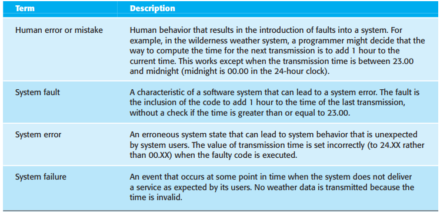
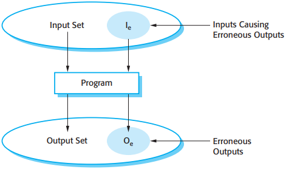
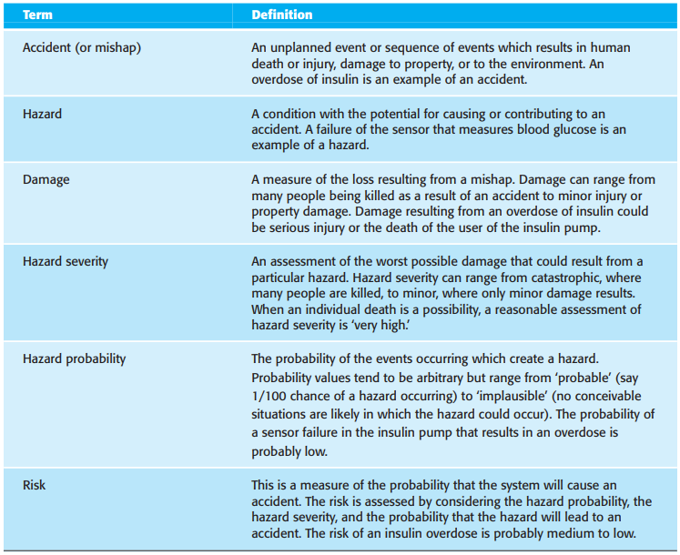

# 第11章 可依赖性与信息安全性

[TOC]

以下理由说明了系统的可依赖性现在通常比它们的具体功能更加重要：

1. 系统失败影响到的人数众多
2. 如果系统是不可靠的，不安全的或是不保密的，那用户往往会拒绝使用它
3. 系统失败的代价可能是巨大的
4. 靠不住的系统能导致信息流失

当设计一个可依赖的系统时，我们需要考虑：

1. 硬件失败
2. 软件失败
3. 操作失败

## 11.1 可依赖性特征

*主要的可依赖性特征*

- 可用性
- 可靠性
- 安全性
- 信息安全性保密性
- 可维修性
- 可维护性
- 生存能力
- 容错

*成本/可依赖性曲线*

## 11.2 可用性和可靠性

系统可靠性和可用性的更精确的定义如下：

1. 可靠性：系统在一特定时间特定环境中为一专门目的而做的无失败操作的可能性。
2. 可用性：系统在一个时刻是可操作的和能执行请求服务的可能性。

*可靠性术语*

*系统被看作是输入/输出间的映射*

软件的缺陷不总是导致系统错误，并且系统错误不会必然导致系统失败。其原因如下：

1. 不是程序中所有的代码都会执行。
2. 错误是短暂的。
3. 系统可能拥有缺陷探测和保护机制。

用于系统可靠性改善的辅助方法：

1. 缺陷避免
2. 缺陷检测和删除
3. 容错

## 11.3 安全性

安全要求极高的软件分为两类：

1. 首要的安全要求极高的软件
2. 次要的安全要求极高的软件

*安全性术语*

确保安全性的关键在于保证要么意外不会发生要么意外发生的后果并不严重。这可以通过3种互补的手段达到：

1. 危险避免：系统的设计要能避免危险的发生。
2. 危险检测和去除：系统的设计要能检测危险，并在其发生之前去除危险。
3. 限制损失：系统会包含保护特征以最小化损失。

## 11.4 信息安全性

*信息安全术语*

对任何一个联网系统，有3个主要类型的信息安全性威胁：

1. 对系统的保密性以及它的数据的威胁
2. 对系统和数据的完整性的威胁
3. 对系统的有用性和系统数据的可用性的威胁

增强系统的信息安全性的控制类似于增加可靠性和安全性：

1. 脆弱性避免
2. 攻击检测和压制
3. 暴露限制与恢复

## 总结

TODO