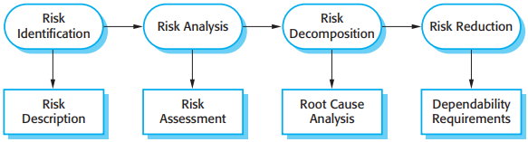
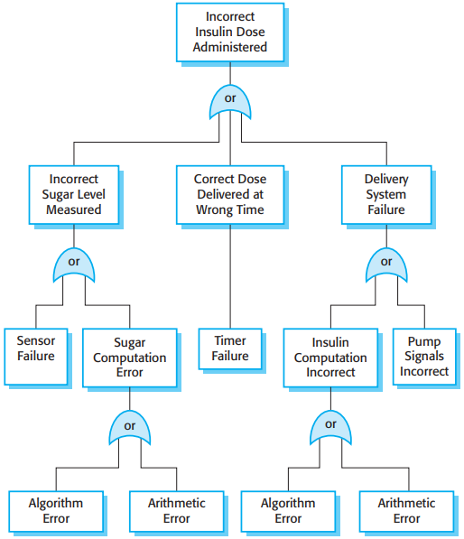
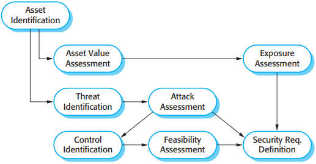
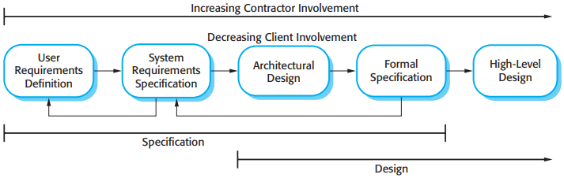

# 12 Dependability and security specification

[TOC]

Those dependability and security requirements are of two types:

1. Functional requirements, which define checking and recovery facilities that should be included in the system and features that provide protection against system failures and external attacks.
2. Non-functional requirements, which define the required reliability and availability of the system.

## Risk-driven requirements specification

*Risk driven specification*

A general risk-driven specification process (Figure 12.1) involves understanding the risks faced by the system, discovering their root causes, and generating requirements to manage these risks. The stages in this process are:

1. Risk identification.
2. Risk analysis and classification.
3. Risk decomposition.
4. Risk reduction.

## Safety specification

### Hazard assessment

*The risk triangle*

There are three risk categories that you can use in hazard assessment:

1. Intolerable risks in safety-critical systems are those that threaten human life.
2. As low as reasonably practical (ALARP) risks are those that have less serious consequences or  that are serious but have a very low probability of occurrence.
3. Acceptable risks are those where the associated accidents normally result in minor damage.

### Hazard analysis

*An example of a fault tree*

### Risk reduction

Once potential risks and their root cause have been identified, you are then able to derive safety requirements that manage the risks and ensure that incidents or accidents do not occur. There are three possible strategies that you can use:

1. `Hazard avoidance:` The system is designed so that the hazard cannot occur.
2. `Hazard detection and removal:` The system is designed so that hazards are detected and neutralized before they result in an accident.
3. `Damage limitation:` The system is designed so that the consequences of an accident are minimized.

## Reliability specification

Reliability requirements are, therefore, of two kinds:

1. Non-functional requirements, which define the number of failures that are acceptable during normal use of the system, or the time in which the system is unavailable for use. These are quantitative reliability requirements.
2. Functional requirements, which define system and software functions that avoid, detect, or tolerate faults in the software and so ensure that these faults do not lead to system failure.

### Reliability metrics

The choice of metric depends on the type of system that is being specified and the requirements of the application domain. The metrics are:

1. `Probability of failure on demand (POFOD)` If you use this metric, you define the probability that a demand for service from a system will result in a system failure.
2. `Rate of occurrence of failures (ROCOF)` This metric sets out the probable number of system failures that are likely to be observed relative to a certain time period (e.g., an hour), or to the number of system executions.
3. `Availability (AVAIL)` The availability of a system reflects its ability to deliver services when requested.

### Non-functional reliability requirements

There are several advantages in deriving quantitative reliability specifications:

1. The process of deciding what required level of the reliability helps to clarify what stakeholders really need. It helps stakeholders understand that there are different types of system failure, and it makes clear to them that high levels of reliability are very expensive to achieve.
2. It provides a basis for assessing when to stop testing a system. You stop when the system has achieved its required reliability level.
3. It is a means of assessing different design strategies intended to improve the reliability of a system. You can make a judgment about how each strategy might lead to the required levels of reliability.
4. If a regulator has to approve a system before it goes into service (e.g., all systems that are critical to flight safety on an aircraft are regulated), then evidence that a required reliability target has been met is important for system certification.

### Functional reliability specification

There are three types of functional reliability requirements for a system:

1. Checking requirements
2. Recovery requirements
3. Redundancy requirements

## Security specification

*The preliminary risk assessment process for security requirements*

## Formal specification

*Formal specification in a plan-based software process*