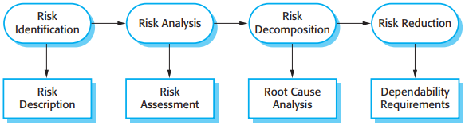
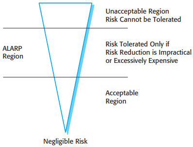
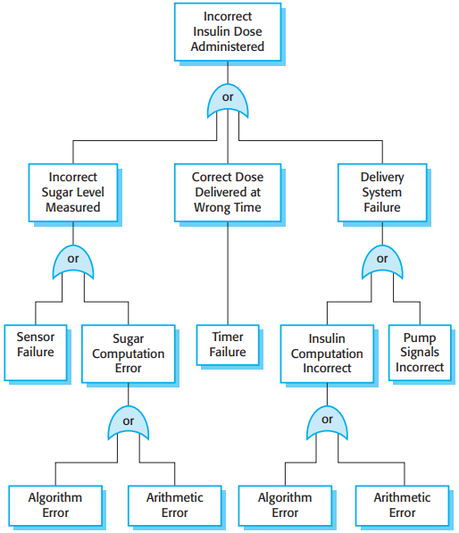
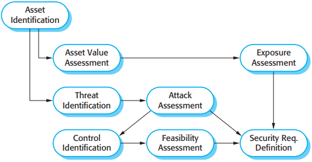

# 第12章 可依赖性与信息安全性描述

可依赖性和信息安全性需求分为两种：

1. 功能性需求：定义了系统应该包含的检查和修复措施，以及防止系统失败和外部攻击的保护性特征。
2. 非功能性需求：定义了系统需要的可靠性和可用性。

## 12.1 风险驱动的需求描述

*风险驱动的描述*

- 风险识别(Risk Identification)
- 风险分析和分类(Risk Analysis)
- 风险分解(Risk Decomposition)
- 风险降低(Risk Reduction)

## 12.2 安全性描述

### 12.2.1 危险识别

### 12.2.2 危险评估

*风险三角形*

1. 不可容忍的风险：在安全要求极高的系统中是指那些能威胁到人的生命的危险。
2. 低于合理的实际水平（ALARP）的风险：此类风险是那些没有太严重后果或后果严重但发生的可能性非常低的风险。
3. 可接受的风险：此类风险是那些相关联的事故通常引起很小的损失。

### 12.2.3 危险分析

*缺陷树的例子*

### 12.2.4 风险降低

一旦识别出潜在的风险及其根源，我们就能够导出安全性需求以管理风险，并确保不会发生各种事故。我们可以使用3个可行的策略：

1. 危险避免：系统设计使得危险不能发生。
2. 危险检测和排除：系统设计使得可以在危险导致事故之前检测出危险并排除他。
3. 灾害限制：系统设计使得事故后果影响达到最小。

## 12.3 可靠性描述

可靠性需求分为两种：

1. 非功能性需求，定义了在用户的日常使用中可接受的失败的次数，或系统不可用的时间。这些是定量的可靠性需求。
2. 功能性需求，定义了系统和避免，缺陷检测或容错等软件功能，因而保证这些缺陷不会引起系统失败。

### 12.3.1 可靠性度量

可靠性度量的选择取决于被描述系统的类别和应用领域的需求。这些度量是：

1. 请求失败的概率（POFOD）
2. 失败发生率（ROCOF）
3. 可用性（AVAIL）

### 12.3.2 非功能性的可靠性需求

导出量化可靠性描述有以下几个优点：

1. 决定可靠性需要的等级的过程有助于弄清楚信息持有者到底需要什么。也帮助信息持有者理解不同种类的系统失败，也让他们清楚要达到高级别的可靠性是需要昂贵的花费的。
2. 评估何时可以停止测试一个系统。你应当在系统达到了要求的可靠性等级的时候停止测试。
3. 它是评估系统可靠性的不同设计策略的方法。你可以对每个策略如何影响可靠性需求等级做出判断。
4. 如果一个外部管理者需要在进入一个服务之前许可系统，那么能说明已达到一个要求的可靠性目标的证据在系统认证中很重要。

### 12.3.3 功能可靠性描述

系统中有三种功能性可靠性需求：

1. 检查需求
2. 恢复需求
3. 冗余性需求

## 12.4 信息安全性描述

*信息安全需求中的初步风险评估过程*

## 12.5 形式化描述

*在基于计划的软件过程中的形式化描述*

## 总结

TODO