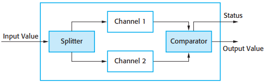

# 13 Dependability engineering

[TOC]

Dependability engineering is concerned with the techniques that are used to enhance the dependability of both critical and non-critical systems. These techniques support three complementary approaches that are used in developing dependable software:

1. Fault avoidance
2. Fault detection and correction
3. Fault tolerance

*The increasing costs of residual fault removal*

## Dependable processes

*Attributes of dependable processes*

## Dependable system architectures

### Protection systems

*Protection system architecture*

### Self-monitoring architectures

*Self-monitoring architecture*

### N-version programming

*Triple modular redundancy*

*N-version programming*

## Dependable programming

*Good practice guidelines for dependable programming*
