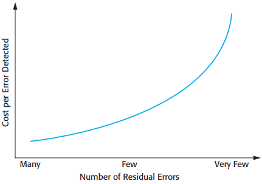
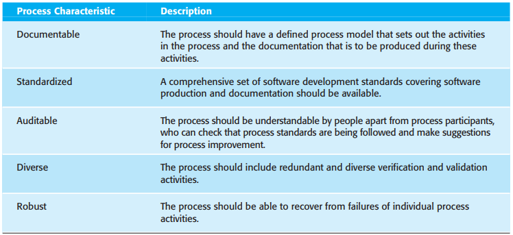
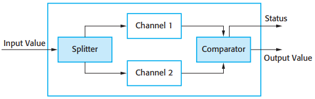
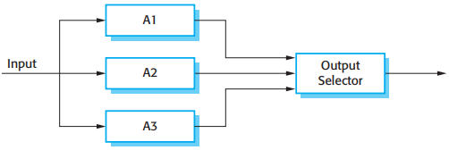
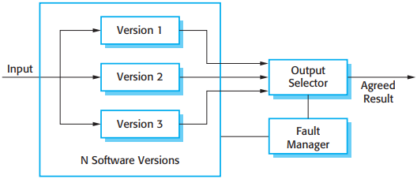
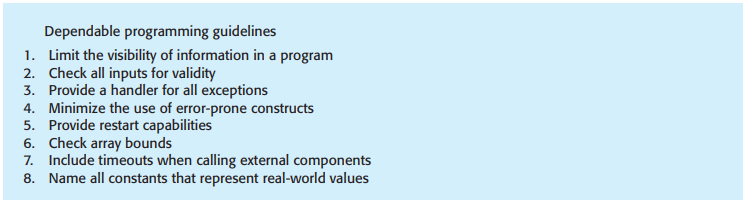

# 第13章 可依赖性工程

[TOC]

3个用在开发可依赖性软件方面的补充方法：

1. 缺陷避免
2. 缺陷检测
3. 容错

*去除驻留缺陷的费用在不断攀升*

## 13.1 冗余性和多样性

## 13.2 可依赖的过程

*可依赖过程的属性*

- 可文档化(Documentable)
- 标准化(Standardized)
- 可审查性(Auditable)
- 多样性(Diverse)
- 鲁棒性(Robust)

## 13.3 可依赖的系统体系结构

### 13.3.1 保护性系统

*保护性系统的体系结构*

### 13.3.2 自监控系统体系结构

*自监控系统体系结构*

### 13.3.3 N-版本编程

*三重模块冗余*

*N-版本编程*

### 13.3.4 软件多样性

## 13.4 可依赖的编程

*好的可依赖编程实践指导准则*

1. 限制程序中信息的可见性；
2. 检查所有输入的有效性；
3. 为所有异常提供处理；
4. 最小化使用易于出错的结构；
5. 提供重启的能力；
6. 检查数组边界；
7. 当调用外部组件时加入超时处理功能；
8. 为每一个代表现实世界值的常量命名。

## 总结

TODO

