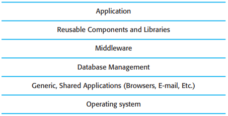
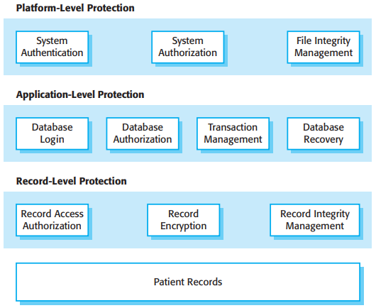
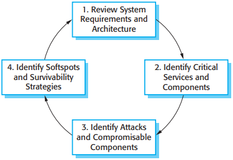

# 14 Security engineering

[TOC]

*System layers where security may be compromised*

## Security risk management

Risk assessment stage:

1. Preliminary risk assessment.
2. Life-cycle risk assessment.
3. Operational risk assessment.

### Life-cycle risk assessment

*Life-cycle risk analysis*

*Vulnerabilities associated with technology choices*

## Design for security

### Architectural design

In designing a system architecture that maintains security, you need to consider two fundamental issues:

1. Protection--how should the system be organized so that critical assets can be protected against external attack?
2. Distribution--how should system assets be distributed so that the effects of a successful attack are minimized?

*A layered protection architecture*

### Design guidelines

*Design guidelines for secure systems engineering*

### Design for deployment

*Software deployment*

Four ways to incorporate deployment support in a system:

1. Include support for viewing and analyzing configurations.
2. Minimize default privileges.
3. Localize configuration settings.
4. Provide easy ways to fix security vulnerabilities.

## System survivability

*Stages in survivability analysis*

The key activities in each of these stages are as follows:

1. System understanding.
2. Critical service identification.
3. Attack simulation.
4. Survivability analysis.