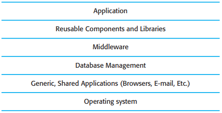
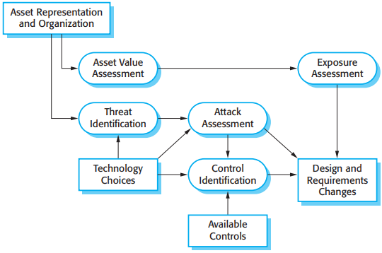
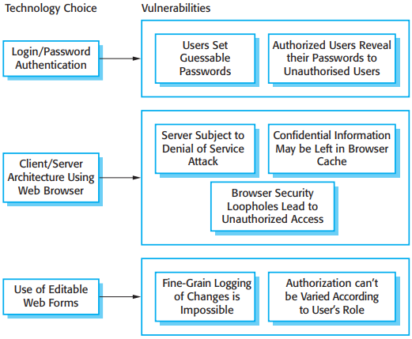
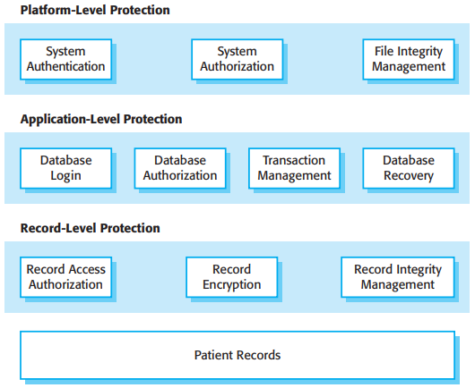
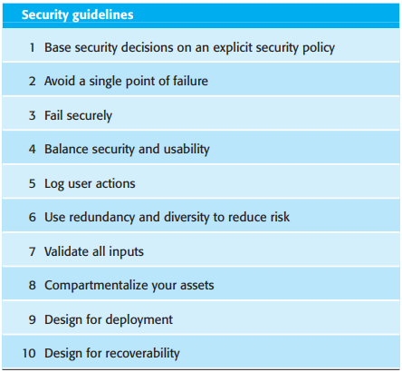
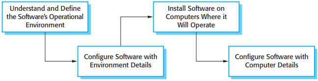
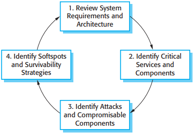

# 第14章 信息安全工程

[TOC]

*存在信息安全性漏洞的系统分层*

## 14.1 信息安全风险管理

风险评估过程：

1. 初步风险评估
2. 生存期风险评估
3. 运行风险评估

### 14.1.1 生存期风险评估

*生命期风险分析*

*与技术选择相关的脆弱性*

### 14.1.2 运行风险评估

## 14.2 面向信息安全的设计

### 14.2.1 体系结构设计

在设计能维护信息安全性的系统体系结构时，需要考虑两个基本问题：

1. 保护。如何组织系统使其关键资产能在外部攻击时得到保护？
2. 分布。如何对系统资产进行分布使得逞的攻击数减到最少？

*分层保护的体系结构*

### 14.2.2 设计准则

*安全系统工程的设计准则*

1. 将信息安全决策建立在明确的信息安全策略之上
2. 避免单点失败
3. 可恢复性失败
4. 寻求信息安全的可用性间的均衡
5. 记录用户行为
6. 通过冗余性和多样性降低风险
7. 验证所有的输入
8. 划分资产
9. 部署设计
10. 可恢复性设计

### 14.2.3 部署设计

*软件部署*

- 了解和定义软件的运行环境(Understand and Define the Software's Operational Environment)
- 根据环境详细信息配置软件(Configure Software with Environment Details)
- 在准备运行软件的计算机上安装软件(Install Software on Computers Where it Will Operate)
- 根据计算机的具体情况配置软件(Configure Software with Computer Details)

在系统中加入部署支持的方法：

1. 包含对配置的观察和分析的支持
2. 最小化缺省特权
3. 局部化配置设定
4. 提供修补安全漏洞的简单方法

## 14.3 系统生存能力

*生存能力分析的各个阶段*

- 系统理解(Review System Requirements and Architecture)
- 关键服务识别(Identify Critical Services and Components)
- 攻击仿真(Identify Attacks and Compromisable Components)
- 生存能力分析(Identify Softspots and Survivability Strategies)

## 总结

TODO