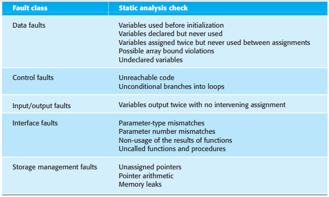
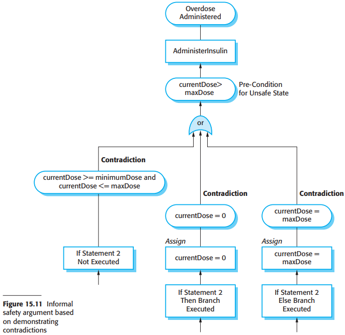

# 15 Dependability and security assurance

[TOC]

Critical systems require particularly stringent testing and analysis for two reasons:

1. Costs of failure.
2. Validation of dependability attributes.

## Static analysis

For critical systems, additional static analysis techniques may be used:

1. Formal verification, where you produce mathematically rigorous arguments that a program conforms to its specification.
2. model checking, where a theorem prover is used to check a formal description of the system for inconsistencies.
3. Automated program analysis, where the source code of a program is checked for patterns that are known to be potentially erroneous.

### Verification and formal methods

Formal methods may be used at different stages in the `V&V` process:

1. A formal specification of the system may be developed and mathematically analyzed for inconsistency.
2. You can formally verify, using mathematical arguments, that the code of a software system is consistent with its specification.

Formal specification and proof do not guarantee that the software will be reliable in practical use. The reasons for this are as follows:

1. The specification may not reflect the real requirements of system users.
2. The proof may contain errors.
3. The proof may make incorrect assumptions about the way that the system is used.

### Model checking

*Model checking*

### Automatic static analysis

*Automated static analysis checks*

## Reliability testing

*Reliability measurement*

This conceptually attractive approach to reliability measurement is not easy to apply in practice. The principal difficulties that arise are:

1. Operational profile uncertainty.
2. High costs of test data generation.
3. Statistical uncertainty when high reliability is specified. 
4. Recognizing failure.

## Security testing

Fundamentally, there are two reasons why security testing is so difficult:

1. Security requirements, like some safety requirements, are `shall not` requirements.
2. The people attacking a system are intelligent and are actively looking for vulnerabilities that they can exploit.

## Safety and dependability cases

### Structured arguments

*Structured arguments*

### Structured safety arguments

*Informal safety argument based on demonstrating contradictions*