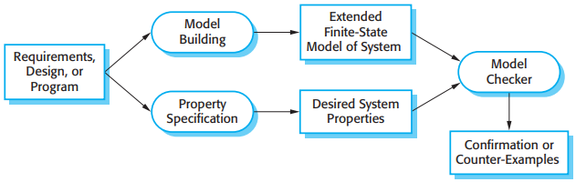
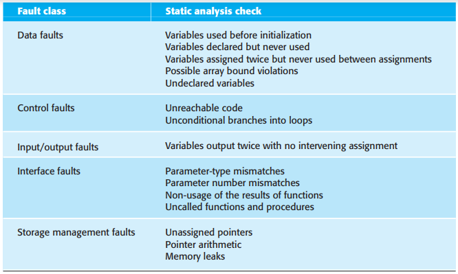
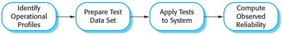
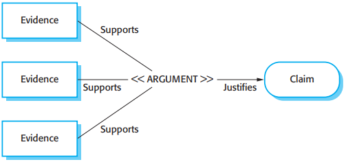
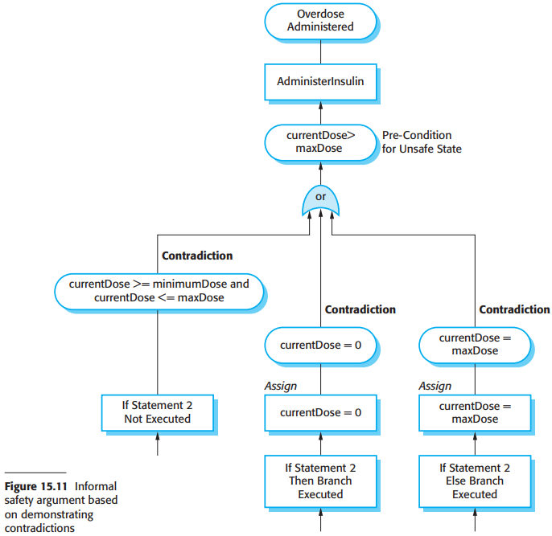

# 第15章 可依赖性与信息安全保证

要求极高的系统要求特别严格的测试和分析，原因如下：

1. 失败的代价
2. 可依赖性属性的有效性验证

## 15.1 静态分析

对于要求极高的系统来说，下列静态分析技术可能会被用到：

1. 形式化的检验
2. 模型检测
3. 自动程序分析

### 15.1.1 检验和形式化方法

形式化方法可以在`V&V`过程的不同阶段中使用：

1. 系统的形式化描述的使用和数学分析可能是为了一致性。
2. 使用数学证明，可以形式化检验软件系统的代码和它的描述是一致的。

形式化描述和证明并不能保证软件在实际使用中将是可靠的。原因如下：

1. 描述可能没有反映系统用户真正的要求。
2. 证明可能包含错误。
3. 证明所假设的使用方式可能是错误的。

### 15.1.2 模型检测

*模型检测*

### 15.1.3 自动静态分析

*自动静态分析检查*

## 15.2 可靠性测试

*可依赖性度量*

可靠性测量方法在实际应用过程中的主要困难：

1. 运行概况的不确定性
2. 测试数据生成的高成本
3. 在指定高可靠性情况下统计的不确定性
4. 识别故障

## 15.3 信息安全性测试

信息安全很难评估的原因：

1. 在于信息安全性需求，就像某些安全性需求一样，是“不应该”的需求。
2. 攻击系统的人都很聪明，并且很积极地去发现系统的弱点。

## 15.4 过程保证

## 15.5 安全性和可依赖性案例

### 15.5.1 结构化论证

*结构化论证*

### 15.5.2 结构化的安全性论证

*基于矛盾显示的非形式化的安全性论证*

## 总结

TODO