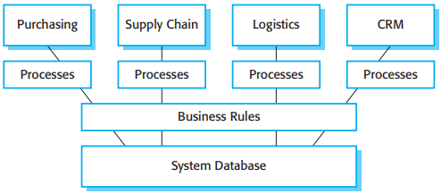
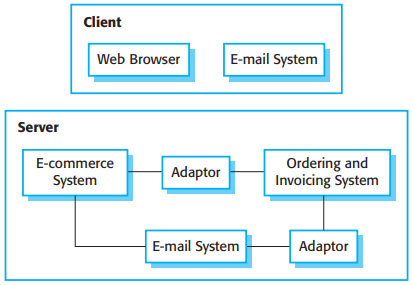

# 16 Software reuse

[TOC]

*Benefits of software reuse*

*Problems with reuse*

## The resue langscape

*The reuse landscape*

key factors that you should consider when planning reuse are:

1. The development schedule for the software.
2. The expected software lifetime.
3. The background, skills, and experience of the development team.
4. The criticality of the software and its non-functional requirements.
5. The application domain.
6. The platform on which the system will run.

*Approaches that support software reuse*

## Application frameworks

Fayad and Schmidt (1997) discuss three classes of frameworks:

1. System infrastructure frameworks.
2. Middleware integration frameworks.
3. Enterprise application frameworks.

## Software product lines

Various types of specialization of a software product line may be developed:

1. Platform specialization.
2. Environment specialization.
3. Functional specialization.
4. Process specialization.

## COTS product reuse

*COTS-solution and COTS-integrated systems*

### COTS-solution systems

*The architecture of an ERP system*

### COTS-integrated systems

*A COTS-integrated procurement system*
