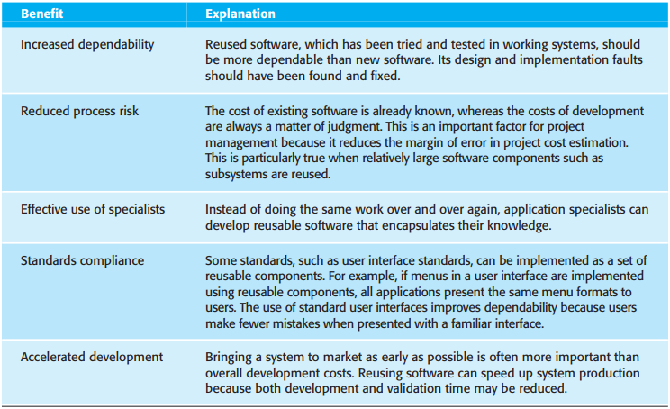
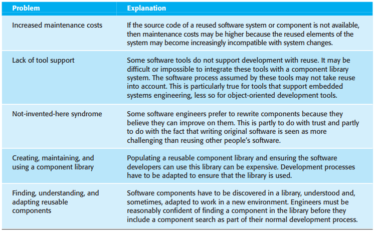
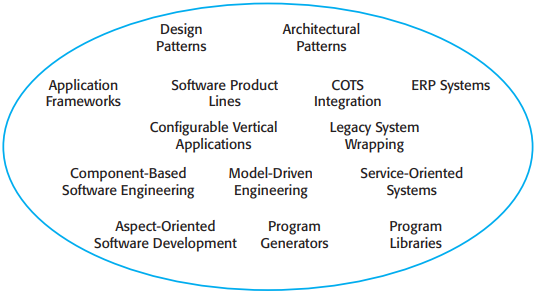
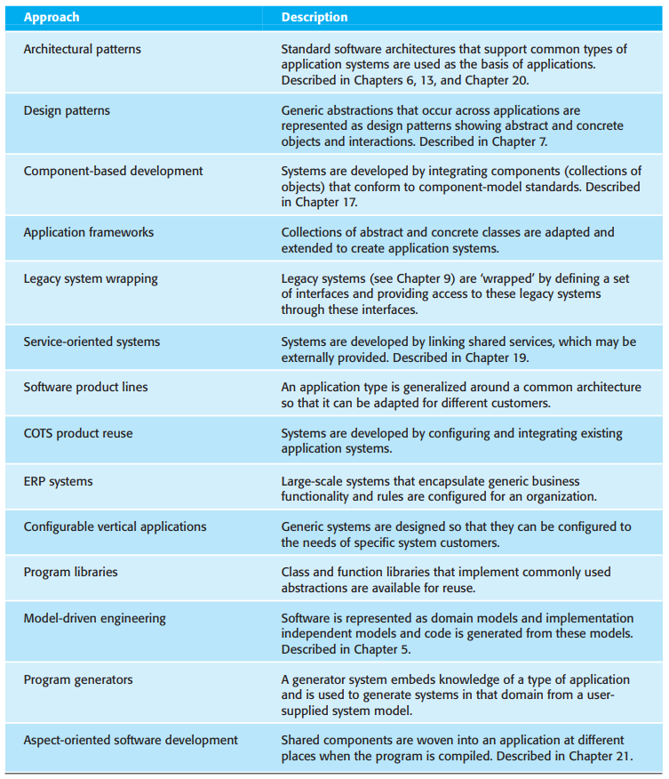
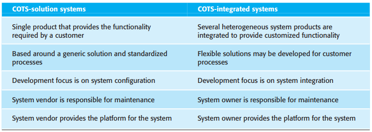
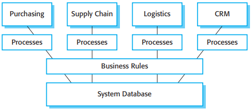
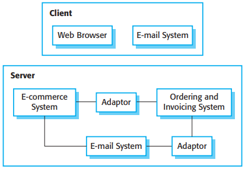

# 第16章 软件复用

[TOC]

*软件复用的优势*

*复用的问题*

## 16.1 复用概览

*复用概览*

在规划复用时需要考虑的关键因素是：

1. 软件的开发进度表
2. 所预计的软件生命期
3. 开发团队的背景，技术和经验
4. 软件的危险程度和它的非功能性需求
5. 应用领域
6. 系统运行的平台

*支持软件复用的方法*

## 16.2 应用框架

3种类型的框架：

1. 系统基础设施框架
2. 中间件集成框架
3. 企业应用框架

## 16.3 软件产品线

对待开发的软件产品线的各类特化处理需要做的工作包括：

1. 平台特化
2. 环境特化
3. 功能特化
4. 过程特化

## 16.4 COTS产品的复用

*COTS解决方案系统和COTS集成系统*

### 16.4.1 COTS解决方案系统

*ERP系统的体系结构*

### 16.4.2 COTS集成系统

*COTS集成的获得系统*
