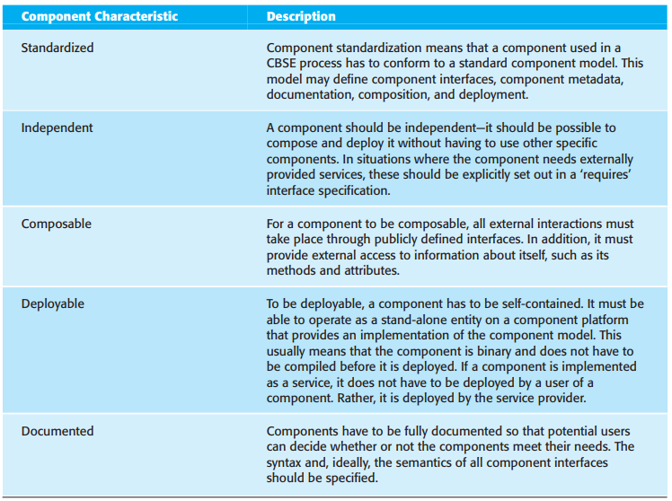
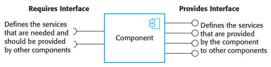
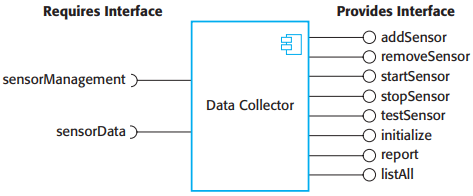
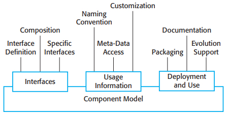
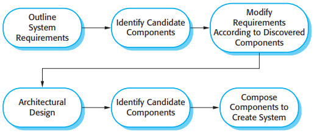
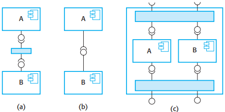
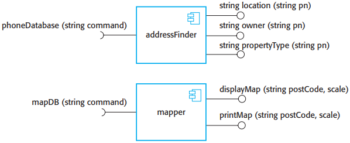

# 17 Component-based software engineering

[TOC]

The essentials of component-based software engineering are:

1. Independent components that are completely specified by their interfaces.
2. Component standards that facilitate the integration of components.
3. Middleware that provides software support for component integration.
4. A development process that is geared to component-based software engineering.

## Components and component models

*Component characteristics*

*Componenty interfaces*

*A model of a data collector component*

### Component models

*Basic elements of a component model*

The elements of a component model define the component interfaces, the information that you need to use the component in a program, and how a component should be deployed:

- Interfaces.
- Usage.
- Deployment.

The services provided by a component model implementation fall into two categories:

1. Platform services, which enable components to communicate and interoperate in a distributed environment.
2. Support services, which are common services that are likely to be required by many different components.

*Middleware services defined in a component model*

## CBSE processes

At the highest level, there are two types of CBSE processes:

1. Development for reuse.
2. Development with reuse.

*CBSE processes*

### CBSE for reuse

Make to a component to make it more reusable include:

- removing application-specific methods;
- changing names to make them more general;
- adding methods to provide more complete functional coverage;
- making exception handling consistent for all methods;
- adding a 'configuration' interface to allow the component to be adapted to different situations of use;
- integrating required components to increase independence.

### CBSE with reuse

*CBSE with reuse*

## Component composition

*Types of Component Composition*

Three types of incompatibility can occur:

1. `Parameter incompatibility` The operations on each side of the interface have the same name but their parameter types or the number of parameters are different.
2. `Operation incompatibility` The names of the operations in the 'provides' and 'requires' interfaces are different.
3. `Operation incompleteness` The `provides` interface of a component is a subset of the `required` interface of another component or vice versa.

*Components with incompatible interfaces*