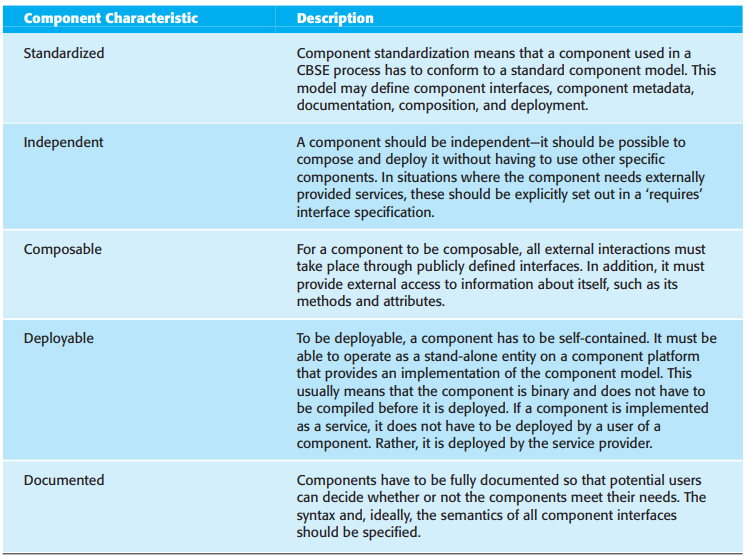
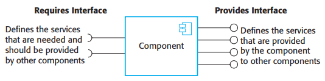
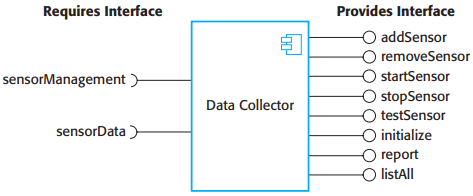
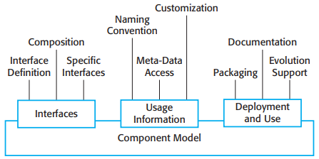
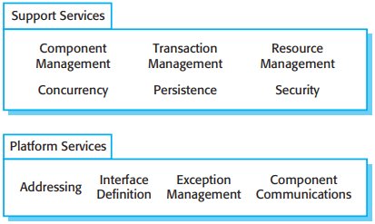
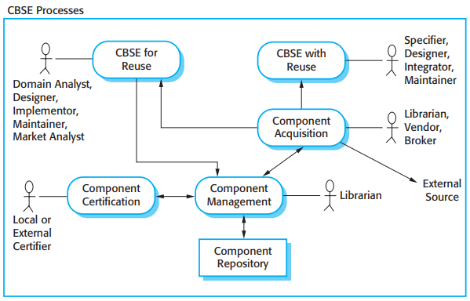
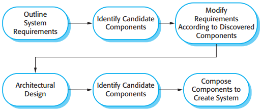
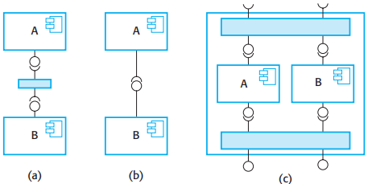
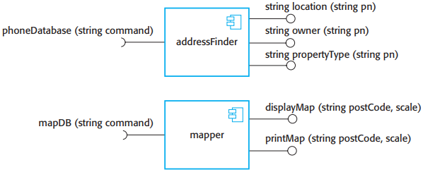

# 第17章 基于组件的软件工程

基于组件的软件工程的要素有：

1. 独立组件由他们的接口完全定义。
2. 组件标准使得组件集成变得更为容易。
3. 中间件为组件集成提供软件支持。
4. 开发过程是一种适应于基于组件的软件工程的开发过程。

## 17.1 组件和组件模型

*组件特性*

- 标准化(Standardized)
- 独立性(Independent)
- 可组合性(Composable)
- 可部署性(Deployable)
- 文档化(Documented)

*组件接口*

*数据采集器组件的模型*

*组件模型的基本要素*

- 接口(Interfaces)
- 使用(Usage Information)
- 部署(Deployment and Use)

组件模型实现提供的服务包括以下两种：

1. 平台服务。允许组件在分布式环境下通信和互操作。
2. 水平服务。这些是一般服务，可以被很多不同的组件所使用。

*由组件模型提供的服务*

## 17.2 CBSE过程

从最高层次来说，存在两种类型的CBSE过程：

1. 面向复用的开发
2. 基于复用的开发

*CBSE过程*

### 17.2.1 面向复用的CBSE

提高组件可复用性的变更：

- 去除哪些应用特定的方法；
- 更名使其更通用；
- 添加方法提供更完备的功能覆盖；
- 为所有方法构造一致的异常处理过程；
- 添加“配置”接口允许对组件进行调整以适应不同的使用情况；
- 继承所需要的组件以增强独立性。

### 17.2.2 基于复用的CBSE

*基于复用的CBSE过程*

## 17.3 组件合成

*组件合成类型*

接口不兼容类型：

1. 参数不兼容：接口每一侧的操作有相同的名字，但参数类型或参数数目是不同的。
2. 操作不兼容：提供接口和需要接口的操作名不同。
3. 操作不完备：一个组件的提供接口是另一个组件需要接口的一个子集，或者相反。

*带有不兼容接口的组件*

## 总结

TODO