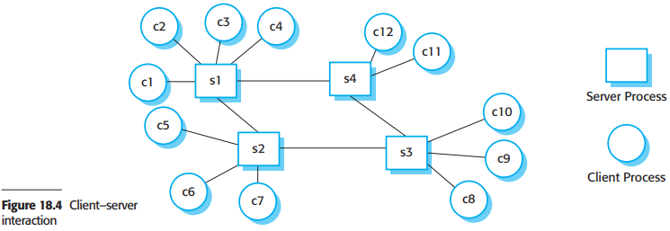
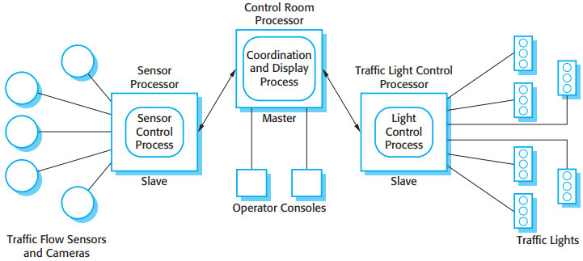
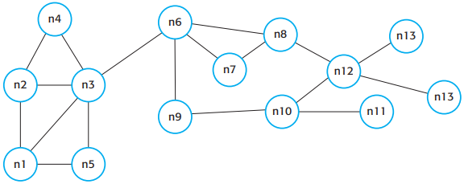

# 18 Distributed software engineering

[TOC]

The advantages of using a distributed approach to system development:

1. Resource sharing.
2. Openness.
3. Concurrency.
4. Scalability.
5. Fault tolerance.

## Distributed systems issues

Some of the most important design issues that have to be considered in distributed system engineering are:

1. Transparency.
2. Openness.
3. Scalability.
4. Security.
5. Quality of service.
6. Failure management.

The scalability of a system reflects its ability to deliver a high quality of service as demands on the system increase. Neuman (1994) identifies three dimensions of scalability:

1. Size.
2. Distribution.
3. Manageability.

The types of attacks that a distributed system must defend itself against are the following:

1. Interception.
2. Interruption.
3. Modification.
4. Fabrication.

The quality of service (QoS) offered by a distributed system reflects the system's ability to deliver its services dependably and with a response time and throughput that is acceptable to its users.

### Models of interaction

There are two fundamental types of interaction that may take place between the computers in a distributed computing system:

- procedural interaction.
- message-based interaction.

### Middleware

*Middleware in a distributed system*

In a distributed system, middleware normally provides two distinct types of support:

1. Interaction support, where the middleware coordinates interactions between different components in the system.
2. The provision of common services, where the middleware provides reusable implementations of services that may be required by several components in the distributed system.

## Client-server computing

*Client-server interaction*

*Layered architectural model for client-server application*

An application structured into four layers:

- A presentation layer that is concerned with presenting information to the user and managing all user interaction;
- A data management layer that manages the data that is passed to and from the client. This layer may implement checks on the data, generate web pages, etc.;
- An application processing layer that is concerned with implementing the logic of the application and so providing the required functionality to end users;
- A database layer that stores the data and provides transaction management services, etc.

## Architectural patterns for distributed systems

Five architectural styles:

1. Master-slave architecture, which is used in real-time systems in which guaranteed interaction response times are required.
2. Two-tier client-server architecture, which is used for simple client-server systems, and in situations where it is important to centralize the system for security reasons. In such cases, communication between the client and server is normally encrypted.
3. Multitier client-server, which is used when there is a high volume of transactions to be processed by the server.
4. Distributed component architecture, which is used when resources from different systems and databases need to be combined, or as an implementation model for multi-tier client-server systems.
5. Peer-to-peer architecture, which is used when clients exchange locally stored information, and the role of the server is to introduce clients to each other. It may also be used when a large number of independent computations may have to be made.

### Master-slave architectures

*A traffic management system with a master-slave architecture*

### Two-tier client-server architectures

*Thin-and fat-client architectural models*

### multi-tier client-server architectures

*Three-tier architecture for an Internet banking system*

*Use of client-server architectural patterns*

### Distributed component architectures

*A distributed component architecture*

The benefits of using a distributed component model for implementing distributed systems are the following:

1. It allows the system designer to delay decisions on where and how services should be provided.
2. It is a very open system architecture that allows new resources to be added as required.
3. The system is flexible and scalable.
4. It is possible to reconfigure the system dynamically with components migrating across the network as required.

Distributed component architectures suffer from two major disadvantages:

1. They are more complex to design than client-server systems.
2. Standardized middleware for distributed component systems has never been accepted by the community.

### Peer-to-peer architectures

*A decentralized p2p architecture*

*A semi-centralized p2p architecture*

It is appropriate to use a peer-to-peer architectural model for a system in two circumstances:

1. Where the system is computationally intensive and it is possible to separate the processing required into a large number of independent computations.
2. Where the system primarily involves the exchange of information between individual computers on a network and there is no need for this information to be centrally stored or managed.

## Software as a service

*Configuration of a software system offered as a service*

When you are implementing Saas you have to take into account that you may have users of the software from several different organizations. You have to take three factors into account:

1. Configurability
2. Multi-tenancy.
3. Scalability.