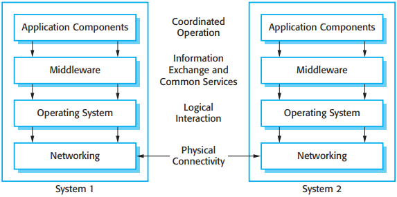
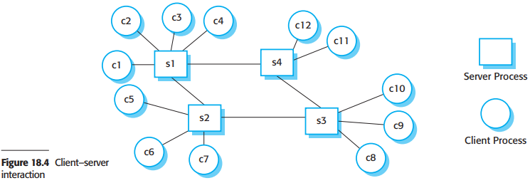
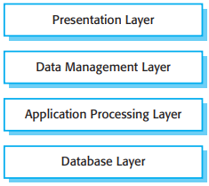
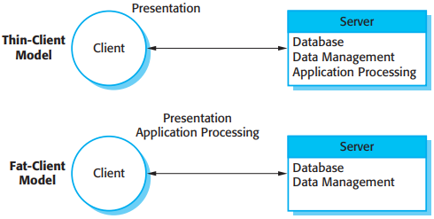
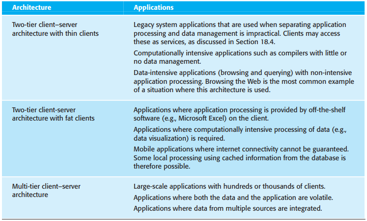
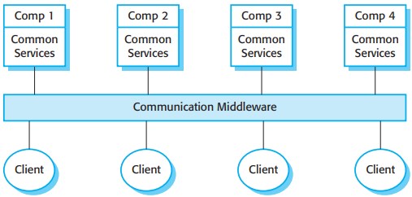
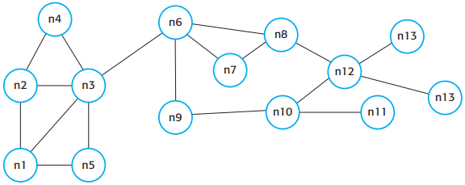
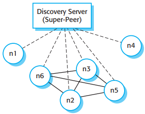
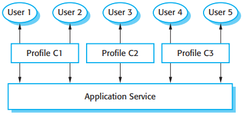

# 第18章 分布式软件工程

[TOC]

用分布式开发系统的优势：

1. 资源共享
2. 开放性
3. 并发性
4. 可扩展性
5. 容错性

## 18.1 分布式系统的问题

在分布式系统工程中一些不得不考虑的重要的设计问题：

1. 透明性
2. 开放性
3. 可扩展性
4. 信息安全性
5. 服务质量
6. 失败管理

系统的可扩展性反映了系统能在需求增长的情况下提供高质量的服务的能力，可扩展性的3个方面：

1. 规模
2. 分布
3. 可管理性

分布式系统必须防卫以免遭到以下类型的攻击：

1. 拦截
2. 中断
3. 更改
4. 捏造

分布式系统提供的服务质量（QoS）反映了系统的一种能力，即可靠地提供服务并使得响应时间和吞吐量对于用户来说都是可接受的。

### 18.1.1 交互模型

分布式计算系统中的计算机之间可能会发生两种基本类型的交互：

1. 过程式交互
2. 基于消息的交互

### 18.1.2 中间件

*分布式系统中的中间件*

## 18.2 客户机-服务器计算

*客户机-服务器交互*

*客户机-服务器应用的分层体系结构模型*

- 表示层，表示层是关于呈现信息给用户和管理所有用户的交互。
- 数据管理层，数据管理层用来管理传给客户机和来自客户机的数据。这一层可以实现数据检查，网页生成等。
- 应用处理层，应用处理曾涉及应用逻辑的实现以及最终用户提供所需求的功能。
- 数据库层，数据库层用来存储数据和提供食物管理服务等。

## 18.3 分布式系统的体系结构模式

5种体系结构风格：

1. 主从体系结构，这种体系结构常用在实时系统中，在实时系统中需要保证交互的反应时间。
2. 两层客户机-服务器体系结构，这种体系结构常用于简单的客户机-服务器系统，也用于由于信息安全原因集中化系统是至关重要的情况下。在这种情况下，客户机和服务器之间的通信通常是经过加密的。
3. 多层客户机-服务器体系结构，这种体系结构用于服务器要处理大量的事务的时候。
4. 分布式组件体系结构，这种体系结构用于不同系统和数据库的资源需要合并的时候。或者作为多层客户机-服务器系统实现模型。
5. 对等体系结构，这种体系结构用于当客户机交换本地存储信息而服务器作为在客户机之间相互介绍认识的时候。也用于要必须进行大量的独立计算的时候。

### 18.3.1 主从体系结构

*交通管理系统的主从体系结构*

### 18.3.2 两层客户机-服务器结构

*瘦客户机和胖客户机的体系结构模型*

### 18.3.3 多层客户机-服务器结构

*网上银行系统的三层体系结构*

*客户机-服务器体系结构模式的应用*

### 18.3.4 分布式组件体系结构

*分布式组件体系结构*

分布式组件体系的优点：

1. 它允许系统设计者延迟决断在哪里和如何提供服务。
2. 它是一个非常开发的体系结构，允许新的资源根据需要增加进来。
3. 系统具有很好的柔性和可扩展性。
4. 可以通过组件在网络上的迁移达到对系统的动态配置。

分布式组件体系的缺点：

1. 其设计比客户机-服务器系统更复杂。
2. 分布组件系统的标准化的中间件还从来没有被软件社会所接受。

### 18.3.5 对等体系结构

*集中式p2p体系结构*

*半集中式p2p体系结构*

在两种环境下适合使用对等体系结构模型：

1. 系统是计算密集的并且有可能把需求的处理分成许多独立的计算。
2. 系统主要涉及个人计算机在网络上的信息交换，没有必要将这些信息集中管理和存储。

## 18.4 软件作为服务

*软件系统作为服务的配置*
