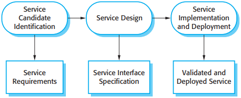
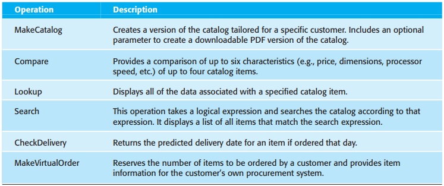
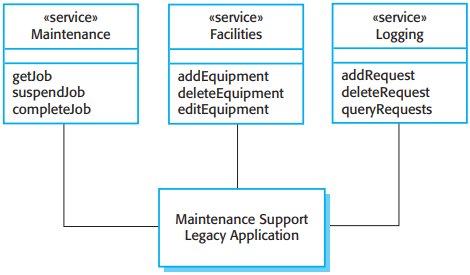

# 19 Service-oriented architecture

[TOC]

*Service-oriented architecture*

Briefly, the key standards for web SOAs are as follows:

1. SOAP This is a message interchange standard that supports the communication between services. It defines the essential and optional components of messages passed between services.
2. WSDL The Web Service Definition Language (WSDL) is a standard for service interface definition. It sets out how the service operations (operation names, parameters, and their types) and service bindings should be defined.
3. WS-BPEL This is a standard for a workflow language that is used to define process programs involving several different services.

*Web service standards*

## Services as reusable components

*Organization of a WSDL specification*

## Service engineering

*The service engineering process*

### Service candidate identification

Erl suggests that there are three fundamental types of service that may be identified:

1. `Utility services` There are services that implement some general functionality that may be used by different business processes.
2. `Business services` There are services that are associated with a specific business function.
3. `Coordination or process services` These are services that support a more general business process which usually involves different actors and activities.

### Service interface design

There are three stages to service interface design:

1. Logical interface design, where you identify the operations associated with the service, their inputs and outputs and the exceptions associated with these operations.
2. Message design, where you design the structure of the messages that are sent and received by the service.
3. WSDL development, where you translate your logical and message design to an abstract interface description written in WSDL.

*Functional descriptions of catalog service operations*

### Legacy system services

*Services providing access to a legacy system*

Some of the services provided are the following:

1. A `maintenance service`.
2. A `facilities service`.
3. A `logging service`.

## Software development with services

*Service construction by composition*

Six key stages in the process of service construction by composition:

1. Formulate outline workflow.
2. Discover services.
3. Select possible services.
4. Refine workflow.
5. Create workflow program.
6. Test completed service or application.

### Workflow design and implementation

*Interacting workflows*

