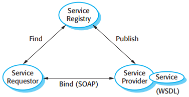
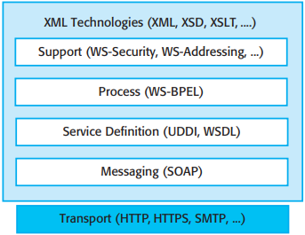
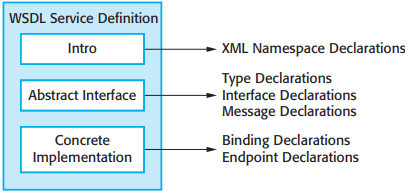
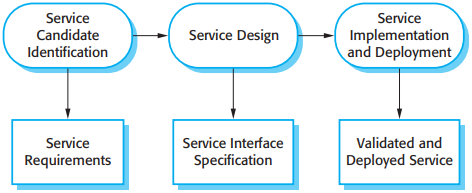
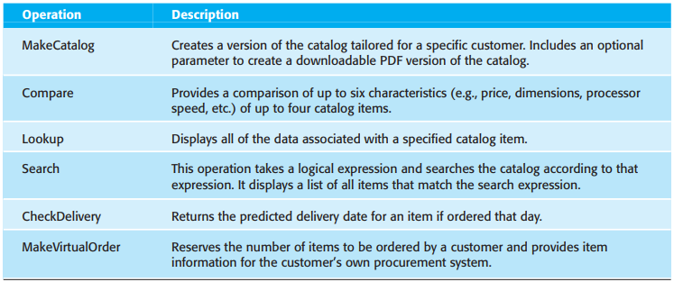
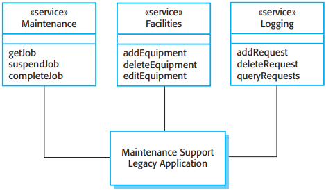
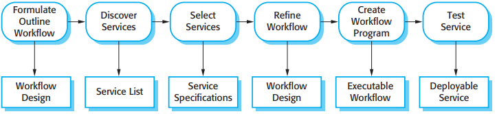
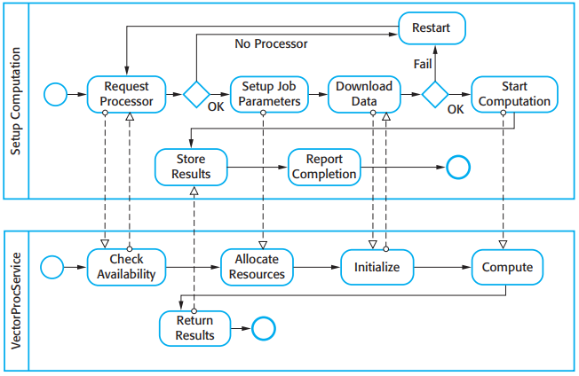

# 第19章 面向服务的体系结构

*面向服务的体系结构*

面向Web服务的体系结构的主要标准有：

1. SOAP 这是一个支持服务之间通信的消息交换标准。它定义服务之间消息传递的必须和可选的组件。
2. WSDL Web服务定义语言（WSDL）是制定服务接口的标准。它给出了服务是如何操作的（操作名，参数，它们的类型）以及必须定义的服务绑定。
3. WS-BPDL 这是一个工作流语言的标准，工作流语言用来定义包括多个不同服务的过程程序。

*Web服务标准*

## 19.1 服务作为可复用的组件

*WSDL描述的组织*

## 19.2 服务工程

*服务工程过程*

### 19.2.1 可选服务的识别

Erl建议可以定义三种基本服务类型：

1. 实用服务
2. 业务服务
3. 协同或过程服务

### 19.2.2 服务接口设计

服务接口设计有3个阶段：

1. 逻辑接口设计，找出与服务关联的操作，这些操作的输入和输出，以及与这些操作关联的异常。
2. 消息设计，设计由服务发送和接收的消息结构。
3. WSDL开发，用WSDL语言将逻辑设计和消息设计翻译成抽象接口描述。

*目录服务操作的功能性描述*

### 19.2.3 服务实现和部署

### 19.2.4 遗留系统服务

*对遗留系统提供访问的服务*

- 维护服务(Maintenance service)
- 工具服务(Facilities service)
- 日志服务(Logging service)

## 19.3 使用服务的软件开发

*通过组合的服务构造*

- 表达概略工作流(Formulate Outline Workflow)
- 发现服务(Discover Services)
- 选择可能的服务(Select Services)
- 精炼工作流(Refine Workflow)
- 创建工作流程序(Create Workflow Program)
- 测试完成的服务或应用(Test Service)

### 18.3.1 工作流设计和实现

*交互中的工作流*

### 19.3.2 服务测试

## 总结

TODO

