[中文版](chapter2_zh.md) | English

# 2 Software processes

[TOC]

There are many different software processes but all must include four activities that are fundamental to software engineering:

1. `Software specification:` The functionality of the software and constraints on its operation must be defined.
2. `Software design and implementation:` The software to meet the specification must be produced.
3. `Software validation:` The software must be validated to ensure that it does what the customer wants.
4. `Software evolution:` The software must evolve to meet changing customer needs.

## Software process models

The process models that I cover here are:

- `The waterfall model:` This takes the fundamental process activities of specification, development, validation, and evolution and represents them as separate process phases such as requirements specification, software design, implementation, testing, and so on.
- `Incremental development:` This approach interleaves the activities of specification, development, and validation. The system is developed as a series of versions(increments), with each version adding functionality to the previous version.
- `Reuse-oriented software engineering` This approach is based on the existence of a significant number of reusable components. The system development process focuses on integrating these components into a system rather than developing them from scratch.

### The waterfall model

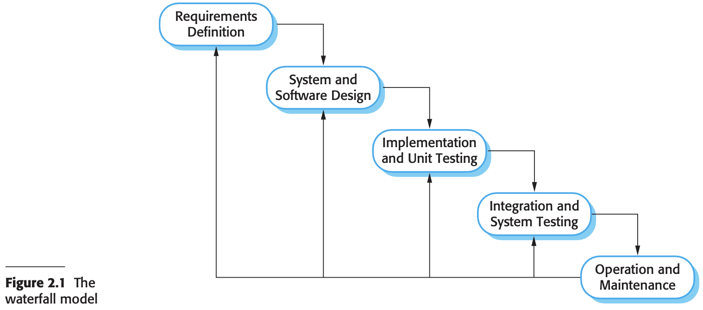

The principal stages of the waterfall model directly reflect the fundamental development activities:

1. Requirements analysis and definition
2. System and software design
3. Implementation and unit testing
4. Integration and system testing
5. Operation and maintenance

### Incremental development

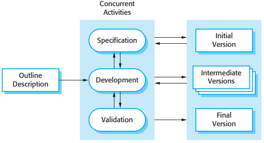

*Incremental development*

Incremental development has three important benefits, compared to the waterfall model:

1. The cost of accommodating changing customer requirements is reduced.
2. It is easier to get customer feedback on the development work that has been done.
3. More rapid delivery and deployment of useful software to the customer is possible, even if all of the functionality has not been included.

From a management perspective, the incremental approach has two problems:

1. The process is not visible.
2. System structure tends to degrade as new increments are added.

### Reuse-oriented software engineering

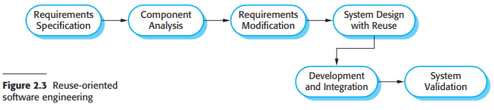

The intermediate stages in a reuse-oriented process are different:

- `Component analysis:` Given the requirements specification, a search is made for components to implement that specification.
- `Requirements modification:` During this stage, the requirements are analyzed using information about the components that have been discovered.
- `System design with reuse:` During this phase, the framework of the system is designed or an existing framework is reused.
- `Development and integration:` Software that cannot be externally procured is developed, and the components and COTS systems are integrated to create the new system.

## Process activities

### Software specification

Software specification or requirements engineering is the process of understanding and defining what services are required from the system and identifying the constraints on the system's operation and development.

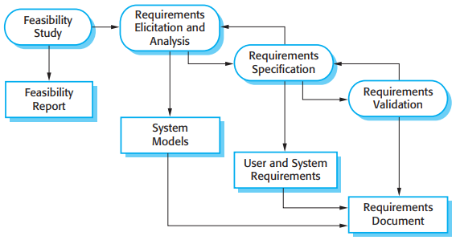

*The requirements engineering process*

There are four main activities in the requirements engineering process:

1. `Feasibility study` An estimate is made of whether the identified user needs may be satisfied using current software and hardware technologies. The study considers whether the proposed system will be cost-effective from a business point of view and if it can be developed within existing budgetary constraints.
2. `Requirements elicitation and analysis` This is the process of deriving the system requirements through observation of existing systems, discussions with potential users and procurers, task analysis, and so on.
3. `Requirements specification` Requirements specification is the activity of translating the information gathered during the analysis activity into a document that defines a set of requirements.
4. `Requirements validation` This activity checks the requirements for realism, consistency, and completeness.

### Software design and implementation

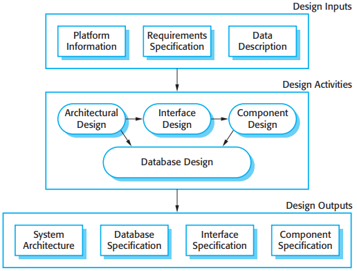

*A general model of the design process*

Four activities that may be part of the design process for information systems:

1. `Architectural design`, where you identify the overall structure of the system, the principal components (sometimes called sub-systems or modules), their relationships, and how they are distributed.
2. `Interface design`, where you define the interfaces between system components.
3. `Component design`, where you take each system component and design how it will operate.
4. `Database design`, where you design the system data structures and how these are to be represented in a database.

### Software validation

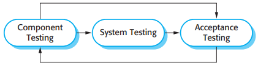

*Stages of testing*

The stages in the testing process are:

1. `Development testing` The components making up the system are tested by the people developing the system.
2. `System testing` System components are integrated to create a complete system.
3. `Acceptance testing` This is the final stage in the testing process before the system is accepted for operational use.

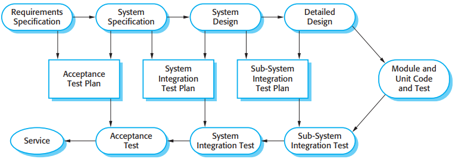

*Testing phases in a plan-driven software process*

## Coping with change

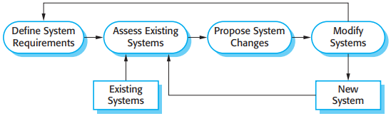

*System evolution*

There are two related approaches that may be used to reduce the costs of rework:

1. Change avoidance, where the software process includes activities that can anticipate possible changes before significant rework is required.
2. Change tolerance, where the process is designed so that changes can be accommodated at relatively low cost.

Two ways of coping with change and changing system requirements. There are:

1. System prototyping, where a version of the system or part of the system is developed quickly to check the customer's requirements and the feasibility of some design decisions.
2. Incremental delivery, where system increments are delivered to the sutomer for comment and experimentation.

### Prototyping

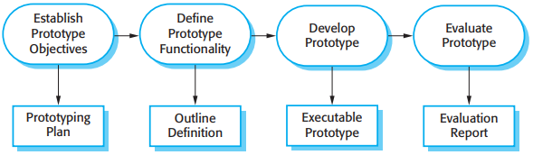

*The process of prototype development*

A software prototype can be used in a software development process to help anticipate changes that may be required:

1. In the requirements engineering process, a prototype can help with the elicitation and validation of system requirements.
2. In the system design process, a prototype can be used to explore particular software solutions and to support user interface design.

### Incremental delivery

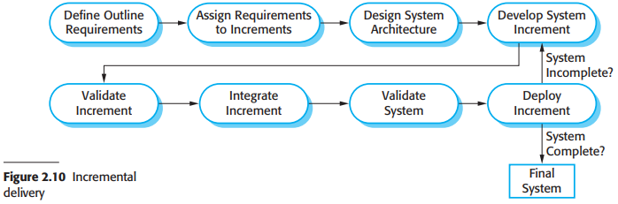

Incremental delivery has a number of advantages:

1. Customers can use the early increments as prototypes and gain experience that informs their requirements for later system increments.
2. Customers do not have to wait until the entire system is delivered before they can gain value from it.
3. The process maintains the benefits of incremental development in that it should be relatively easy to incorporate changes into the system.
4. As the highest-priority services are delivered first and increments then integratd, the most important system services receive the most testing.

There are problems with incremental delivery:

1. Most systems require a set of basic facilities that are used by different parts of the system.
2. Iterative development can also be difficult when a replacement system is being developed.
3. The essence of iterative processes is that the specification is developed in conjunction with the software.

### Boehm's spiral model

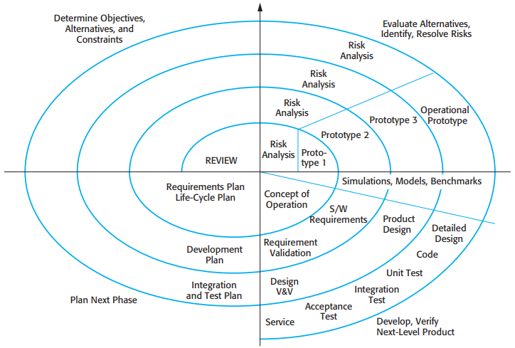

*Boehm's spiral model of the software process*

Each loop in the spiral is split into four sectors:

1. `Objective setting` Specific objectives for that phase of the project are defined.
2. `Risk assessment and reduction` For each of the identified project risks, a detailed analysis is carried out. Steps are taken to reduce the risk.
3. `Development and validation` After risk evaluation, a development model for the system is chosen.
4. `Planning` The project is reviewed and a decision made whether to continue with a further loop of the spiral.

## The Rational Unified Process

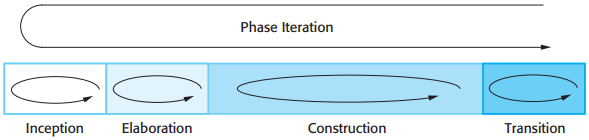

*Phases in the Rational Unified Process*

The phases in the RUP:

1. `Inception` The goal of the inception phase is to establish a business case for the system.
2. `Elaboration` The goals of the elaboration phase are to develop an understanding of the problem domain, establish an architectural framework for the system, develop the project plan, and identify key project risks.
3. `Construction` The construction phase involves system design, programming, and testing.
4. `Transition` The final phase of the RUP is concerned with moving the system from the development community to the user community and making it work in a real environment.

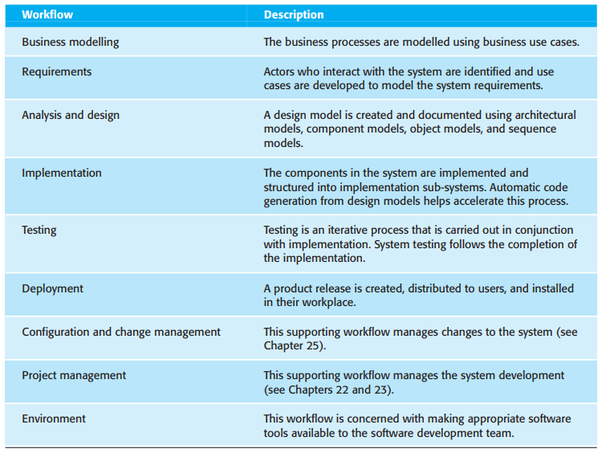

*Static workflows in the Rational Unified Process*

The practice perspective on the RUP describes good software engineering practices that are recommended for use in systems development. Six fundamental best practices are recommended:

1. `Develop software iteratively` Plan increments of the system based on customer priorities and develop the highest-priority system features early in the development process.
2. `Manage requirements` Explicitly document the customer's requirements and keep track of changes to these requirements. Analyze the impact of changes on the system before accepting them.
3. `Use component-based architectures` Structure the system architecture into components, as discussed earlier in this chapter.
4. `Visually model software` Use graphical UML models to present static and dynamic views of the software.
5. `Verify software quality` Ensure that the software meets the organizational quality standards.
6. `Control changes to software` Manage changes to the software using a change management system and configuration management procedures and tools.