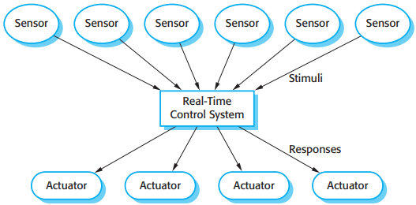
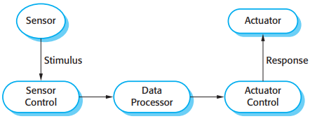
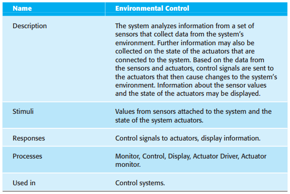
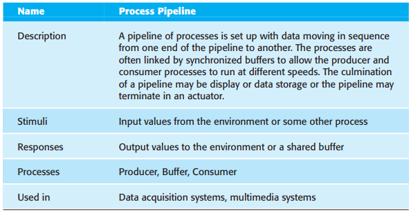
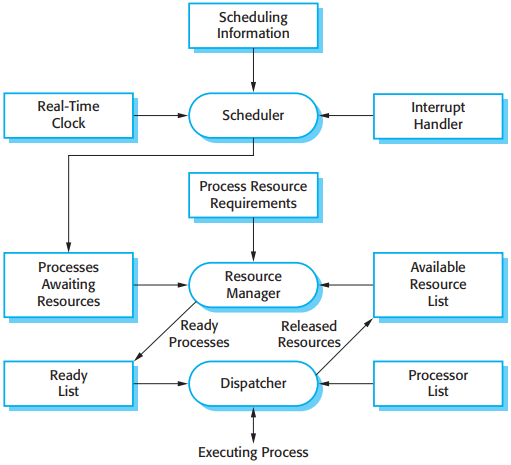

# 20 Embedded software

[TOC]

As well as the need for real-time response, there are other important differences between embedded systems and other types of software system:

1. Embedded systems generally run continuously and do not terminate.
2. Interactions with the system's environment are uncontrollable and unpredictable.
3. There may be physical limitations that affect the design of a system.
4. Direct hardware interaction may be necessary.
5. Issues of safety and reliability may dominate the system design.

## Embedded systems design

Stimuli fall into two classes:

1. `Periodic stimuli` These occur at predictable time intervals.
2. `Aperiodic stimuli` These occur irregularly and unpredictably and are usually signaled using the computer's interrupt mechanism.

*A general model of an embedded real-time system*

*Sensor and actuator processes*

There is no standard embedded system design process. Rather, different processes are used that depend on the type of system, available hardware, and the organization that is developing the system. The following activities may be included in a real-time software design process:

1. Platform selection.
2. Stimuli/response identification.
3. Timing analysis.
4. Process design.
5. Algorithm design.
6. Data design.
7. Process scheduling.

## Architectural patterns

Three real-time architectural patterns that are commonly used:

1. Observe and React.
2. Environmental Control.
3. Process Pipeline.

### Observe and React

*The Observe and React pattern*

### Environmental Control

*The Environmental Control pattern*

### Process Pipeline

*The Process Pipeline pattern*

## Timing analysis

When you are analyzing the timing requirements of embedded real-time systems and designing systems to meet these requirements, there are three key factors that you have to consider:

1. Deadlines.
2. Frequency.
3. Execution time.

## Real-time operating systems

For all except the simplest systems, they usually include:

1. A real-time clock, which provides the information required to schedule processes periodically.
2. An interrupt handler, which manages aperiodic requests for service.
3. A scheduler, which is responsible for examining the processes that can be executed and choosing one of these for execution.
4. A resource manager, which allocates appropriate memory and processor resources to processes that have been scheduled for execution.
5. A dispatcher, which is responsible for starting the execution of processes.

### Process management

*Components of a real-time operating system*

The RTOS has to be able to manage at least two priority levels for system processes:

1. `Interrupt level` This is teh highest priority level. It is allocated to processes that need a very fast response. One of these processes will be the real-time clock process.
2. `Clock level` This level of prioroty is allocated to periodic processes.

*RTOS actions required to start a process*

There are two commonly used scheduling strategies:

1. `Non-pre-emptive scheduling` Once a process has been scheduled for execution it runs to completion or until it is blocked for some reason, such as waiting for input.
2. `pre-emptive scheduling` The execution of an executing process may be stopped if a higher-priority process requires service.