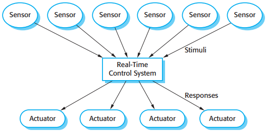
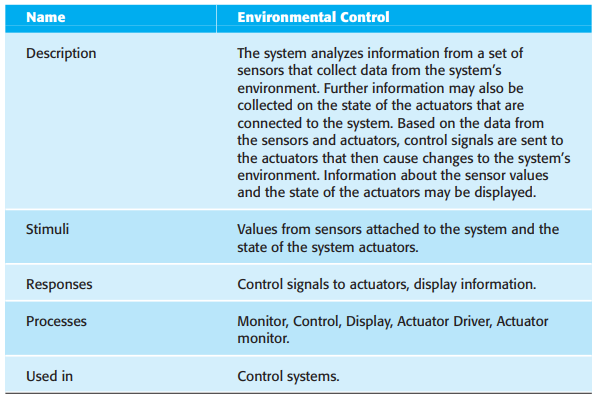

# 第20章 嵌入式软件

[TOC]

嵌入式系统和其他类型的软件系统之间的不同点：

1. 嵌入式系统通常持续运行而不终止。
2. 和系统环境的交互是不可控制和不可预测的。
3. 存在影响系统设计的物理限制。
4. 直接硬件交互是必要的。
5. 安全性和可靠性在系统设计中占据主要的地位。
6. 实时嵌入式系统通常要求实时响应。

## 20.1 嵌入式系统设计

激励有两类：

1. 周期性的激励
2. 非周期性的激励

*嵌入式实时系统的一般模型*

*传感器和执行器进程*

没有标准的嵌入式系统设计过程。使用不同的过程取决于系统的类型，可利用硬件以及开发系统的机构。实时软件设计过程可能包含以下几步：

1. 平台选择
2. 激励/响应识别
3. 时序分析
4. 进程设计
5. 算法设计
6. 数据设计
7. 进程调度

### 20.1.1 实时系统建模

### 20.1.2 实时编程

## 20.2 体系结构模式

经常使用的实时的体系结构模式：

1. 观察和反应
2. 环境控制
3. 处理管道

### 20.2.1 观察和反应

*观察和反应模式*

### 20.2.2 环境控制

*环境控制模式*

### 20.2.3 处理管道

*管道处理模式*

## 20.3 时序分析

当分析嵌入式实时系统的时序需求和设计系统满足这些需求的时候，需要考虑3个主要因素：

1. 时限
2. 频率
3. 执行时间

## 20.4 实时操作系统

*实时操作系统的组件*

一般的实时系统总是包括：

1. 实时时钟，提供周期性调度进程所需的信息；
2. 中断处理器，管理非周期性的对服务的请求；
3. 调度单元，该组件负责检查可以执行的进程并选择其中一个去执行；
4. 资源管理器，给定一个经过调度准许执行的进程，资源管理器分配相应的内存和处理器资源给进程；
5. 分派单元，该组件负责开始一个进程的执行。

RTOS对于系统进程来说，必须能管理至少两个等级的优先权：

1. 中断级：这是最高的优先级层次。它分派给要求快速响应的进程。
2. 时钟级：这个层次的优先级被分派给周期性的进程。

*RTOS启动进程所需要的动作*

两个基本调度策略：

1. 非抢占调度：一旦一个进程被调度执行，就执行到完成为止，或是由于某些原因被阻塞为止。
2. 抢占调度：当有更高优先级的进程需要服务时，正在执行的进程可能会被终止。
