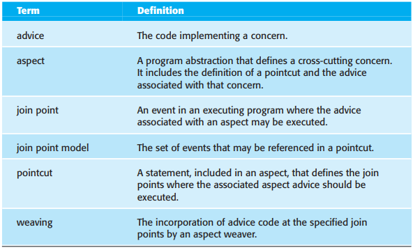
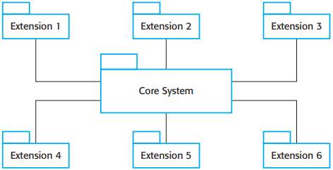
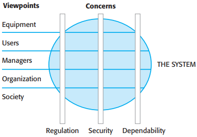
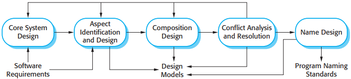

# 21 Aspect-oriented software engineering

[TOC]

## Aspects, join points, and pointcuts

*Terminology used in aspect-oriented software engineering*

## Software engineering with aspects

*Core system with extensions*

### Concern-oriented requirements engineering

*Viewpoints and Concerns*

### Aspect-oriented design and programming

*A generic aspect-oriented design process*