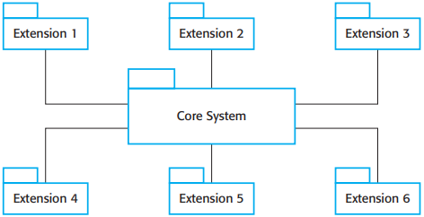
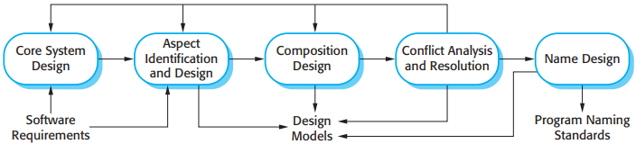

# 第21章 面向方面的软件工程

[TOC]

## 21.1 关注点分离

## 21.2 方面，连接点和切入点

*面向方面软件工程中使用的术语*

- 建议(advice)
- 方面(aspect)
- 连接点(join point)
- 连接点模型(join point model)
- 切入点(pointcut)
- 编织(weaving)

## 21.3 采用方面的软件工程

*带扩展的核心系统*

### 21.3.1 面向关注点的需求工程

*视点和关注点*

### 21.3.2 面向方面的设计和编程

*通用的面向方面设计过程*

- 核心系统设计(Core System Design)
- 方面识别和设计(Aspect Identification and Design)
- 合成设计(Composition Design)
- 重复分析和解决(Conflict Analysis and Resolution)
- 名字设计(Name Design)

### 21.3.3 检验和有效性验证

## 总结

TODO