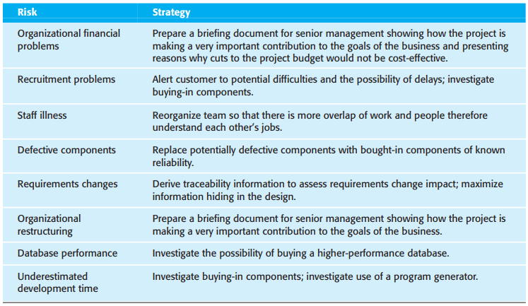

# 22 Project management

[TOC]

**Good management cannot guarantee project success. However, bad management usually results in project failure.**

For most projects, important goals are:

1. Deliver the software to the customer at the agreed time.
2. Keep overall costs within budget.
3. Deliver software that meets the customer's expectations.
4. Maintain a happy and well-functioning development team.

Most managers take responsibility at some stage for some or all of the following activities:

1. Project planning.
2. Reporting.
3. Risk management.
4. People management.
5. Proposal writing.

## Risk management

Three related categories of risk:

1. Project risks.
2. Product risks.
3. Business risks.

*Examples of common project, product, and business risks*

An outline of the process of risk management is illustrated in Figure 22.2. It involves several stages:

1. `Risk identification` You should identify possible project, product, and business risks.
2. `Risk analysis` You should assess the likelihood and consequences of these risks.
3. `Risk planning` You should make plans to address the risk, either by avoiding it or minimizing its effects on the project.
4. `Risk monitoring` You should regularly assess the risk and your plans for risk mitigation and revise these when you learn more about the risk.

*The risk management process*

There are at least six types of risk that may be included in a risk checklist:

1. `Technology risks` Risks that derive from the software or hardware technologies that are used to develop the system.
2. `People risks` Risks that are associated with the people in the development team.
3. `Organizational risks` Risks that derive from the organizational environment where the software is being developed.
4. `Tools risks` Risks that derive from the software tools and other support software used to develop the system.
5. `Requirements risks` Risks that derive from changes to the customer requirements and the process of managing the requirements change.
6. `Estimation risks` Risks that derive from the management estimates of the resources required to build the system.

### Risk analysis

*Examples of different types of risks*

### Risk planning

*Risk types and examples*

### Risk planning

*Strategies to help manage risk*

### Risk monitoring

*Risk indicators*

## Managing people

There are four critical factors in people management:

1. Consistency.
2. Respect.
3. Inclusion.
4. Honesty.

### Motivating people

*Human needs hierarchy*

Bass and Dunteman (1963) classify professionals into three types:

1. Task-oriented people.
2. Self-oriented people.
3. Interaction-oriented people.

## Teamwork

The benefits of creating a cohesive group are:

1. The group can establish its own quality standards.
2. Individuals learn from and support each other.
3. Knowledge is shared.
4. Refactoring and continual improvement is encouraged.

There are three generic factors that affect team working:

1. The people in the group.
2. The group organization.
3. Technical and managerial communications.

### Group communications

The effectiveness and efficiency of communications is influenced by:

1. Group size.
2. Group structure.
3. Group composition.
4. The physical work environment.
5. The available communication channels.