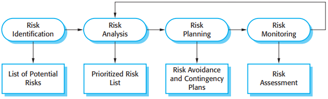
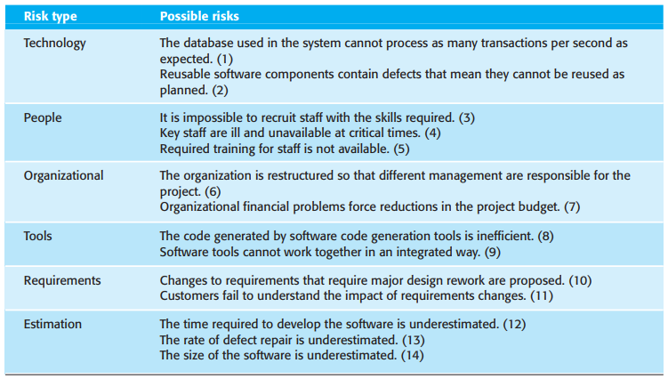
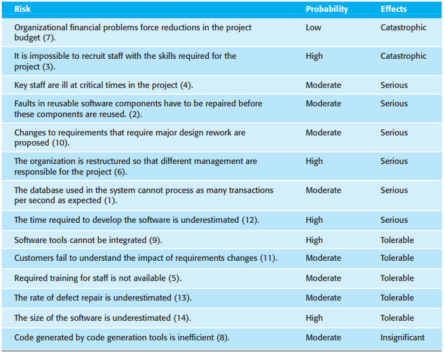
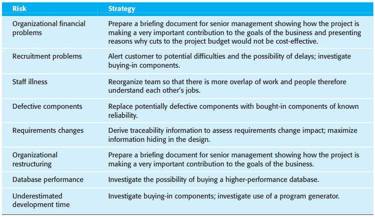
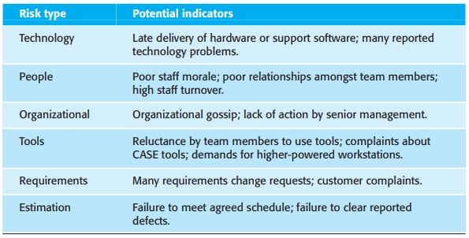
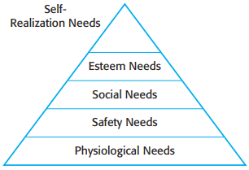

# 第22章 项目管理

**好的管理不能确保项目成功，但是，不好的管理注定要带来项目的失败。**

对于大多数项目来说，最重要的管理目标是：

1. 在约定的时间将软件产品交付给客户；
2. 将全部成本控制在预算之内；
3. 交付的软件产品满足客户的要求；
4. 保持一个愉悦并且运作良好的开发团队。

绝大多数管理者要在某些阶段对下列部分或全部活动负起责任：

1. 项目规划
2. 工作报告
3. 风险管理
4. 人员管理
5. 提出书面建议

## 22.1 风险管理

风险种类：

1. 项目风险
2. 产品风险
3. 业务风险

*风险管理过程*

- 风险识别(Risk Identification)：识别可能的项目风险，产品风险和业务风险。
- 风险分析(Risk Analysis)：评估这些风险出现的可能性及其后果。
- 风险规划(Risk Planning)：制定计划说明如何规避风险或最小化风险对项目的影响。
- 风险监控(Risk Monitoring)：定期对风险和缓解风险的计划进行评估，并随着有关风险信息的增多即使修正缓解风险的计划。

### 22.1.2 风险识别

*不同风险类型实例*

### 22.1.2 风险分析

*风险类型和实例*

### 22.1.3 风险规划

*风险管理策略*

### 22.1.4 风险监控

*风险因素*

## 22.2 人员管理

在人员管理方面有4个关键要素：

1. 一致性
2. 尊重
3. 包容
4. 诚实

*人的需求层次*

职业人士分类：

1. 面向任务型
2. 面向自我型
3. 面向交互型

## 22.3 团队协作

小组的凝聚力带来如下好处：

1. 能够建立起小组自己的质量标准
2. 成员相互学习，相互帮助
3. 知识分享
4. 鼓励重构以及不断改善

影响团队工作的普遍因素：

1. 小组的人员
2. 团队的组织
3. 技术上和管理上的交流

### 22.3.1 成员挑选

### 22.3.2 小组的结构

### 22.3.3 小组的沟通

影响沟通有效性和效率的主要因素有：

1. 小组规模
2. 小组结构
3. 小组构成
4. 小组的物理工作环境
5. 可利用的交流渠道

## 总结

TODO