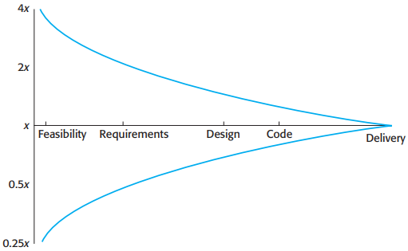

# 23 Project planning

[TOC]

Project planning takes place at three stages in a project life cycle:

1. At the proposal stage.
2. During the project startup phase.
3. Periodically throughout the project.

There are three main parameters that you should use when computing the costs of a software development project:

- effort costs (the costs of paying software engineers and managers);
- hardware and software costs, including maintenance;
- travel and training costs.

## Software pricing

*Factors affecting software pricing*

## Plan-driven development

### Project plans

Although the specific details of project plans vary depending on the type of project and organization, plans normally include the following sections:

1. Introduction.
2. Project organization.
3. Risk analysis.
4. Hardware and software resource requirements.
5. Work breakdown.
6. Project schedule.
7. Monitoring and reporting mechanisms.

*Project plan supplements*

### The planning process

*The project planning process*

## Project scheduling

### Schedule representation

*The project scheduling process*

There are two types of representation that are commonly used:

1. Bar charts.
2. Activity networks.

*Tasks, durations, and dependencies*

*Staff allocation chart*

## Agile planning

The most commonly used agile approaches such as Scrum (Schwaber, 2004) and extreme programming (Beck, 2000) have a two-stage approach to planning, corresponding to the startup phase in plan-driven development and development planning:

1. Release planning, which looks ahead for several months and decides on the features that should be included in a release of a system.
2. Iteration planning, which has a shorter-term outlook, and focuses on planning the next increment of a system.

*Planning in XP*

## Estimation techniques

Organizations need to make software efforts and cost estimates. There are two types of techniques that can be used to do this:

1. `Experience-based techniques` The estimate of future effort requirements is based on the manager's experience of past projects and the application domain. Essentially, the manager makes an informed judgment of what the effort requirements are likely to be.
2. `Algorithmic cost modeling` In this approach, a formulaic approach is used to compute the project effort based on estimates of product attributes, such as size, and process characteristics, such as experience of staff involved.

*Estimate uncertainty*

### Algorithmic cost modeling

Algorithmic models for estimating effort in a software project are mostly based on a simple formula:
$$
Effort = A \times Size^{B} \times M
$$

- $A$ is a constant factor which depends on local organizational practices and the type of software that is developed.
- $Size$ may be either an assessment of the code size of the software or a functionality estimate expressed in function or application points.
- The value of exponent $B$ usually lies between 1 and 1.5.
- $M$ is a multiplier made by combining process, product, and development attributes, such as the dependability requirements for the software and the experience of the development team.

### The COCOMO II model

*COCOMO estimation models*

The submodels (Figure 23.10) that are part of the COCOMO II model are:

1. An application-composition model

   

   *Application-point productivity*

   The final formula for effort computation for system prototypes is: $PM = (NAP \times (1 - \%reuse/100))/PROD$

   - $PM$ is the effort estimate in person-months.
   - $NAP$ is the total number of application points in the delivered system.
   - $\text{"\%reuse"}$ is an estimate of the amount of reused code in the development.
   - $PROD$ is the application-point productivity.

2. An early design model

   The estimates produced at this stage are based on the standard formula for algorithmic models, namely:$Effor = A \times Size^{B} \times M$

   The multiplier $M$ is based on seven project and process attributes tht increase or decrease the estimate. Where: $M = PERS \times RCPX \times RUSE \times RDIF \times PREX \times FCIL \times SCED$

   - RCPX: complexity.
   - RUSE: reuse required.
   - PDIF: platform difficulty.
   - PERS: personnel capability.
   - PREX: personnel experience.
   - SCED: schedule.
   - FCIL: support facilities.

3. A reuse model

   The COCOMO II reuse model includes a formula to estimate the effort rquired to integrate this generated code:

   $PM_{Audio} = (ASLOC \times (AT/100)) / ATPROD // \text{Estimate for generated code}$

   - $ASLOC$ is the total number of lines of reused code, including code that is automatically generated. 
   - $AT$ is the percentage of reused code that is automatically generated.
   - $ATPROD$ is the productivity of engineers in integrating such code.

   The following formula is used to calculate the number of equivalent lines of soruce code: $ESLOC = ASLOC \times AAM$

   - $ESLOC$ is the equivalent number of liens of new source code.
   - $ASLOC$ is the number of lines of code in the components that have to be changed.
   - $AAM$ is an Adaptation Adjustment Multiplier, as discussed below.

   If some code adaptation can be done automatically, this reduces the effort rquired. You therefore adjust the estimate by estimating the percentage of auto matically adapted code ($AT$) and using this to adjust $ASLOC$. Therefore, the final formula is: $ESLOC = ASLOC \times (1 - AT/100) \times AAM$.

4. A post-architecture model

   

   *Scale factors used in the exponent computation in the post-architecture model*

### Project duration and staffing

The COCOMO model includes a formula to estimate the calendar time required to complete a project:
$$
TDEV = 3 \times (PM)^{(0.33 + 0.2 \times (B - 1.01))}
$$

- $TDEV$ is the nominal schedule for the project, in calendar months, ignoring any multiplier that is related to the project scheduel.
- $PM$ is the effort computed by the COCOMO model.
- $B$ is the complexity-related exponent.
