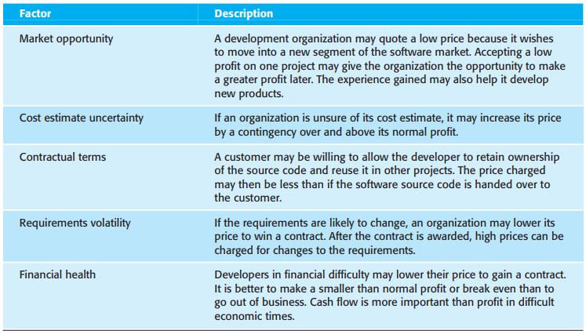
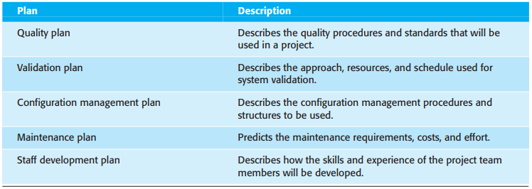
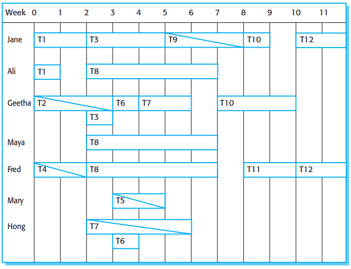

# 第23章 项目规划

[TOC]

项目规划发生在项目生存周期的以下3个阶段：

1. 投标提案阶段
2. 项目开始阶段
3. 贯穿于项目过程中

在计算软件开发项目总成本时要分析以下3方面：

- 工作量成本（支付给软件开发人员的费用）。
- 包括维护在内的硬件和软件费用。
- 差旅费和培训费用。

## 23.1 软件报价

*影响软件报价的因素*

- Market opportunity(市场机遇)
- Cost estimate uncertainty(成本估算的不确定性)
- Contractual terms(合同条款)
- Requirements volatility(需求易变性)
- Financial health(财务状况)

## 23.2 计划驱动的开发

### 23.2.1 项目计划

多数项目计划书应该包括以下部分：

1. 引言
2. 项目组织
3. 风险分析
4. 硬件和软件资源需求
5. 工作分解
6. 项目进度安排
7. 监控和报告机制

*项目辅助计划*

- Quality plan(质量计划)
- Validation plan(有效性验证计划)
- Configuration management plan(配置管理计划)
- Maintenance plan(维护计划)
- Staff development plan(员工发展计划)

### 23.2.2 规划过程

*项目规划过程*

- Identify Constraints(识别约束)
- Identify Risks(识别风险)
- Define Milestones and Deliverables(定义里程碑和可交付文档)
- <<system>> Project Planner(<<system>>项目规划程序)
- Define Project Schedule(定义项目进度安排)
- Do the Work(继续工作)
- Monitor Progress Against Plan(根据计划的监控进程)
- Initiate Risk Mitigation Actions(启动风险缓解行动)
- Replan Project(重新规划项目)

## 23.3 项目进度安排

*项目进度安排过程*

- Identify Activities(识别活动)
- Identify Activity Dependencies(识别活动依赖关系)
- Estimate Resources for Activities(估算活动的资源)
- Allocate People to Activities(为活动分配人员)
- Create Project Charts(创建项目图表)

项目进度表示方法：

1. 条形图
2. 活动网络图

*任务，持续时间以及依赖关系*

*人员分配示意图*

## 23.4 敏捷规划

最常用的敏捷方法，它的规划时两个阶段法，这两个阶段分别对应着计划驱动开发的启动阶段和开发规划：

1. 版本规划
2. 迭代规划

*极限编程(XP)规划*

- Story Identification(情节识别)
- Initial Estimation(初始估计)
- Release Planning(版本规划)
- Iteration Planning(迭代规划)
- Task Planning(任务规划)

## 23.5 估算技术

对软件所需工作量和成本进行估算的技术：

1. 基于经验的技术：使用管理者之前项目和应用领域的经验估算要求的未来工作量，即管理者主观给出所需要的工作量的一个估计。
2. 算法成本建模：在此方法中，使用一个公式方法计算项目的工作量，它基于对产品属性（比如规模）和过程特点（比如参与员工的经验）的估计。

*估算的不确定性*

- Feasibility(可行性)
- Requirements(需求)
- Design(设计)
- Code(代码)
- Delivery(移交)

### 23.5.1 算法成本建模

软件项目中的工作量估算的算法模型可基于一个简单的公式：$Effort = A \times Size^{B} \times M$

- $A$ 常数因子，依赖于机构的实践经验和所开发的软件类型。
- $Size$ 软件的代码行数或用功能点或应用点表示的功能的估算。
- $B$ 指数，值通常在1到1.5之间。
- $M$ 乘数因子，反映了过程，产品，开发属性。

### 23.5.2 COCOMO II模型

作为COCOMO II模型一部分的子模型有：

*COCOMO估计模型*

- Application Composition Model(应用组合模型)

  | 开发者的经验和能力     | 非常低 | 低   | 一般 | 高   | 非常高 |
  | ---------------------- | ------ | ---- | ---- | ---- | ------ |
  | CASE工具的成熟度和能力 | 非常低 | 低   | 一般 | 高   | 非常高 |
  | PROD（NOP/月）         | 4      | 7    | 13   | 25   | 50     |

  开发项目的工作量计算公式：$PM = (NAP \times (1 - \%reuse/100))/PROD$

  - $PM$ 以人月为单位的工作量
  - $NAP$ 交付系统的应用程序点的总数
  - $\%reuse$ 在开发中利用的代码量的估计
  - $PROD$ 应用点生产率

- Early Design Model(早期设计模型)

  基于算法模型的标准公式得出工作量的估算公式：$PM = 2.94 \times Size^{(1.1 - 1.24)} \times M$

  - $M$ 乘数因子，计算公式为：$M = PERS \times RCPX \times RUSE \times RDIF \times PREX \times FCIL \times SCED$；其中产品可靠性和复杂性（RCPX），要求的复用数（RUSE），平台困难程度（PDIF），个人能力（PERS），个人经验（PREX），进度（SCED）以及支持设施（FCIL）。

- Reuse Model(复用模型)

  开发项目的工作量计算公式：$PM_{Audio} = (ASLOC \times (AT/100)) / ATPROD // 生成代码的估计$；

  其中ASLOC是服用代码的总行数，包含自动生成的代码。AT是自动生成的服用代码所占的百分比。ATPROD是工程师在集成这些代码时的生产率。

  用于计算等价的源代码行数公式：$ESLOC = ASLOC \times (1 - AT/100) \times AAM$；其中ESLOC是新源代码的相当行数。ASLOC必须修改的组建的代码行数。AAM改写调整因子。

- Post-Architecture Model(后体系结构模型)

  

  *在后体系结构模型中指数计算所用的级别因素*

  - 有先例可援引(Precedentedness)
  - 开发的灵活性(Development flexibility)
  - 体系结构/风险解决方案(Architecture/risk resolution)
  - 团队凝聚力(Team cohesion)
  - 过程成熟度(Process maturity)

### 23.5.3 项目的工期和人员配备

COCOMO模型包括一个对项目所需日历时间的计算公式$TDEV = 3 \times (PM)^{(0.33 + 0.2 \times (B - 1.01))}$

- $TDEV$ 项目的理论进度（月），忽略关于项目进度的任何乘数。
- $PM$ 使用COCOMO模型计算的工作量。
- $B$ 复杂度相关指数。

## 总结

TODO
