# 24 Quality management

[TOC]

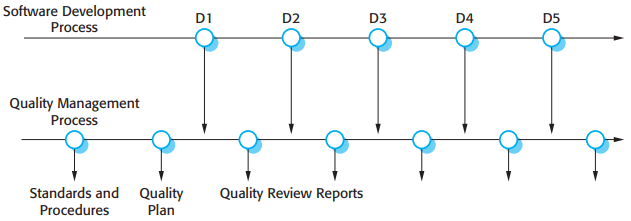

*Quality management and software development*

Humphrey (1989), in his classic book on software management, suggests an outline structure for a quality plan. This includes:

1. Product introduction.
2. Product plans.
3. Process descriptions.
4. Quality goals.
5. Risks and risk management.

## Software quality

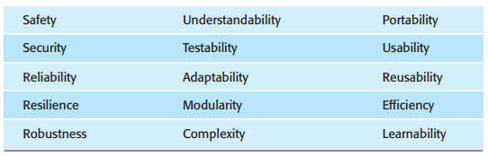

*Software quality attributes*

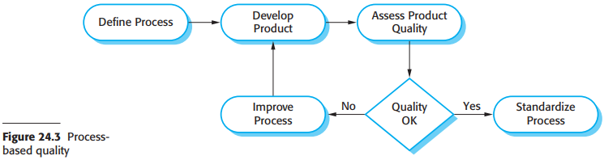

## Software standards

Software standards are important for three reasons:

1. Standards capture wisdom that is of value to the organization.
2. Standards provide a framework for defining what 'quality' means in a particular setting.
3. Standards assist continuity when work carried out by one person is taken up and continued by another.

There are two related types of software engineering standards that may be defined and used in software quality management:

1. Product standards.
2. Process standards.

*Product and process standards*

### The ISO 9001 standards framework

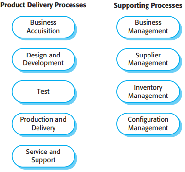

*ISO 9001core processes*

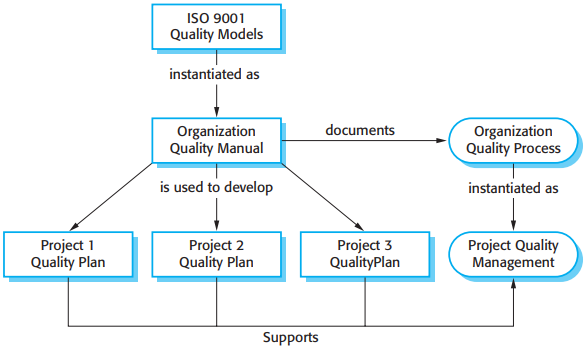

*ISO 9001 and quality management*

## Reviews and inspections

### The review process

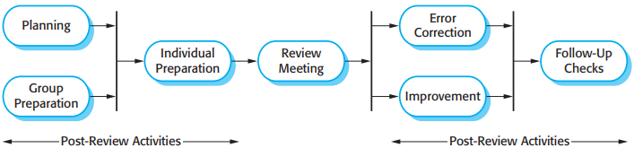

*The software review process*

### Program inspections

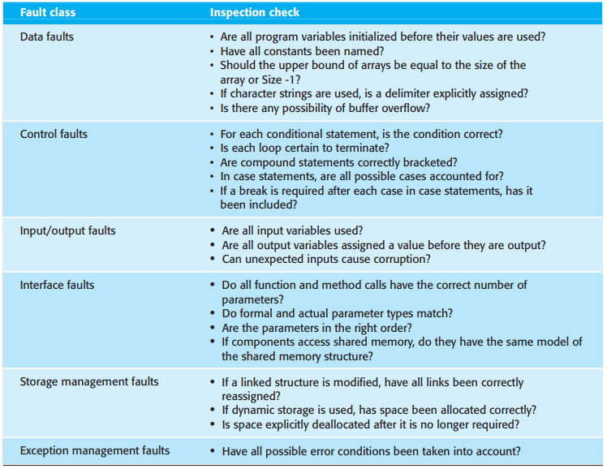

*An inspection checklist*

## Software measurement and metrics

Software measurement is concerned with deriving a numberic value or profile for an attribute of a software component, system, or process. By comparing these values to each other and to the standards that apply across an organization, you may be able to draw conclusions about the quality of software, or assess the effectiveness of software processes, tools, and methods.

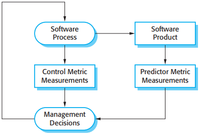

*Predictor and control measurements*

There are two ways in which measurements of a software system may be used:

1. To assign a value to system quality attributes.
2. To identify the system components whose quality is substandard.

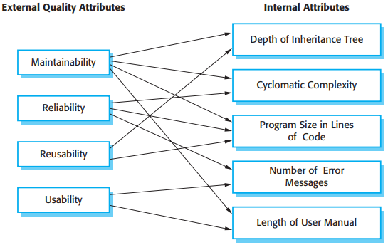

*Relationships between internal and external software*

If the measure of the internal attribute is to be a useful predictor of the external software characteristic, three conditions must hold (Kitchenham, 1990):

1. The internal attribute must be measured accurately.
2. A relationship must exist between the attribute that can be measured and the external quality attribute that is of interest.
3. This relationship between the internal and external attributes must be understood, validated, and expressed in terms of a formula or model.

### Product metrics

Product metrics fall into two classes:

1. Dynamic metrics, which are collected by measurements made of a program in execution. These metrics can be collected during system testing or after the system has gone into use.
2. Static mertics, which are collected by measurements made of representations of the system, such as the design, program, or documentation.

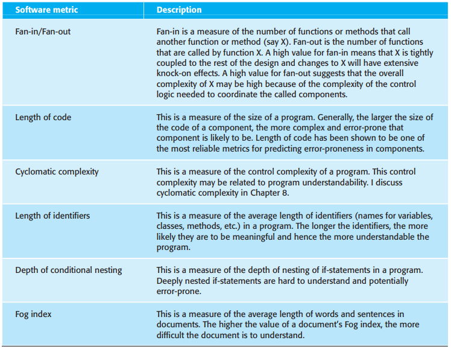

*Static software product metrics*

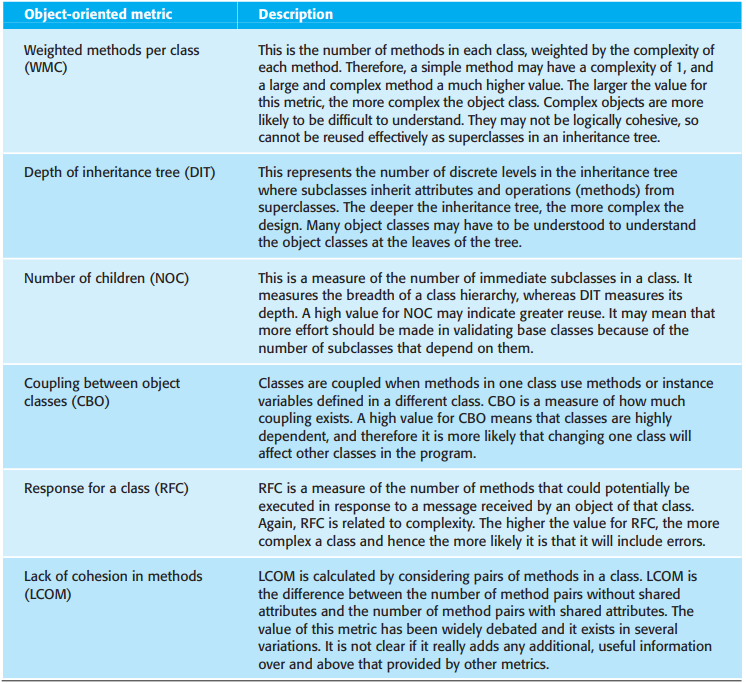

*The CK object-oriented metrics suite*

### Software component analysis

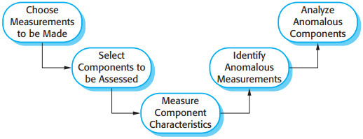

*The process of product measurement*

