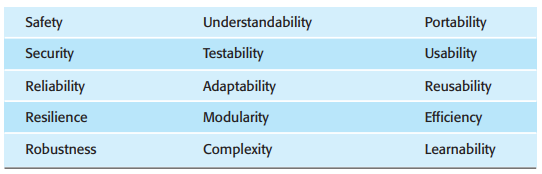
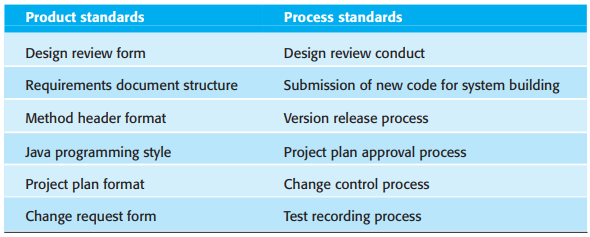
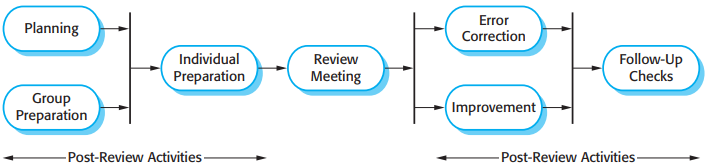
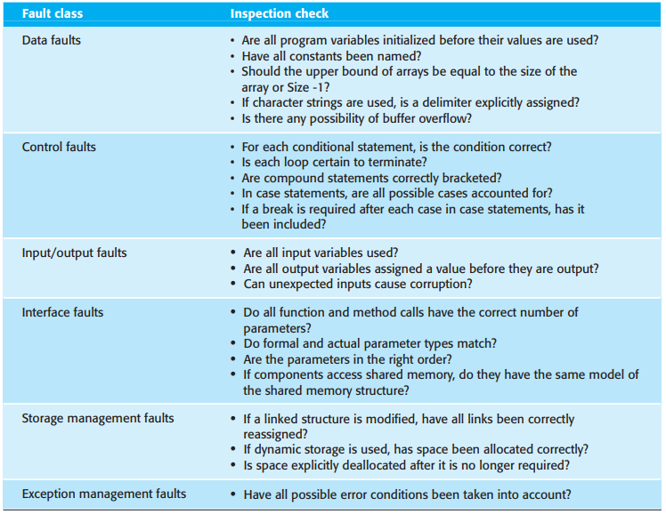

# 第24章 质量管理

*质量管理和软件开发*

- 软件开发过程(Software Development Process)
- 质量管理过程(Quality Manaement Process)
- 标准和规程(Standards and Procedures)
- 质量规划(Quality Plan)
- 质量评审报告(Quality Review Reports)

质量规划的轮廓结构：

1. 产品介绍
2. 产品计划
3. 过程描述
4. 质量目标
5. 风险和风险管理

## 24.1 软件质量

*软件质量属性*

*基于过程的质量*

## 24.2 软件标准

软件标准非常重要，原因如下：

1. 标准是智慧的结晶，对一个机构有重要意义。
2. 标准为定义特定环境中的“质量”含义提供了一个框架。
3. 软件标准还有助于工作的连贯性，由一个人着手进行的工作别人也可以接着做。

在软件质量管理中，现存两类可用于定义和使用的相关软件工程标准：

1. 产品标准
2. 过程标准

*产品和过程标准*

*ISO 9001核心过程*

*ISO 9001和质量管理*

## 24.3 复查和审查

### 24.3.1 复查过程

*软件复查过程*

### 24.3.2 程序审查

*审查过程中的检查表*

## 24.4 软件度量和量度

软件度量（measurement）就是对软件组件，系统或过程的某种属性进行量化。在得到的数据之间以及数据和机构的通用标准之间进行比较，就可以得出有关软件质量或评估软件过程有效性，工具和方法有效性的结论。

软件量度（metric）是能够被客观度量的软件系统，系统文档或开发过程有关的特性。

*预言者度量和控制度量*

软件产品度量可能用到两种方法：

1. 给系统质量属性赋值
2. 找出质量低于标准的系统组件

*软件的内在和外在关系*

软件内在属性的度量能否对外部的软件特性做出有益的预测，取决于以下条件：

1. 内在属性必须被精确度量。
2. 在能够度量的属性和我们感兴趣的外部质量属性之间必须有一定关系。
3. 内部属性和外部属性的关系必须是可理解的，可验证的，能用公式或模型表达出来。

### 24.4.1 产品量度

产品量度分为两类：

1. 动态量度，通过对执行中的程序度量所收集到的。TODO
2. 静态量度

