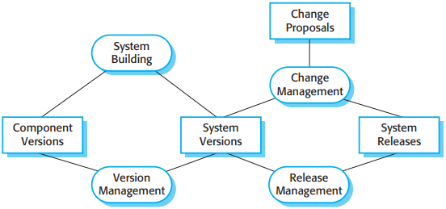
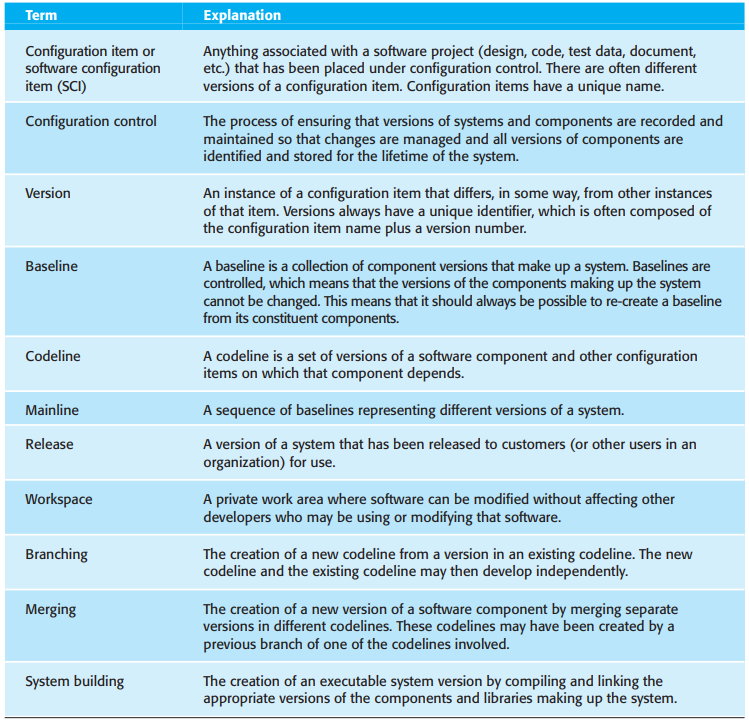
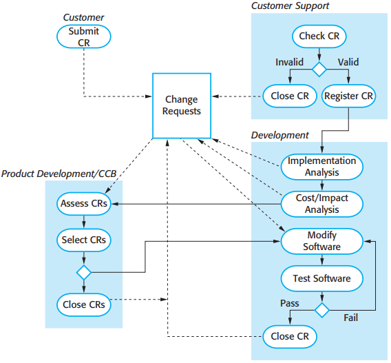
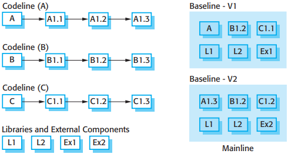
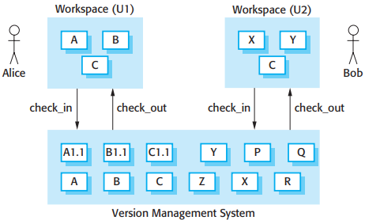
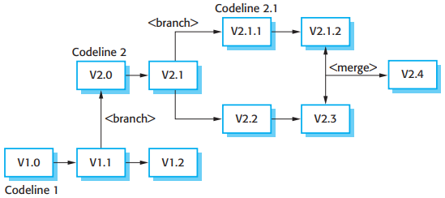
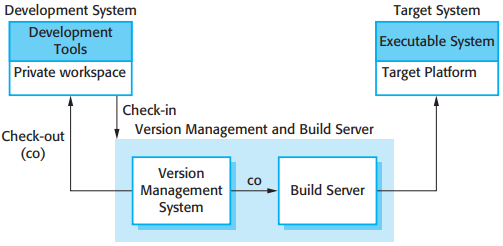
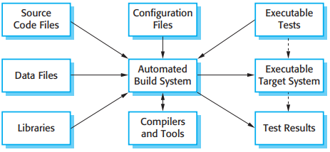
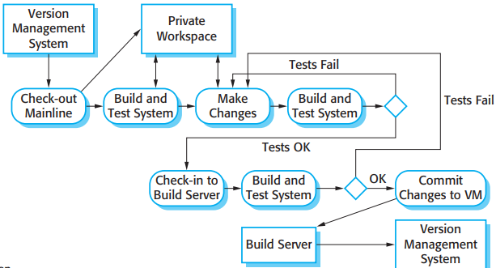
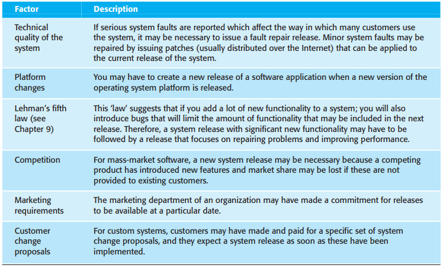

# 25 Configuration management

[TOC]

*Configuration management activities*

*CM terminology*

## Change management

*The change management process*

Significant factors that should be taken into account in deciding whether or not a change should be approved are:

1. The consequences of not making the change.
2. The benefits of the change.
3. The number of users affected by the change.
4. The costs of making the change.
5. The product release cycle.

## Version management

*Codelines and baselines*

Version management systems normally provide a range of features:

1. Version and release identification.
2. Storage management.
3. Change history recording.
4. Independent development.
5. Project support.

*Check-in and check-out from a version repository*

*Branching and merging*

## System building

*Development, build, and target platforms*

*System building*

There are many build tools available and a build system may provide soem or all of the following features:

1. Build script generation.
2. Version management system integration.
3. Minimal recompilation.
4. Executable system creation.
5. Test automation.
6. Reporting.
7. Documentation generation.

There are two types of signatures that may be used:

1. Modification timestamps.
2. Source code checksums.

*Continuous integration*

## Release management

*Factors influencing system release planning*