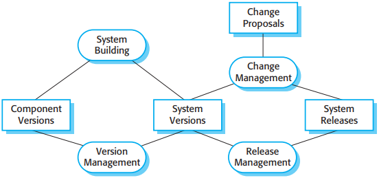
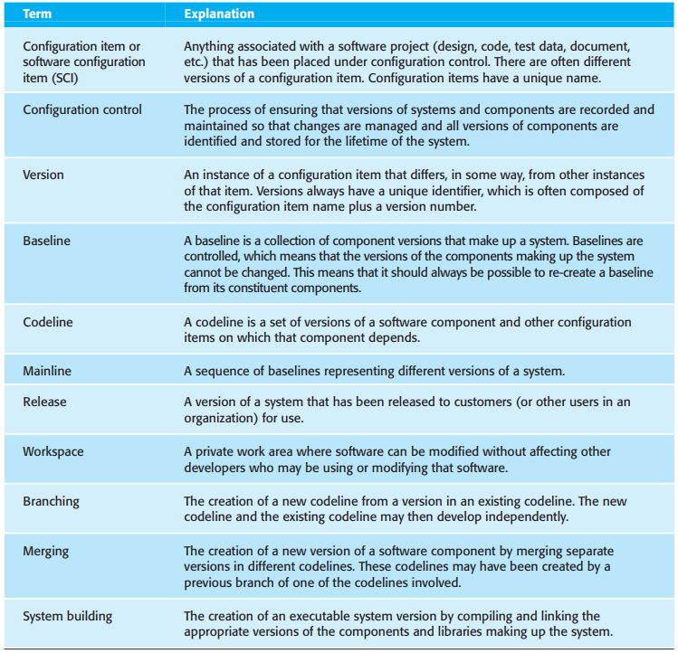
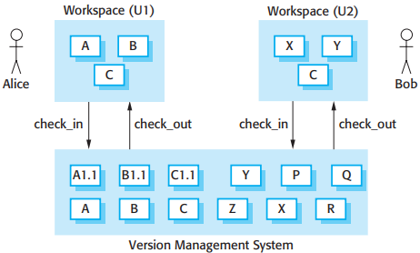
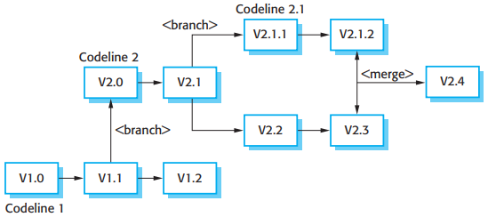
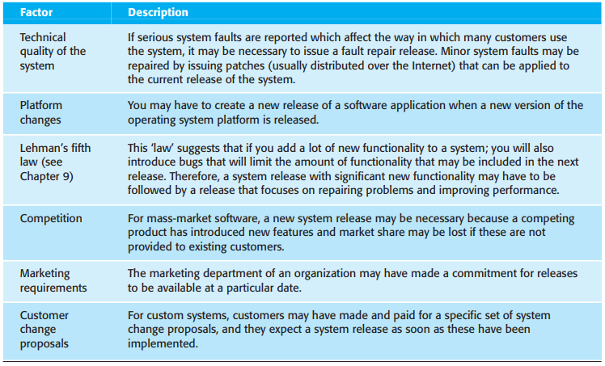

# 第25章 配置管理

[TOC]

*配置管理活动*

- 变更管理(System Building)
- 版本管理(Version Management)
- 系统构建(System Building)
- 发布管理(Release Management)

*配置管理术语*

## 25.1 变更管理

*变更管理过程*

在决定是否同意变更请求时需要考虑的重要因素：

1. 不做变更会引起的后果
2. 变更的益处
3. 变更影响的用户数
4. 变更所需花费
5. 产品发布循环

## 25.2 版本管理

*代码线和基线*

版本管理系统通常提供一系列特征：

1. 版本和发布版本识别
2. 存储管理
3. 变更历史记录
4. 独立开发
5. 项目支持

*从版本容器中检入和检出*

*分支和合并*

## 25.3 系统构建

*开发，构建和目标平台*

*系统构建*

一个构建系统可能提供部分或全部以下特征：

1. 构建脚本生成
2. 版本管理系统集成
3. 最小化再编译
4. 可执行系统创建
5. 测试自动化
6. 报告
7. 文档生成

存在两类可以使用的签名：

1. 修改的时间戳
2. 源代码校验和

*持续集成*

## 25.4 发布版本管理

*影响系统发布规划的因素*
